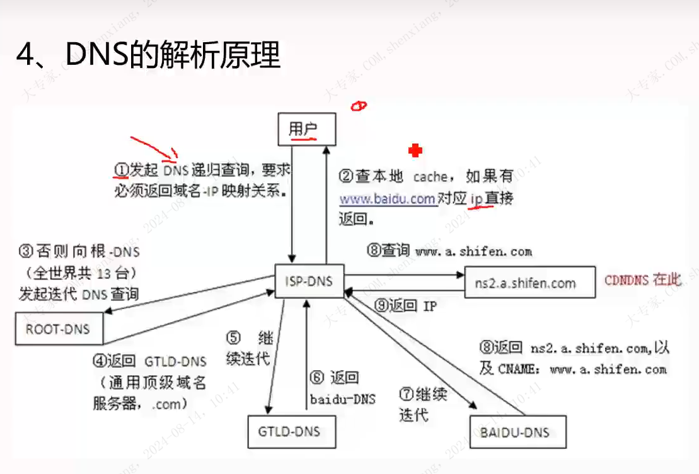
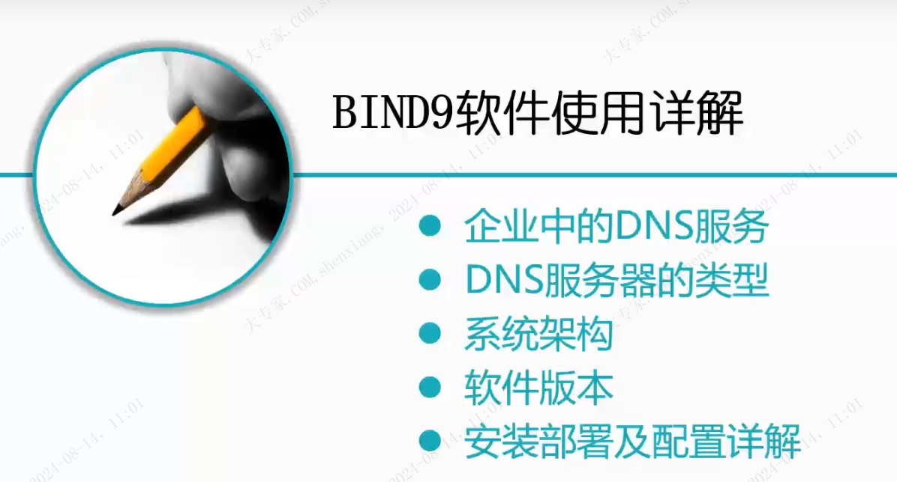
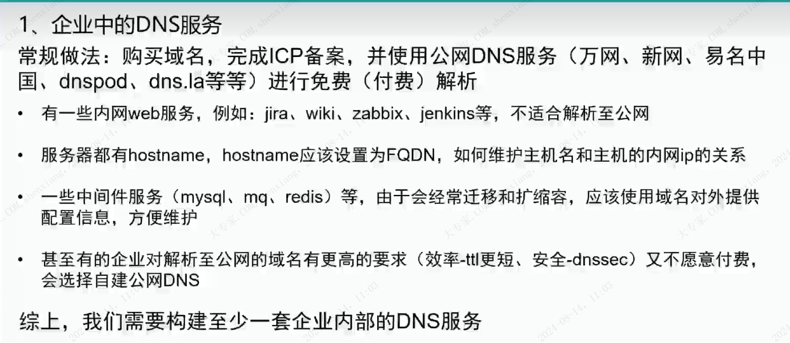

## 第一部分

### 互联网为什么要使用域名地址

### 域名结构

根(ROOT)
顶级域名（TLD）
二级域名
三级域名
四级域名

### 相关概念

根域：名字为A-M ，10组在美国，剩下三组位于，英国，瑞典，日本；

顶级域名：通用域和国家域；
         有ICANN委任的注册机构负责运行。

二级域名：需要到顶级域名的注册机构去检查待申请的名字是否可用。却不是别人的商标。
         需要缴纳年费。
域名购买：万网 

三级域名，四级域名，自己管理。

### 域名的相关规则

1. 域名与大小写无关；
2. 各部分最多63个字符，整个路径不超过255；
3. 没有规则限制不能在两个或以上顶级域名下注册，例如：sony.com ，sony.net；
4. 要创建一个新的域，需要上级域的许可，一旦创建成功，就可以创建子域名，无需再征求上级同意。  所以买到二级域名就够了。可以建立相关的三级，四级域名；
5. 域名遵循的是组织边界，不是物理网络的边界。

### DNS解析原理

递归查询： 负责返回ip与域名的映射关系；
迭代查询：只负责告诉请求方下级域名解析服务器的地址。

## 第二部分

### 企业中的DNS

关键词：ICP备案，FQDN，中间件的域名配置，自建公网DNS

### BIND9 的安装

[BIND9 的安装--视频](https://www.bilibili.com/video/BV1at4y1a7Ge?p=9&spm_id_from=pageDriver&vd_source=8fb3a82a92eebdb73fc7444aebb1a21e)

-- 剩下内容有点多，待后续看。
### 