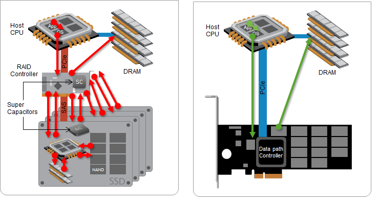

| operator | createtime | updatetime |
| ---- | ---- | ---- |
| shenx | 2025-1月-09 | 2025-1月-09  |
| ... | ... | ... |
---
# double write探究

[toc]

## 参考文章

* [MySQL性能测试 : 新的InnoDB Double Write Buffer](https://cloud.tencent.com/developer/article/1630526)
* [MariaDB · 分支特性 · FusionIO特性支持](https://www.bookstack.cn/read/aliyun-rds-core/4711d90795139c3b.md)
* [Innodb三大特性之两次写（double write)](https://blog.csdn.net/MortShi/article/details/122525895)

### 一、脏页刷盘风险

关于IO的最小单位：

1、数据库IO的最小单位是16K(MySQL默认，oracle是8K)

2、文件系统IO的最小单位是4K(也有1K的)

3、磁盘IO的最小单位是512字节

因此，存在IO写入导致page损坏的风险：  


### 二、doublewrite：两次写

提高innodb的可靠性，用来解决部分写失败(partial page write页断裂)。

1、Double write解决了什么问题

一个数据页的大小是16K，假设在把内存中的脏页写到数据库的时候，写了2K突然掉电，也就是说前2K数据是新的，后14K是旧的，那么磁盘数据库这个数据页就是不完整的，是一个坏掉的数据页。redo只能加上旧、校检完整的数据页恢复一个脏块，不能修复坏掉的数据页，所以这个数据就丢失了，可能会造成数据不一致，所以需要double write。

2、使用情景

当数据库正在从内存想磁盘写一个数据页是，数据库宕机，从而导致这个页只写了部分数据，这就是部分写失效，它会导致数据丢失。这时是无法通过重做日志恢复的，因为重做日志记录的是对页的物理修改，如果页本身已经损坏，重做日志也无能为力。

3、double write工作流程  

  
doublewrite由两部分组成，一部分为内存中的doublewrite buffer，其大小为2MB，另一部分是磁盘上共享[表空间](https://so.csdn.net/so/search?q=%E8%A1%A8%E7%A9%BA%E9%97%B4&spm=1001.2101.3001.7020)(ibdata x)中连续的128个页，即2个区(extent)，大小也是2M。

1、当一系列机制触发数据缓冲池中的脏页刷新时，并不直接写入磁盘数据文件中，而是先拷贝至内存中的doublewrite buffer中；

2、接着从两次写缓冲区分两次写入磁盘共享表空间中(连续存储，顺序写，性能很高)，每次写1MB；

3、待第二步完成后，再将doublewrite buffer中的脏页数据写入实际的各个表空间文件(离散写)；(脏页数据固化后，即进行标记对应doublewrite数据可覆盖)

4、doublewrite的崩溃恢复

如果操作系统在将页写入磁盘的过程中发生崩溃，在恢复过程中，[innodb存储引擎](https://so.csdn.net/so/search?q=innodb%E5%AD%98%E5%82%A8%E5%BC%95%E6%93%8E&spm=1001.2101.3001.7020)可以从共享表空间的doublewrite中找到该页的一个最近的副本，将其复制到表空间文件，再应用redo log，就完成了恢复过程。

因为有副本所以也不担心表空间中数据页是否损坏。

Q：为什么log write不需要doublewrite的支持？

A：因为[redolog](https://so.csdn.net/so/search?q=redolog&spm=1001.2101.3001.7020)写入的单位就是512字节，也就是磁盘IO的最小单位，所以无所谓数据损坏。

### 三、doublewrite的副作用

1、double write带来的写负载

1、double write是一个buffer, 但其实它是开在物理文件上的一个buffer, 其实也就是file, 所以它会导致系统有更多的fsync操作, 而硬盘的fsync性能是很慢的, 所以它会降低mysql的整体性能。

2、但是，doublewrite buffer写入磁盘共享表空间这个过程是连续存储，是顺序写，性能非常高，(约占写的%10)，牺牲一点写性能来保证数据页的完整还是很有必要的。

2、监控double write工作负载

```sql
mysql> show global status like '%dblwr%';
| Variable_name | Value |
| Innodb_dblwr_pages_written | 7 |
| Innodb_dblwr_writes | 3 |
```

关注点：Innodb_dblwr_pages_written / Innodb_dblwr_writes

开启doublewrite后，每次脏页刷新必须要先写doublewrite，而doublewrite存在于磁盘上的是两个连续的区，每个区由连续的页组成，一般情况下一个区最多有64个页，所以一次IO写入应该可以最多写64个页。

而根据以上系统Innodb_dblwr_pages_written与Innodb_dblwr_writes的比例来看，大概在3左右，远远还没到64(如果约等于64，那么说明系统的写压力非常大，有大量的脏页要往磁盘上写)，所以从这个角度也可以看出，系统写入压力并不高。

3、关闭double write适合的场景

1、海量DML

2、不惧怕数据损坏和丢失

3、系统写负载成为主要负载

```sql
mysql> show variables like '%double%';
| Variable_name | Value |
| innodb_doublewrite | ON |
```

作为InnoDB的一个关键特性，doublewrite功能默认是开启的，但是在上述特殊的一些场景也可以视情况关闭，来提高数据库写性能。静态参数，配置文件修改，重启数据库。

4、为什么没有把double write里面的数据写到data page里面呢？

1、double write里面的数据是连续的，如果直接写到data page里面，而data page的页又是离散的，写入会很慢。

2、double write里面的数据没有办法被及时的覆盖掉，导致double write的压力很大；短时间内可能会出现double write溢出的情况。  


### 所谓fio(FusionIO)

随着存储设备越来越快，InnoDB许多原有的设计不再适合新的高速硬件，因此MariaDB 10.1 Alpha版本针对FusionIO PCI-E SSD做出了专门的优化，充分利用了Fio的硬件特性。 MDEV-6246这个需求改造了MariaDB，以利用fio的Atomic writes和文件系统压缩特性。

为何Fio会更快呢，因为传统的存储设备读取，是左图的方式，要经过RAID控制器，来回的路径就长了。而Fio才有右图的方式，设备通过PCI槽直接与CPU交互，大大缩短了路径。

**Atomic writes**

InnoDB一直存在一个叫做Double Write Buffer的东西，目的就是为了防止页面写到一半系统崩溃，导致页面损坏，因为InnoDB的Page是16K，而一般的机械硬盘扇区是512字节，SSD大都是4K的块大小，都不能保证16K的写入是完整的。 而Fio的NVMFS文件系统则提供了原子写的保证，只要对文件句柄增加DFS_IOCTL_ATOMIC_WRITE_SET的ioctl标记位，就可以启用这个文件的原子写支持。

`ioctl(file, DFS_IOCTL_ATOMIC_WRITE_SET, &amp;atomic_option)`
MariaDB新增了一个参数来启用这个特性，一旦开启，所有文件会用DFS_IOCTL_ATOMIC_WRITE_SET标记打开。

`innodb_use_atomic_writes = 1`
**这样一来Double Write Buffer就没有存在的价值了，因为不会出现部分写，每个write下去都可以保证所写内容全部完成，这可以相当程度上提升InnoDB的性能。**

