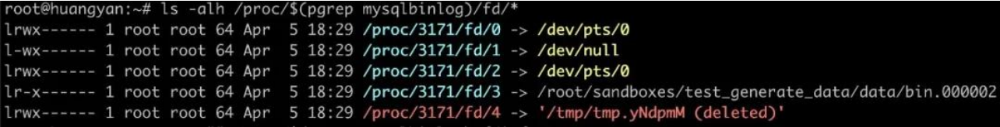
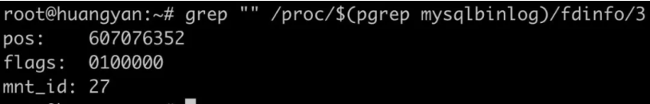

| operator | createtime | updatetime |
| ---- | ---- | ---- |
| shenx | 2024-7月-29 | 2024-7月-29  |
| ... | ... | ... |
---
# 1.10查看mysqlbinlog的解析进度 (该方法可以用来看linux 其他进程的文件读取情况)

[toc]

## 资料

[怎么查看mysqlbinlog的解析进度](https://cloud.tencent.com/developer/article/1628837) 

## 实验记录 

### 1. 产生大量的binlog

我们在实验 08 中介绍了如何生成随机数据。可以利用其中技巧生成较大的 binlog，我们忽略这个过程。

### 2. 开始mysqlbinlog的解析工作

```bash
time ~/opt/mysql/8.0.17/bin/mysqlbinlog bin.000002 >/dev/null 
```

### 3. 我们在 mysqlbinlog 解析时，查看其文件句柄

```bash

ls -alh /proc/$(pgrep mysqlbinlog)/fd/*  

```


> 可以看到 mysqlbinlog 用句柄 3 读取 binlog。（我们暂时忽略句柄 4 指向的临时文件，其涉及到了行格式的解析过程，我们安排在以后的实验中慢慢介绍）。

### 4. 获取了 mysqlbinlog 处理文件句柄 3 的进度



```bash
grep "" /proc/$(pgrep mysqlbinlog)/fdinfo/3
```

> 可以看到 mysqlbinlog 此时的进度大概是 600M 左右，整体进度估算为 54%。

## tips

> mysqlbinlog 不是真的"流式"处理 binlog，所以本实验只能是估算，大家在实验时，会观察到mysqlbinlog 读取了全部 binlog 后，会继续处理一点时间，才完成所有工作。我们以后安排实验来研究 mysqlbinlog 是如何处理 binlog 的。