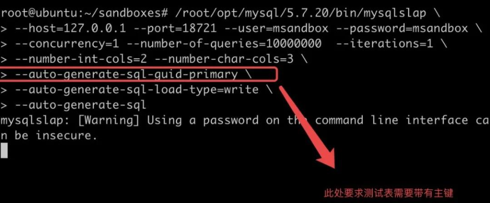
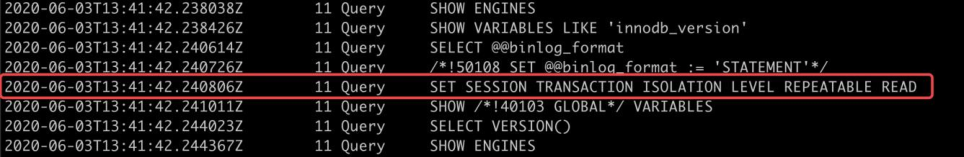

| operator | createtime | updatetime |
| ---- | ---- | ---- |
| shenx | 2024-7月-30 | 2024-7月-30  |
| ... | ... | ... |
---
# 1.13 pt-table-checksum会不会影响性能

[toc]

## 资料 

[第13问：pt-table-checksum 到底会不会影响业务性能？](https://blog.csdn.net/ActionTech/article/details/106566433)  
[MySQL性能测试工具之mysqlslap使用详解](https://www.cnblogs.com/royfans/p/7857760.html)

## 实验记录


### 启动一个主从实例

pt-table-checksum 只能在主从环境中使用

```bash

dbdeployer deploy replication 8.0.33 --nodes 2 --sandbox-directory test-pt-checksum

```


### 给数据库一个持续的压力

```bash

mysqlslap  --host=127.0.0.1 --port=22334 --user=msandbox --password=msandbox  --concurrency=1 --iterations=200 --number-of-queries=1000000 --number-int-cols=2 --number-char-cols=3 --auto-generate-sql-guid-primary --auto-generate-sql-load-type=write --auto-generate-sql

```

 

### 开启general_log

`./m -e 'set global general_log = 1'`

### 执行pt-table-checksum

```bash

pt-table-checksum --databases=mysqlslap --tables='t1'  --recursion-method=none h=127.0.0.1,u=msandbox,p=msandbox,P=22334

```

### 查看线程号以及全部的sql

```bash

# 查看进程号
cat sx-db.log | awk '{if ($2 == 11) print}'

# 查看全部的sql语句 
cat  sx-db.log | awk '{if ($2 == 121) print}'

```

### sql 分析

#### 修改lock_wait


这里工具调小了 innodb 锁等待时间。使得之后的操作，只要在 innodb 上稍微有锁等待，就会马上放弃操作，对业务影响很小。另外工具调小了 wait_timeout 时间，倒是没有特别的作用。  

#### 修改为RR



工具将隔离级别调整为了 RR 级别，事务的维护代价会比 RC 要高，不过后面我们会看到工具使用的每个事务都很小，加上之前提到 innodb 锁等待时间调到很小，对线上业务产生的成本比较小。

**RR 级别是数据对比的基本要求。** 

**每个 SQL 前都会 EXPLAIN 一下，看一下执行成本，非常小心翼翼。**

