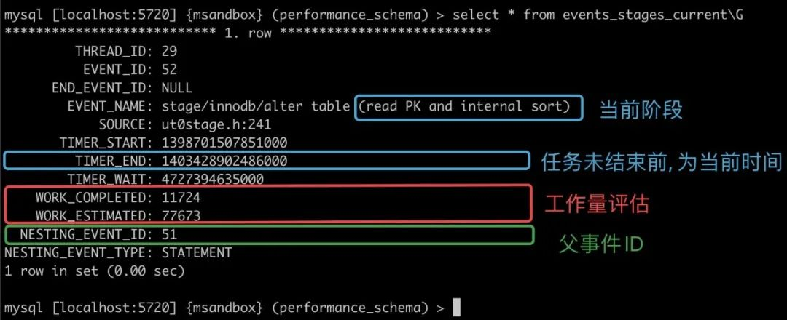

| operator | createtime | updatetime |
| ---- | ---- | ---- |
| shenx | 2024-7月-31 | 2024-7月-31  |
| ... | ... | ... |
---
# 1.17 ALTER TABLE 的进度如何评估

[toc]

## 资料  

[第17问：如何评估 alter table 的进度？](https://cloud.tencent.com/developer/article/1670819)

[Monitoring ALTER TABLE Progress ](https://dev.mysql.com/doc/refman/5.7/en/monitor-alter-table-performance-schema.html)

## 实验记录  

### 开启相关performance_schema监控项

```bash
 dbdeployer deploy single 5.7 --sandbox-directory test-alter-table-progress
-c performance_schema=ON
-c performance-schema-instrument='stage/innodb/alter%=ON'
-c performance-schema-consumer-events-stages-current=ON
-c performance-schema-consumer-events-stages-history=0N
-c performance-schema-consumer-events-stages-history-long=ON

```


### 进度查询语句

```sql

select
    stmt.SQL_TEXT as sql_text,
    concat(WORK_COMPLETED, '/' , WORK_ESTIMATED) as progress,
    (stage.TIMER_END - stmt.TIMER_START) / 1e12 as current_seconds,
    (stage.TIMER_END - stmt.TIMER_START) / 1e12 * (WORK_ESTIMATED-WORK_COMPLETED) / WORK_COMPLETED as remaining_seconds
    from events_stages_current stage, events_statements_current stmt
    where stage.THREAD_ID = stmt.THREAD_ID
      and stage.NESTING_EVENT_ID = stmt.EVENT_ID;

```
可以看到，估算的剩余时间不是完全精确，在整个过程中，进度在不停被评估。不过这种精确度对于我们也足够用了。

### 查询原理



在这张表里，MySQL 提供了如下信息：

* DDL 语句运行的当前阶段
* 当前阶段的开始时间和结束时间，当前阶段未结束时，结束时间为当前时间
* 父事件 ID，语句运行的各个阶段，会具有相同的父事件 ID
* 工作量评估，MySQL 将 DDL 的运行过程拆成一个一个任务包，这里提供了已经完成的任务包数量和估算的任务包总数量，两者的比值即为当前进度 