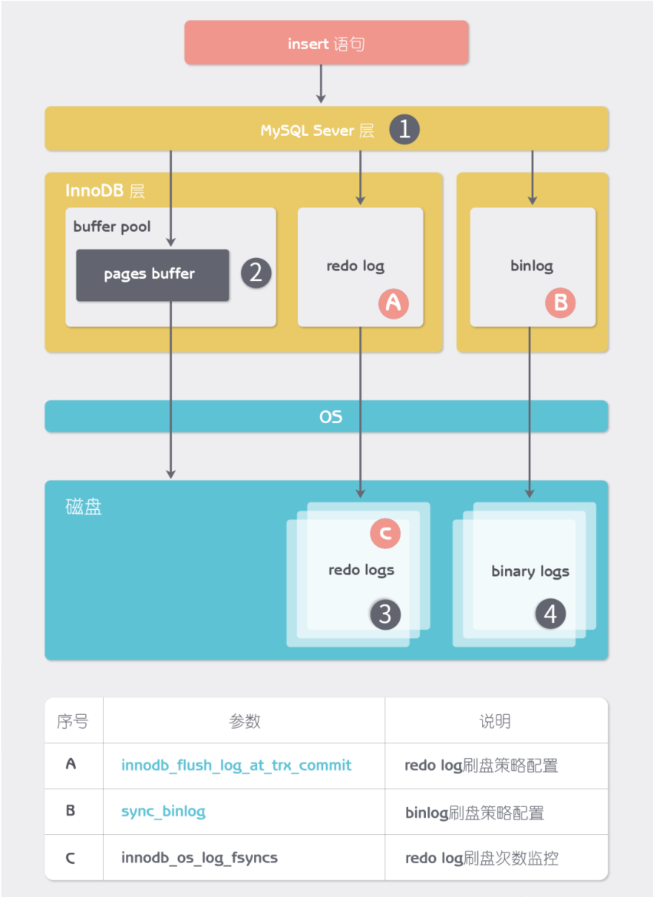
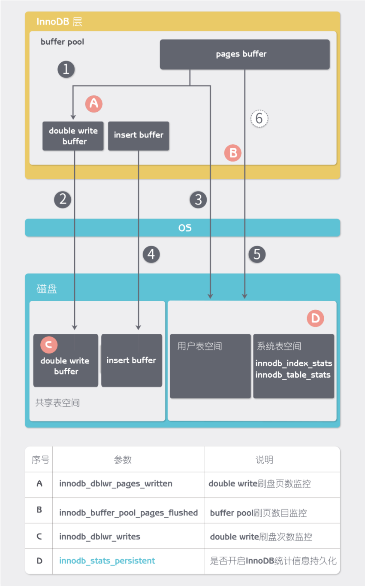

| operator | createtime | updatetime |
| ---- | ---- | ---- |
| shenx | 2024-8月-09 | 2024-8月-09  |
| ... | ... | ... |
---
# 1.27 MySQL Insert 语句的磁盘写入之旅

[toc]

## 资料

[MySQL Insert 语句的磁盘写入之旅](https://my.oschina.net/actiontechoss/blog/4477886)

## 实验记录

## tips

**commit**

**sync**

旅途过程：

1. 当 buffer pool 中的数据页达到一定量的脏页或 InnoDB 的 IO 压力较小 时，都会触发脏页的刷盘操作。
2. 当开启 double write 时，InnoDB 刷脏页时首先会复制一份刷入 double write，在这个过程中，由于double write 的页是连续的，对磁盘的写入也是顺序操作，性能消耗不大。
3. 无论是否经过 double write，脏页最终还是需要刷入表空间的数据文件。刷入完成后才能释放 buffer pool 当中的空间。
4. insert buffer 也是 buffer pool 中的一部分，当 buffer pool 空间不足需要交换出部分脏页时，有可能将 insert buffer 的数据页换出，刷入共享表空间中的 insert buffer 数据文件中。
5. 当 innodb_stats_persistent=ON 时，SQL 语句所涉及到的 InnoDB 统计信息也会被刷盘到innodb_table_stats 和 innodb_index_stats 这两张系统表中，这样就不用每次再实时计算了。
6. 有一些情况下可以不经过 double write 直接刷盘
    * 关闭 double write 
    * 不需要 double write 保障，如 drop table 等操作
汇总两张图，一条 insert 语句的所有涉及到的数据在磁盘上会依次写入 redo log，binlog，(double write，insert buffer) 共享表空间，最后在自己的用户表空间落定为安。  