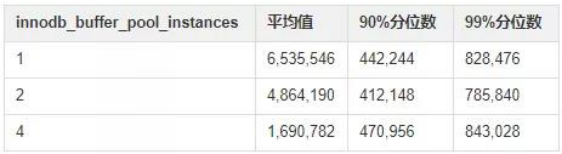

| operator | createtime | updatetime |
| ---- | ---- | ---- |
| shenx | 2024-7月-27 | 2024-7月-27  |
| ... | ... | ... |
---
# 1.7 innodb_buffer_pool_instances 是如何影响性能的

[toc]

## 资料

[第07问：innodb_buffer_pool_instances 是如何影响性能的？](https://blog.csdn.net/ActionTech/article/details/105434752)
[sysbench安装-使用](../../工具/sysbench安装-使用.md)


## 实验记录

### 1.1. 数据库创建

```bash
dbdeployer deploy single 8.0.33 -c innodb_buffer_pool_size=4g -c innodb_buffer_pool_instances=1 -c performance_schema_events_waits_history_long_size=1000000  --sandbox-directory=test_innodb_buffer_pool_instances
```

### 1.2 开启相关观察选项

```sql
-- 仅开启我们需要的
call sys.ps_setup_enable_instrument('');

call sys.ps_setup_enable_instrument('hash_table_locks');  -- 生产者

call sys.ps_setup_enable_consumer('waits'); -- 消费者

--  排除后台的进程的影响
call sys.ps_setup_disable_background_threads();

call sys.ps_setup_truncate_all_tables(false);

```

### 1.3 sysbench 安装-使用 

```bash
sysbench usr/share/sysbench/olto_read_write.lua \
--db-driver=mysql --threads=128  --time=60 \
--mysql-host=127.0.0.1 --mysql-port=8034 \
--mysql-user=msandbox --mysql-password=msandbox \
--tables=10 --table-size=5000000 \
--db-ps-mode=disable --report-interval=1 run \
run

```


### ps数据分析

```sql
-- 注意到启动sendbox 时 给定的参数 performance_schema_events_waits_history_long_size = 1000000 了吗
select distinct(event_name),count(1) from performance_schema.event_waits_history_long ;

event_name : wait/synch/sxlock/innodb/hash_table_locks 
count(1)   : 1000000

-- 平均值
select avg(timer_wait) from performance_schema.event_waits_history_long ;
-- 90%分位数
select time_wait from performance_schema.event_waits_history_long order by timer_wait desc limit 100000,1;
-- 99%分位数
select time_wait from performance_schema.event_waits_history_long order by timer_wait desc limit 100000,1;

```



可以看到如下结果：
1. 平均值都在 99% 分位数以上，意味着有极大的数据严重影响的平均值（有几次对 buffer pool 锁的获取，等待了非常久）。
2. 随着 innodb_buffer_pool_instances 增大，这种严重的影响会逐渐减小。
3. 在实验的场景中，innodb_buffer_pool_instances 的增大，对 90% 和 99% 分位数影响都不大，即不会影响到大部分 SQL 对 buffer pool 锁的获取时间。 


### 我们再来看看这些时间的单位是什么 

```sql
-- 查看时间单位
select * from performance_schema.setup_timers;

select * from performance_schema.performance_timers;

```
可以看到，1 cycle = 1/2387771144 秒。