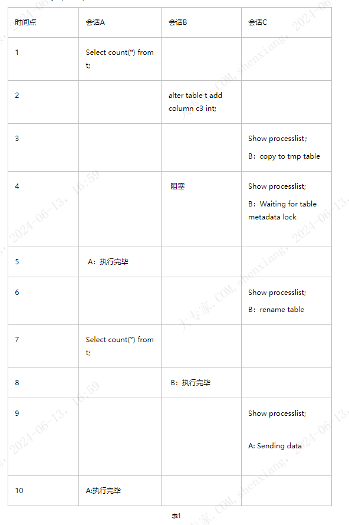
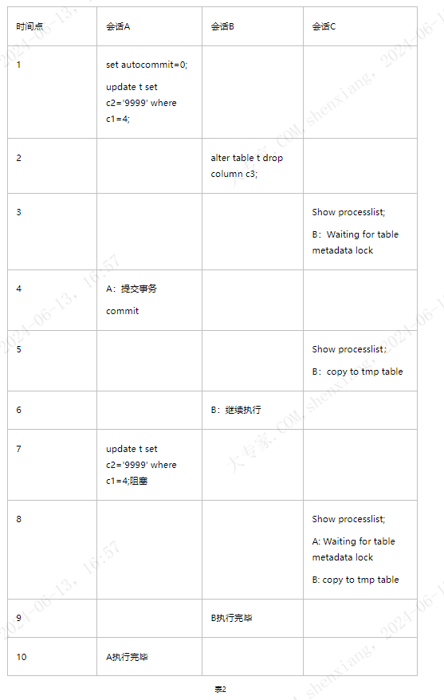
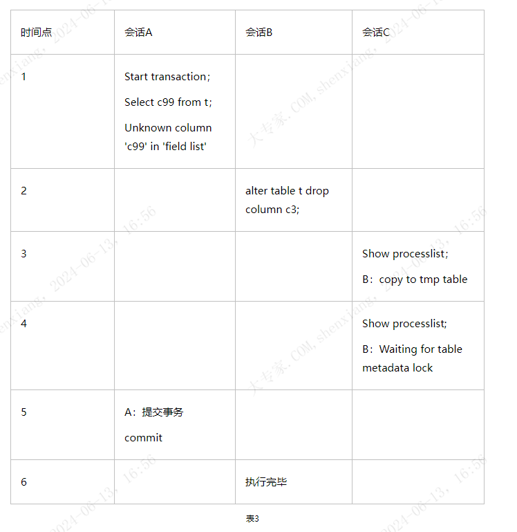
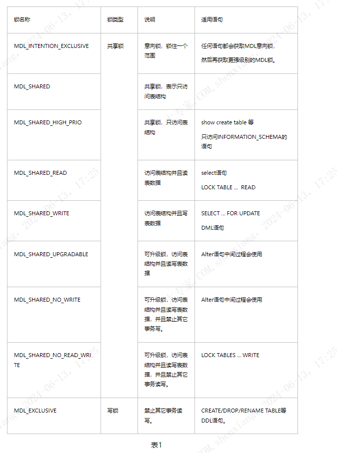

 # MDL 锁的 研究

 [toc]
  
 ## MDL 锁的典型场景 
    想必玩过mysql的人对Waiting for table metadata lock肯定不会陌生，一般都是进行alter操作时被堵住了，导致了我们在show processlist 时，看到线程的状态是在等metadata lock。本文会对mysql 的metadata lock做一个小小的总结，希望对大家有所帮助。

    MDL是在5.5才引入到mysql，之前也有类似保护元数据的机制，只是没有明确提出MDL概念而已。但是5.5之前版本(比如5.1)与5.5之后版本在保护元数据这块有一个显著的不同点是，5.1对于元数据的保护是语句级别的，5.5对于metadata的保护是事务级别的。所谓语句级别，即语句执行完成后，无论事务是否提交或回滚，其表结构可以被其他会话更新；而事务级别则是在事务结束后才释放MDL。

    引入MDL后，主要解决了2个问题，一个是事务隔离问题，比如在可重复隔离级别下，会话A在2次查询期间，会话B对表结构做了修改，两次查询结果就会不一致，无法满足可重复读的要求；另外一个是数据复制的问题，比如会话A执行了多条更新语句期间，另外一个会话B做了表结构变更并且先提交，就会导致slave在重做时，先重做alter，再重做update时就会出现复制错误的现象。

    5.5以后，什么情况下会碰到MDL锁，我结合实际情况举3个会出现MDL的场景，来分析MDL加锁时机。下文的.测试都是以mysql 5.5这个版本为基准，没有考虑到online ddl，下一篇博文会详细介绍5.6的online ddl。

### 1.大查询或mysqldump导致alter等待MDL

                                                                        

       从表1可以看到，会话A先执行select ,B后执行alter,在会话A执行完毕前，会话B拿不到MDL锁，从表格上面来看，主要阻塞在rename阶段。A会话在时间点5执行完毕后，会话B拿到MDL锁，变为rename table状态，这个操作持续时间非常短，时间点7，A会话再次执行查询，当B执行完后，此时A正常执行。这说明对于MDL锁而言，select会阻塞alter，而alter不会阻塞select。在rename的瞬间，alter是会阻塞select的，
详细请参考[《mysql metadata lock(二)》](http://www.cnblogs.com/cchust/p/4303929.html)

### 2.表上存在未提交的事务，导致alter等待MDL

    从表2可以看到，会话A第一次执行update语句后，未提交，导致后面会话B执行alter语句时需要等待MDL锁；时间点4，A会话提交事务，此时会话B获取MDL锁，开始执行；时间点7，A会话再次发起update操作，此时A会话被阻塞住，这说明对于MDL锁而言，update会阻塞alter，同样alter也会阻塞update。

PS：时间点3由于通过show processlist只看到alter被阻塞了，但不清楚被谁阻塞，可以通过查看information_schema.innodb_trx可以找到活动的事务。

### 3.这种情况是第1种情况的特例，存在一个查询失败的语句，比如查询不存在的列，语句失败返回，但是事务没有提交，此时alter仍然会被堵住。

                                                            

      这里注意时间1，会话A要显示开启一个事务，否则查询会隐式回滚结束，无法重现上面的场景。会话B执行alter后，没有立即阻塞住，而是立马开始copy to tmp table，这个过程结束后，才进行了MDL锁等待。这怎么解释呢，应该是执行alter操作主要分为创建临时新表->插入老表的数据->临时新表rename to老表三个步骤，在这种情况下，到最后一步才需要MDL锁，所以copy过程中不会阻塞。由于没有查询在进行，而且查询也没有进入innodb层 (失败返回)，所以show processlist和information_schema.innodb_trx没有可以参考的信息。

     这里有一个小疑点，对于第二种情况，alter在开始时就立马堵住了，第一种和第三种情况是copy结束后，才堵住。通过多次实验，确实发现第二种情况在opening tables就堵住了。为什么要这样具体原因还没弄清楚，有兴趣的同学可以去debug源码看看究竟。

root@chuck 11:57:41>show profile for query 4;  
+----------------------+-----------+  
| Status | Duration |  
+----------------------+-----------+  
| starting | 0.000050 |  
| checking permissions | 0.000004 |  
| checking permissions | 0.000005 |  
| init | 0.000007 |  
| Opening tables | 19.068828 |  
| System lock | 0.000011 |  
| setup | 0.000034 |  
| creating table | 0.005047 |  
| After create | 0.000056 |  
| copy to tmp table | 89.574539 |  
| rename result table | 1.101672 |  
| end | 0.000040 |  
| query end | 0.000004 |  
| closing tables | 0.000009 |  
| freeing items | 0.000021 |  
| logging slow query | 0.000002 |  
| logging slow query | 0.000090 |  
| cleaning up | 0.000004 |  
+----------------------+-----------+

## MDL锁 的原理 与互斥情况

     上一篇《[mysql metadata lock(一)](http://www.cnblogs.com/cchust/p/3826398.html)》介绍了为什么引入MDL，MDL作用以及MDL锁导致阻塞的几种典型场景，文章的最后还留下了一个小小的疑问。本文将更详细的介绍MDL，主要侧重介绍MDL的原理和实现。一般而言，商业数据库系统实现锁，一般将锁划分为读锁(共享锁)和写锁(排它锁)，为了进一步提高并发性，还会加入意向共享锁和意向排它锁。但是偏偏mysql的MDL搞地比较复杂，但目的也是为了提高并发度。MDL包含有9种类型，详细参考表1。主要其实也是两大类，只是对共享锁做了进一步细分。

一、MDL的锁类型

二、MDL的兼容性矩阵(对象维度)

说明：横向表示其它事务已经持有的锁，纵向表示事务想加的锁

三、几种典型语句的加(释放)锁流程

1.select语句操作MDL锁流程

   1）Opening tables阶段，加共享锁

       a)   加对象级别的MDL_SHARED_READ锁

  2）事务提交阶段，释放MDL锁

       a)   释放MDL_SHARED_READ锁

1. DML语句操作MDL锁流程

  1）Opening tables阶段，加共享锁

     a)   加global类型的MDL_INTENTION_EXCLUSIVE锁

     b)   加对象级别MDL_SHARED_WRITE锁

  2）事务提交阶段，释放MDL锁

    a)   释放MDL_INTENTION_EXCLUSIVE锁

    b)   释放MDL_SHARED_WRITE锁

3. alter操作MDL锁流程

  1）Opening tables阶段，加共享锁

    a)   加global类型的MDL_INTENTION_EXCLUSIVE锁

    b)   加对象级别的MDL_SHARED_UPGRADABLE锁，升级到MDL_SHARED_NO_WRITE锁

  2）操作数据，copy data，流程如下：

    a)   创建临时表tmp，重定义tmp为修改后的表结构

    b)   从原表读取数据插入到tmp表

 3）将MDL_SHARED_NO_WRITE读锁升级到MDL_EXCLUSIVE锁

    a)   删除原表，将tmp重命名为原表名

 4）事务提交阶段，释放MDL锁

   a)   释放MDL_INTENTION_EXCLUSIVE锁

   b)   释放MDL_EXCLUSIVE锁

四、典型问题分析。

一般而言，我们关注MDL锁，大部分情况都是线上出现异常了。那么出现异常后，我们如何去判断是MDL锁导致的呢。监视MDL锁主要有两种方法，一种是通过show  processlist命令，判断是否有事务处于“Waiting for table metadata lock”状态，另外就是通过mysql的profile，分析特定语句在每个阶段的耗时时间。

抛出几个问题：

1.  select 与alter是否会相互阻塞
2.  dml与alter是否会相互阻塞
3.  select与DML是否会相互阻塞

结合第三节几种语句的上锁流程，我们很容易得到这三个问题的答案。语句会在阻塞在具体某个环节，可以通过profile来验证我们的答案是否正确。

**第一个问题**: 当执行select语句时，只要select语句在获取MDL_SHARED_READ锁之前，alter没有执行到rename阶段，那么select获取MDL_SHARED_READ锁成功，后续有alter执行到rename阶段，请求MDL_EXCLUSIVE锁时，就会被阻塞。rename阶段会持有MDL_EXCLUSIVE锁，但由于这个过程时间非常短(大头都在copy数据阶段)，并且是alter的最后一个阶段，所以基本感觉不到alter会阻塞select语句。由于MDL锁在事务提交后才释放，若线上存在大查询，或者存在未提交的事务，则会出现ddl卡住的现象。这里要注意的是，ddl卡住后，若再有select查询或DML进来，都会被堵住，就会出现threadrunning飙高的情况。

**第二个问题**: alter在opening阶段会将锁升级到MDL_SHARED_NO_WRITE，rename阶段再将升级为MDL_EXCLUSIVE，由于MDL_SHARED_NO_WRITE与MDL_SHARED_WRITE互斥，所以先执行alter或先执行DML语句，都会导致语句阻塞在opening tables阶段。结合第一个和第二个问题，就可以回答《mysql metadata lock(一)》的疑问了。

**第三个问题**:显然，由于MDL_SHARED_WRITE与MDL_SHARED_READ兼容，所以它们不会因为MDL而导致等待的情况。具体例子和profile分析可以参考《[mysql metadata lock(一)](http://www.cnblogs.com/cchust/p/3826398.html)》。这里我们要考虑一个问题，LOCK TABLE ... READ上的MDL锁是MDL_SHARED_READ，而DML操作上的是MDL_SHARED_WRITE，那么前者和后者如何互斥？其实这个MDL是无能为力的，需要通过SERVER层的table lock来解，可以简单做一个实验，一个会话执行LOCK TABLE test READ，另外一个会话执行update test set xxx where id=xxx，会发现update语句堵塞，通过show processlist查看，状态为:"Waiting for table level lock"。但是如果使用LOCK TABLE test WRITE，则状态变为"Waiting for table metadata lock"，其实此时table lock也是堵住的，只不过MDL在之前挡住了，这说明SERVER层的table lock和MDL在同时起作用。

参考：

http://www.mysqlperformanceblog.com/2013/02/01/implications-of-metadata-locking-changes-in-mysql-5-5/

http://ctripmysqldba.iteye.com/blog/1938150