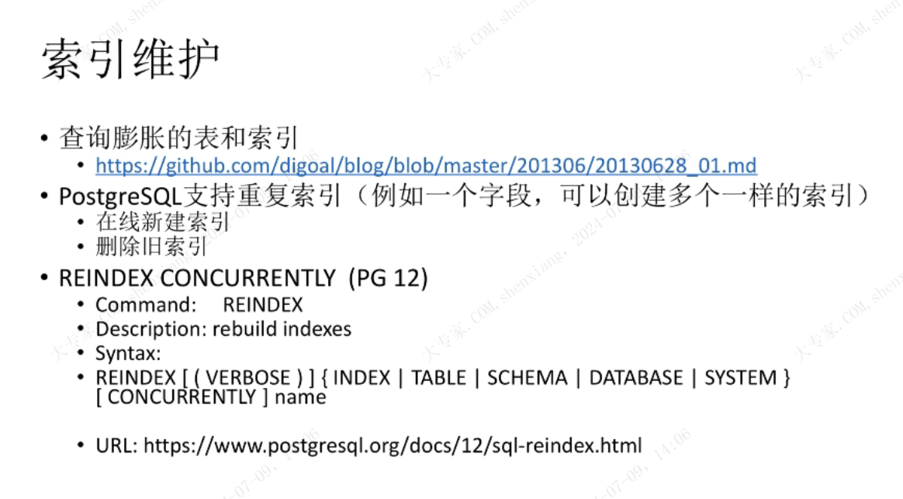
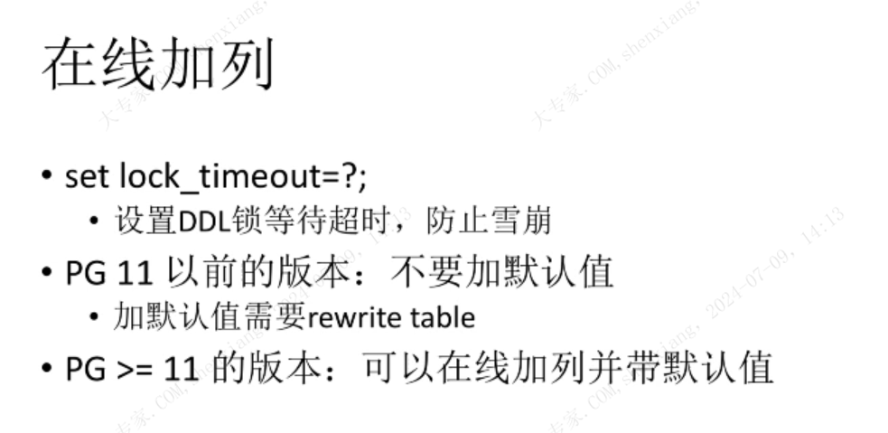
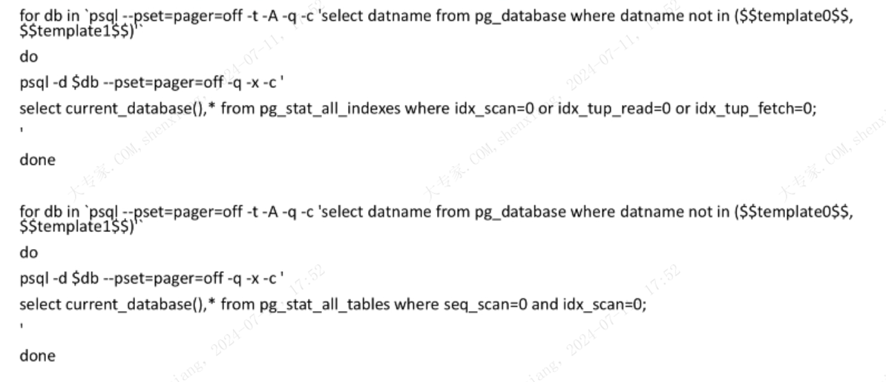
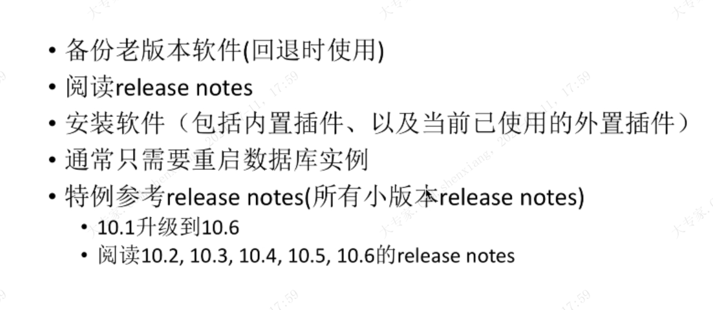
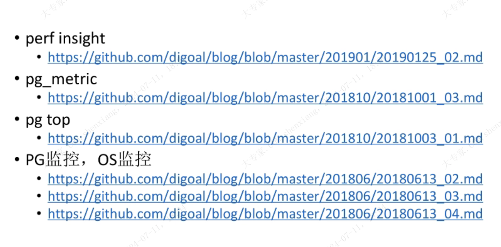
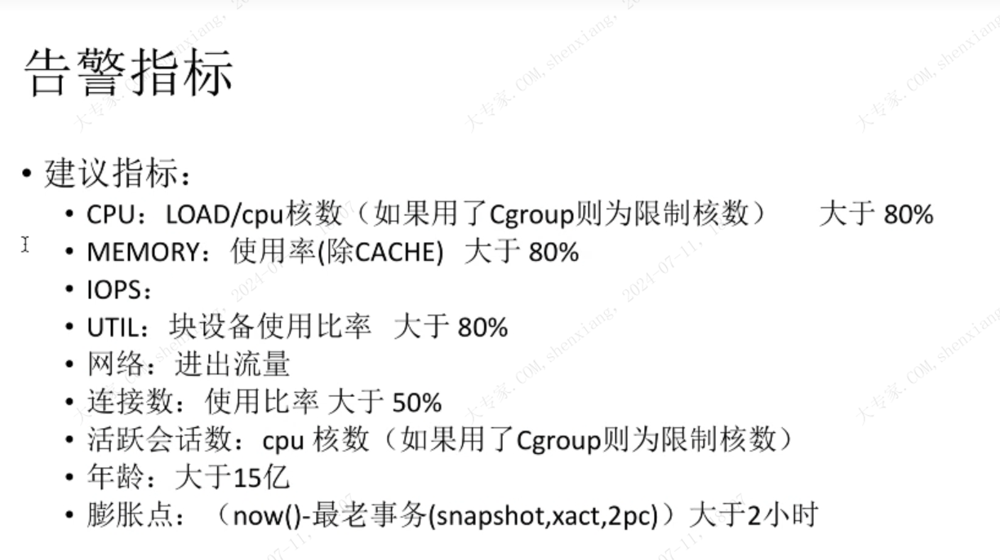
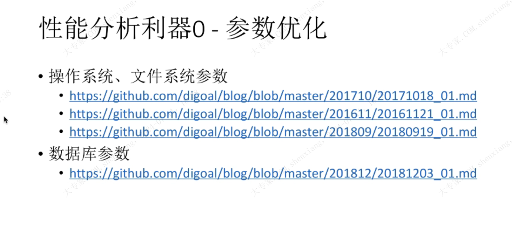
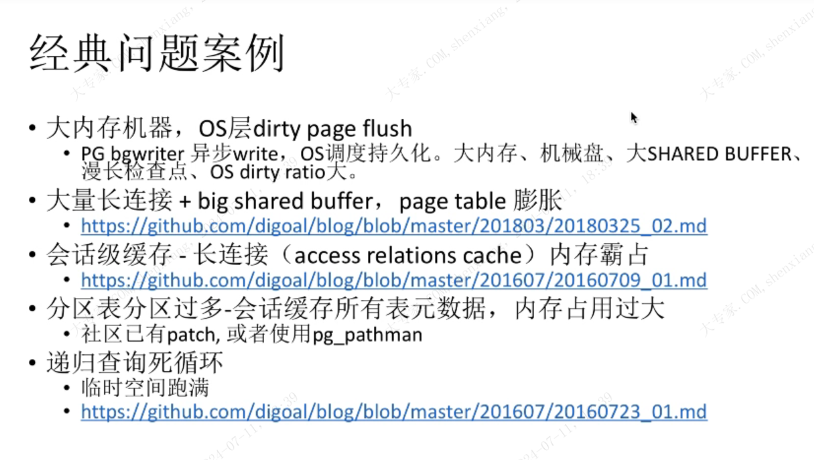
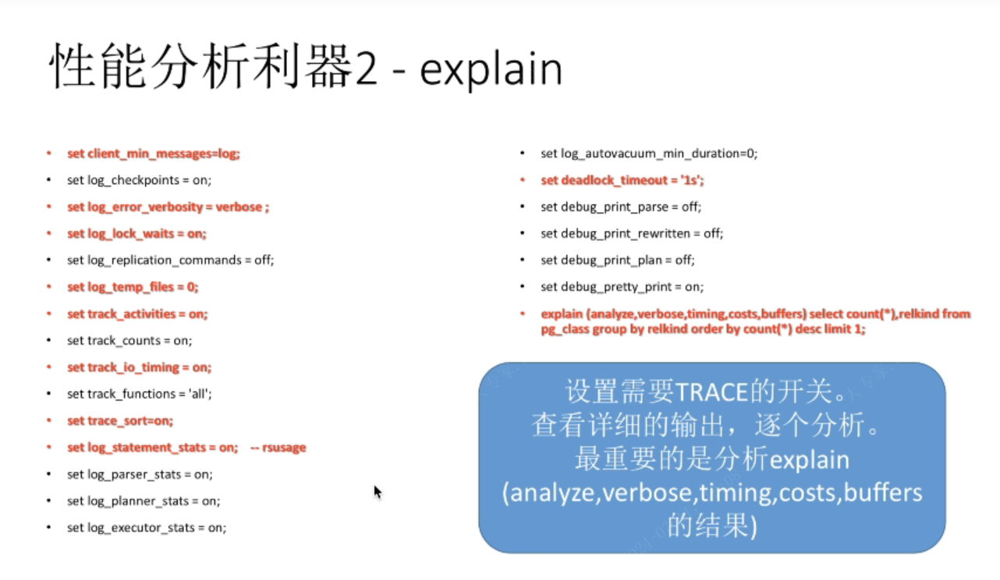

# pg学习笔记

[toc]

## 第三章 日常维护

### SQL 审计
审计参数： log_statment='none'
    # none,ddl，mod,all  ->->  审计面积变大

审计配置的级别
* 全局 postgresql.conf
* user级 : alter role ** set 
* DB级 ： alter database ** set 

[精细化审计插件](https://www.pgaudit.org/)


### 日常维护

#### 索引膨胀维护



#### 在线回收空间(从磁盘回收)
**处理方法**


#### 在线加列

1. 对于DDL的执行，一定要确认是否设置了锁超时，防止DDL导致锁一直被占有，导致雪崩。`set lock_timeout='' ;` 需要根据业务的容忍度来调整。

#### 清理wal日志

**注意redo log 的cheackpoint，停机重启，会需要redo log 提供事务完整性验证，没有的话会报错，导致不能启动**

```sql
pg_controldata
……
latest cheackpoint  REDO WAL file: ************
……
```

`pg_archivecleanup` 命令清理WAL文件

**注意replication_slots,清理掉的话，可能导致replication断掉**
查看 replication_slots

```sql
\dv *.*slot*
select * from pg_repliction_slots;
```

**注意归档时间点**
当有归档时，如果清理掉归档时间的 `latest cheackpoint` 会导致这个归档废掉。

#### 清理`$PGDATA/log` or `$PGDATA/pg_log`

`$PGDATA/log` : 审计日志存放目录  

`select pg_size_pretty(sum(size)) from pg_ls_logdir;`

### 进程维护


1. 当数据库出现连接占用过多内存(分配给当个连接的私有内存，可能会导致oom)
2. 这种情况需要清理内存

```sql
select pg_terminate_backend(pid) from pg_stat_activity where pg_stat_activity.state='idle'
```

#### 序列耗尽维护


1. cycle设置的问题

#### 日志审计
[日志分析——pgbadger](https://github.com/dalibo/pgbadger)  
[pgbadger](https://pgbadger.darold.net/)  
[官方文档](https://www.postgresql.org/docs/11/file-fdw.html)  

配置项目:
* log_checkpoint
* log_connections
* log_disconnection
* log_statment

### freeze的预测和解决

### 大表分区


[PostgreSQL 普通表在线转换为分区表 - online exchange to partition table](https://github.com/digoal/blog/blob/master/201901/20190131_01.md)

[Greenplum 计算能力估算 - 暨多大表需要分区，单个分区多大适宜](https://github.com/digoal/blog/blob/master/201803/20180328_01.md)

分区方法： pg_pathman

### 冷热分离存储


### 清理未使用对象(索引，表)
[PostgreSQL 实时健康监控 大屏 - 低频指标 - 珍藏级](https://github.com/digoal/blog/blob/master/201806/20180613_04.md)  
[PostgreSQL pg_stat_ pg_statio_ 统计信息(scan,read,fetch,hit)源码解读](https://github.com/digoal/blog/blob/master/201610/20161018_03.md)  




### 长事务清理


### 锁等待清理
[PostgreSQL 谁堵塞了谁（锁等待检测）- pg_blocking_pids, pg_safe_snapshot_blocking_pids](https://github.com/digoal/blog/blob/master/201902/20190201_02.md)  

[PostgreSQL 锁等待监控 珍藏级SQL - 谁堵塞了谁](https://github.com/digoal/blog/blob/master/201705/20170521_01.md)

### 版本升级

#### 小版本升级


#### 大版本升级


#### 详细文档


## 监控与告警
### 监控


1. perf insight
2. pg_metric
3. pg top
4. pg 监控，os 监控

### 告警




## 优化

### 系统参数，数据库参数优化




### SQL执行计划分析、优化
性能分析利器 - TOP SQL
pg_stat_statement 插件


#### EXPLAIN




1. 标红的开关最好都打开

