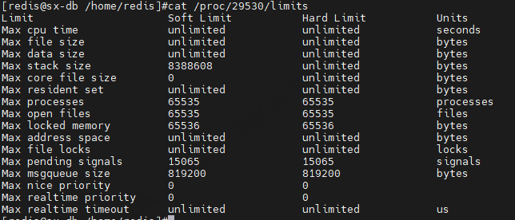

| operator | createtime | updatetime |
| ---- | ---- | ---- |
| shenx | 2024-11 月-13 | 2024-11 月-13  |
| ... | ... | ... |
---
# redis 最大连接数的问题 

[toc]

## 问题表现表现

redis 版本 6.2.11/6.2.14

服务连接redis出现错误

```bash
1 connections initialized for 172.30.126.103/172.30.126.103:6600
[TID:N/A] 2024-11-12 17:44:53.040 [INFO ] [1] --- [redisson-netty-6-15] [o.r.c.p.MasterPubSubConnectionPool.140] : 1 connections initialized for 172.30.126.103/172.30.126.103:6600
[TID:N/A] 2024-11-12 17:45:04.633 [INFO ] [1] --- [redisson-netty-6-23] [o.r.c.p.MasterPubSubConnectionPool.140] : 1 connections initialized for 172.30.126.103/172.30.126.103:6600
[TID:N/A] 2024-11-12 17:45:16.229 [INFO ] [1] --- [redisson-netty-6-10] [o.r.c.p.MasterPubSubConnectionPool.140] : 1 connections initialized for 172.30.126.103/172.30.126.103:6600
[TID:N/A] 2024-11-12 17:45:26.331 [WARN ] [1] --- [main] [o.s.b.w.s.c.AnnotationConfigServletWebServerApplicationContext.591] : Exception encountered during context initialization - cancelling refresh attempt: org.springframework.beans.factory.BeanCreationException: Error creating bean with name 'activityTaskApiImpl': Injection of resource dependencies failed; nested exception is org.springframework.beans.factory.UnsatisfiedDependencyException: Error creating bean with name 'distributedRedisLock': Unsatisfied dependency expressed through field 'redissonClient'; nested exception is org.springframework.beans.factory.BeanCreationException: Error creating bean with name 'redissonClient' defined in class path resource [com/dzj/doabf/config/RedissionConfig.class]: Bean instantiation via factory method failed; nested exception is org.springframework.beans.BeanInstantiationException: Failed to instantiate [org.redisson.api.RedissonClient]: Factory method 'redissonClient' threw exception; nested exception is org.redisson.client.RedisConnectionException: Unable to init enough connections amount! Only 1 of 24 were initialized. Redis server: 172.30.126.103/172.30.126.103:6600
```

## 问题原因

发现redis的maxclients 与预期不符合

maxclients 未设置时是有默认值的。为4064

尝试在线修改

```bash
config set maxclients 10000

(error) ERR Invalid argument '10000' for CONFIG SET 'maxclients' - The operating system is not able to handle the specified number of clients, try with 4064

```

原因：

redis 最大连接数受到/etc/seucrity/limits.conf 中最大文件数的限制

可以查看/proc/pid/limits 中关于 Max open files 的值



进过测试redis的这是值最小为4064。


## 处理

### 调整最大文件数

添加/etc/seucrity/limits.conf 总关于redis的配置

```bash
redis soft nofile 65535
redis hard nofile 65535
redis soft nproc 65535
redis hard nproc 65535
```

调整当前shell生效的值
`ulimit -n 10000`
or
关闭当前shell,重新开启shell

### 修改redis配置文件

```bash
maxclients 10000
```

### 重启redis

```bash
127.0.0.1:6000> shutdown save

/usr/local/data/redis/bin/redis-server /usr/local/data/redis/6000/conf/redis.conf
```

### 查看当前file limit

`cat /proc/pid/limits`

### 修改当前生效的redis配置

```bash
127.0.0.1:6000>config set maxclients 10000

```

### 查看是否ok

```bash
127.0.0.1:6000>config get maxclients 10000

```