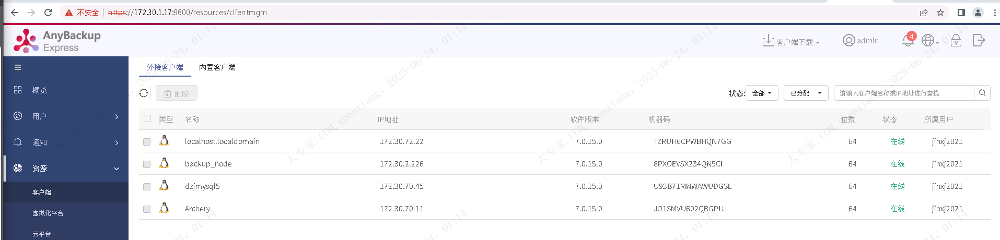

| operator | createtime | updatetime |
| ---- | ---- | ---- |
| shenx | 2025-6月-23 | 2025-6月-23  |
| ... | ... | ... |
---
# 客户端安装

[toc]

## 下载


## 安装

```bash
tar -zxvf Linux_el7_x64-latest.tar.gz -C /app/

cd /app/AnyBackupClient/ClientService/

./install.sh

Do you agree that we will get privacy on the operating system?y(yes)/n(no):  
y
Do you wish to continue?y(yes)/n(no):  
y
Please Input Self IP Address:
172.30.70.45
Please Input Server IP Address:
172.30.1.17
Please choose the setup Language:
   [ (1)Chinese   |   (2)English ]
1
Do you want to enable SSL? y/n: 
n
Are you sure to install now? y(yes)/n(no):
y

```

## 分配用户

admin 用户

