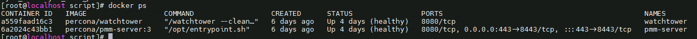
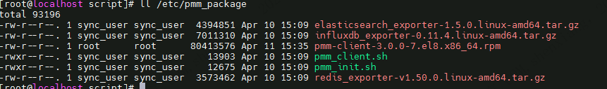

| operator | createtime | updatetime |
| -------- | ---------- | ---------- |
| shenx    | 2025-4月-09 | 2025-4月-09 |

---
# pmm 服务器搭建以及数迁移.md

[toc]

## 环境

[PMM-doc](https://docs.percona.com/percona-monitoring-and-management/3/?utm_source=pmm&utm_medium=pmm_app&utm_campaign=pmm_app_links)

原IDC环境版本：
ip： 172.30.2.208   
port：443  
version： 2.36.0  
部署方式docker-compose,**外部自部署的postgresql**  

cat /usr/local/data/pmm-server/docker-compose.yaml  
```bash
version: '3'

services:
  pmm-managed-server:
    image: percona/pmm-server:2.36.0
    container_name: pmm-managed-server
    hostname: pmm-managed-server
    restart: always
    ports:
      - 443:443
    volumes:
      - ./data/data/:/srv/
      - ./data/script/:/opt/script
    command:
      - /opt/script/init.sh
```

迁移相关操作参见  
[监控搭建以及迁移配置信息-未写完，此方案已经弃用](监控搭建以及迁移配置信息--方案未完已弃用.md)  
由于发生了grafan api_key无效,导致grafana cpu占用异常的问题，官方将以升级到3.0,所以有了这篇文档。以下为航天云安装的3.0版本。

航天云：
ip: 10.159.65.151  
port： 443  
version: 3.0  
部署方式percona官方部署脚本  


## 安装过程

--- 

### docker

--- 

[docker最新版本安装](../../脚本与程序开发/脚本/docker-install.sh)

[docker](<../../docker/docker 配置文件.md>)

### docker-container创建

--- 
```bash
curl -fsSL https://www.percona.com/get/pmm  > pmm-install.sh

# 网络原因 无法直接执行，可以手工下载镜像
# docker pull percona/pmm-server
# /usr/local/data/pmm-install.sh
/bin/bash /usr/local/data/pmm-install.sh

```
安装完成后会启动两个容器  



### rsync 安装

[rsync linux 安装](<../../linux/各种环境/rsync linux 安装.md>)


相关配置  
**/etc/rsyncd.conf**

```bash
uid = root
gid = root
use chroot = no
max connections = 4
strict modes = yes
port = 873
pid file = /var/run/rsyncd.pid
lock file = /var/run/rsync.lock
log file = /var/log/rsyncd.log

[pmm-package]
path = /etc/pmm_package
auth users = sync_user
uid = root
gid = root
secrets file = /etc/rsyncd.passwd
read only = yes
```

**/etc/rsyncd.passwd**

```bash
sync_user:sync_user_pwd
```

**服务端rsync path下安装包**


-----
 
### PMM客户端安装

[pmm_agent_manage](../../脚本与程序开发/脚本/pmm_agent_manage)  
脚本与程序开发/脚本/pmm_agent_manage

```bash
cd /usr/local/data/pmm_agent_manage
# 依赖安装
/usr/local/bin/python3.8 -m pip install --upgrade pip
pip3 install -r requirements.txt

export PYTHONPATH=./

python3 pmm_agent_manage.py --help 

# 拉取备份pmm 客户端安装包和exporter
python3 pmm_agent_manage.py --operation init

# 安装
python3 pmm_agent_manage.py --operation  install
```

**rename_node** 与 **rename_servive**

修改配置文件中的：  
env_name = 'DZJ-IDC-CLUSTER-test';   说明：DZJ_[环境名(IDC|HTY)]_seriver_name
[service_name]_user='';  
[service_name]_pass='';

default_port 中对应服务的端口,非'mysql', 'proxysql','postgresql'，'mongodb'需要提供exporter的端口

```txt
-------------------------------

REDIS


CLUSTER_NAME DZJ-HTY-PROD_REDIS
node_rename NODE-HTY-PROD_REDIS1
redis-rename SERVICE-HTY-PROD_REDIS1

node_rename NODE-HTY-PROD_REDIS2
redis-rename SERVICE-HTY-PROD_REDIS2

node_rename NODE-HTY-PROD_REDIS_SENTINEL3
redis-rename SERVICE-HTY-PROD_REDIS_SENTINEL3


CLUSTER_NAME DZJ-HTY-ALGORITHM_REDIS
redis-rename SERVICE-HTY-ALGORITHM_REDIS1
redis-rename SERVICE-HTY-ALGORITHM_REDIS2


--------------------------------

MYSQL 

CLUSTER_NAME DZJ-HTY-PROD_MYSQL
node_rename NODE-HTY-PROD_MYSQL1
redis-rename SERVICE-HTY-PROD_MYSQL1

node_rename NODE-HTY-PROD_MYSQL2
redis-rename SERVICE-HTY-PROD_MYSQL2

node_rename NODE-HTY-PROD_MYSQL3
redis-rename SERVICE-HTY-PROD_MYSQL3

node_rename NODE-HTY-PROD_MYSQL4
redis-rename SERVICE-HTY-PROD_MYSQL4

node_rename NODE-HTY-PROD_MYSQL5
redis-rename SERVICE-HTY-PROD_MYSQL5


CLUSTER_NAME DZJ-HTY-ALGORITHM_MYSQL

node_rename NODE-HTY-ALGORITHM_MYSQL1
redis-rename SERVICE-HTY-ALGORITHM_MYSQL1


node_rename NODE-HTY-ALGORITHM_MYSQL2
redis-rename SERVICE-HTY-ALGORITHM_MYSQL2

----------------------------------
PROXYSQL

CLUSTER_NAME DZJ-HTY-PROD_PROXYSQL
node_rename NODE-HTY-PROD_PROXYSQL1
redis-rename SERVICE-HTY-PROD_PROXYSQL1

node_rename NODE-HTY-PROD_PROXYSQL2
redis-rename SERVICE-HTY-PROD_PROXYSQL2

node_rename NODE-HTY-PROD_PROXYSQL3
redis-rename SERVICE-HTY-PROD_PROXYSQL3


----------------------------------

ELASTICSEARCH

CLUSTER_NAME DZJ-HTY-PROD_ELASTICSEARCH
node_rename NODE-HTY-PROD_ELASTICSEARCH1
redis-rename SERVICE-HTY-PROD_ELASTICSEARCH1
NODE-IDC-PROD_ELASTICSEARCH1
SERVICE-IDC-PROD_ELASTICSEARCH1


node_rename NODE-HTY-PROD_ELASTICSEARCH2
redis-rename SERVICE-HTY-PROD_ELASTICSEARCH2

NODE-IDC-PROD_ELASTICSEARCH2
SERVICE-IDC-PROD_ELASTICSEARCH2

node_rename NODE-HTY-PROD_ELASTICSEARCH3
redis-rename SERVICE-HTY-PROD_ELASTICSEARCH3

NODE-IDC-PROD_ELASTICSEARCH3
SERVICE-IDC-PROD_ELASTICSEARCH3


----------------------------------

INFLUXDB

CLUSTER_NAME DZJ-HTY-PROD_INFLUXDB
node_rename NODE-HTY-PROD_INFLUXDB
redis-rename SERVICE-HTY-PROD_INFLUXDB


---------------------------------

NEO4J

CLUSTER_NAME DZJ-HTY-PROD_NEO4J
node_rename NODE-HTY-PROD_NEO4J
redis-rename SERVICE-HTY-PROD_NEO4J


---------------------------------


ORIENTDB


CLUSTER_NAME DZJ-HTY-PROD_ORIENTDB
node_rename NODE-HTY-PROD_ORIENTDB1
redis-rename SERVICE-HTY-PROD_NORIENTDB1


node_rename NODE-HTY-PROD_ORIENTDB2
redis-rename SERVICE-HTY-PROD_NORIENTDB2


node_rename NODE-HTY-PROD_ORIENTDB3
redis-rename SERVICE-HTY-PROD_NORIENTDB3
```

---

### 特例 10.159.65.123,10.159.65.124

10.159.65.123,10.159.65.124 这两台服务器存在不只有一个服务redis服务，第一个redis服务可以通过脚本启动，第二个请手动拉起来

```bash
/usr/local/data/pmm/exporter//redis_exporter/redis_exporter/redis_exporter -redis.addr 127.0.0.1:6100 -redis.password [passwd] -web.listen-address 127.0.0.1:9121

/usr/local/data/pmm/exporter//redis_exporter/redis_exporter/redis_exporter -redis.addr 127.0.0.1:6100 -redis.password [passwd] -web.listen-address 127.0.0.1:9121


pmm-admin add external --service-name=Redis-10.159.65.123-6000 --listen-port=9121 --cluster=DZJ-HTY-ALGORITHM_REDIS-Redis --environment=DZJ-HTY-ALGORITHM_REDIS  --metrics-path=/metrics --custom-labels=node_type=Redis,rename_service_name=SERVICE-HTY-ALGORITHM_REDIS1

pmm-admin add external --service-name=Redis-10.159.65.124-6000 --listen-port=9121 --cluster=DZJ-HTY-ALGORITHM_REDIS-Redis --environment=DZJ-HTY-ALGORITHM_REDIS  --metrics-path=/metrics --custom-labels=node_type=Redis,rename_service_name=SERVICE-HTY-ALGORITHM_REDIS2

```