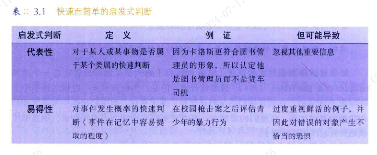
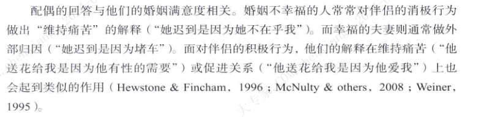
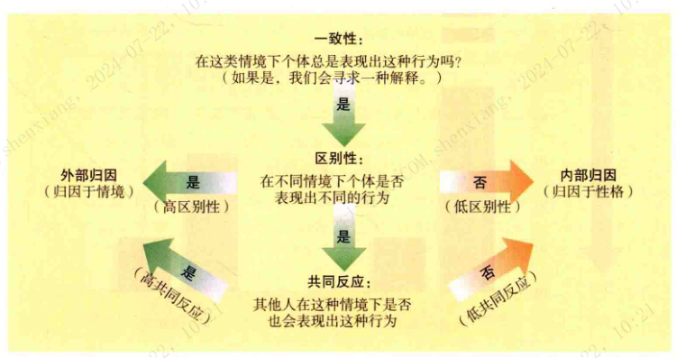

| operator | createtime | updatetime |
| ---- | ---- | ---- |
| shenx | 2024-6月-18 | 2024-6月-18  |
| ... | ... | ... |
---
# 社会心理学

[toc]

## 第一章：导论

### 我们构建起社会现实

> 我们人类总是有一种不可抑制的冲动，想要解释行为，对其归因，以使其变得次序井然．具有可预见性，使一切尽在掌握之中。你我对于类似的情境却可能表现出截然不同的反应，这是因为我们的想法不同。

> 我们对自己的信念也同样重要。我们是否对自己的前途抱有乐观的态度?我们是否认为一切尽在自己的掌握之中?我们把自己看得高人一等还是矮人一头?我们如何构建这个世界、如何构建我们自己是极其重要的。

想法: 强大的内心，与自己和解。既不高看自己，也不自怨自艾。

> 心理学作为一门科学，它揭示了一个令人惊叹的无意识心灵——一个由直觉在幕后操纵着的心灵

> 思维、记忆和态度都是同时在两个水平上运行的：一个是有意识和有意图的另一个是无意识和自动的。今天的学者把它称为“**双重加工**”。我们的所知比我们知道自己所知的还要多。

> 在多数情境中，“快捷省力”的速食型判断方式足以适应我们的需要。但在另一些情境中，当准确性变得很重要时——正如当我们需要适时地表现出恐惧．合理使用我们的资源时——我们最好用批判性的思维来抑制直觉冲动

### 社会影响塑造行为

聚焦: 我早就知道了

后见之明：
有时候我们会对自己过分苛责，我们忘记了事情在当时并非是那么的显而易见。

观点之多入大海浩瀚，无论我们发现了什么，总有人对此预见。

我们免不了误以为，我们现在和过去所知道的，比我们现在和过去已经做的要多。

帮我们区分真实与幻想，真正的预测和简单的后见之明。

## 第二章：社会中的自我

对于人类来说，没有比人更有趣的话题了。再者对大多数人来说，最有趣的人正是他们自己  -- 《社会心理学中的自我》

焦点效应 ： 我们很在意自己被别人留下了什么印象，我们倾向与认为别人给与我的关注比实际要多。

透明度错觉 : 我们也倾向与认为我们的情绪总是比实际表现的更明显。

### 社会自我的发展
不要做任何比较 -- 查尔斯一世

实际上我们基本无法做到，到时应该意识到，我么就是我们自己，我们不需要与别人比较来产生价值。只应该与自己比较，只要确信我们走在正确的道路上，我们就会充满力量。当然如果我们现在的状态斌不然自己满意就尽量让自己变得更好吗，但是不要过分苛责自己。。。身份是自己给的。

**他人的评价**

我们一他人的评价作为镜子来认识我们自己。  -- 我希望我能强大到不在依赖别人的评价来认识自己。

与我们的自我概念有关的不是别人如何评价我们而是我们

自我与文化关系：
西方人更自在的赞美个人，东方文化相对更难。我很少赞美别人，这要改，这其实也是我过度的自尊心。
集体主义催生了相互依存的自我，在我们东亚的文化中，人们往往自我批评，很少自我肯定  -- 做的好的事不应该是理所当然，做的不好的事也不应该过分苛责，不要后知之明。

西方
保守主义 往往 倾向于 经济上的个人主义（减税），道德上的集体主义(加强法律约束犯罪) 
自由主义 往往 倾向于 经济上的集体主义（医保），道德上的个人主义(放松法律约束，自由感)

**个人主义在文化中的滋长**，文化随时间变化，许多文化在走向个人主义 -- 20世纪的中国，集体温馨的农村的解体，城市导出是冷漠缺少温情。

文化与认知

与个人主义文化不同。在相互依赖型的文化中社会生活的目标不仅仅是提升个体自我或者独立做出选择，而是协调并支持所处的群体。

毫无疑问，我的自我是更偏向依赖自我的。

**解释我们的行为**

事实上，我并不知道我为何如此悲伤。 -- 莎士比亚《薇威尼斯商人》

与我们的生活的世界相比，我们对自己头脑中的世界视乎了解的更少。

**预测我们的行为**

人们在预测他们的行为时同样也会犯错，事实上，他人的预测反而更加准确。

规划谬误：低估我们完成一项任务的时间。

知人者智，自知者明  -- 老子

**预测我们的感受**

当一种感觉存在的时候，他们感到它好像永远不会走；当它消失以后，他们感到它好像从未有过；当它回来的时候，他们感到它好像从未消失。  -- 乔治.麦克唐纳

到时是什么让我们快乐：
我们想要，我们得到，我们快乐。   然而事实并不尽然如此。 -- 我们常常高估情绪事件的持久影响，好消息带来的情绪痕迹消失的比预想中要快的多。

**影响偏差**是重要的，如果高估了快乐的强度和持续时间，那么就可能做出轻率的决定。

因为关注消极事件，人们会忽视其他所有事件对快乐的贡献。所以就会过高地预期自己的痛苦。

你说关注的事不会带来你锁以为的那么大的改变。

免疫忽视现象 : 我们是有恢复力的。
相比轻微的消极事件（不能激活我们的防御机制），重大的消极事件（触发了我们的心理防御机制）所引发的痛苦持续时间反而更短。

**自我分析的智慧与错觉**

我们对大多数心理事件都没有察觉，我们对思维的结果比对思维的过程知道的多。

**控制我们社会行为的心理过程与解释我们社会行为的心理过程显然不同。** 我们的理性解释可能因此忽略了实际上指引我们行为的内在态度。

我们常常是自己的陌生人，我们在意的因素往往没有我们预想中的那么重要，我们也往往并不那么真的在意。

双重态度系统： 我们关于人或事的自动的内隐态度通常与受意识控制的外显态度不同。

尽管可能外显态度改变起来相对容易一些，，内因态度就像老习惯一样，改变起来非常缓慢。然而通过重复练习来形成新的态度，新的习惯就能够代替就的态度。

认识到自我认知的局限性有两种价值 ：   
> 第一是对于心理调查来说，自我报告常常是靠不住的，自我理解中的错误限制了主观报告的科学性。  -- 对于自己的自我理解
> 其次，在我们的日常生活中，人民报告和解释其经验的真实性无法保证这些报告的有效性。-- 对于他人的自我阐述应有的认知态度  
> 牢记这种潜在的错误，可以帮助我们较少的产生收人胁迫和被骗之感。

小结：
自我包括的两种元素 ： 
1. 自我图式：指导我们对与自我相关的信息进行特殊加工  
2. 可能自我：我们梦想或害怕成为的自我

文化对自我的塑造
独立的自我 与 依赖的自我

自我认识存在缺陷：
1. 我们常常不知道自己为什么如此行动。
2. 当他人无法发现我们行为的有力影响时，我们也会忽视它。
3. 控制行为的内部微妙过程可能与我们对它有意识的，清楚的解释不同。
4. 我们往往会错误的预测自己的情绪。 -- 缺少做出判断的场景，也无法预估当时哪一个角度才会在我们的脑海中占据最有利的位置，被我们高估它的重要性。
5. 我们会低估心理免疫系统的力量，并因此倾向与高估我们对重大事件的情绪反应。

## 自尊的实质与其动机力量
给与称赞： 给与具体的称赞；反应真实的情况的称赞，而不是盲目乐观主义。

### 自尊动机
社会拒绝 会降低我们的自尊。
并不是每个人都能认识到其存在的真正的价值，认识到真正的自尊永远无法完全是无条件的。   -- 你因为是你而特别。

### 自尊的阴暗面：
**自恋: 当自尊变成了自负**

经过这么些年，很抱歉我的建议是：忘掉自尊，把更多的精力集中到自我控制和自律上。

我们可能会以为一个自大的同学仅仅是为了掩盖他的不安全感，但更有可能的是。他们内心就认为自己极好。

**自恋人数在增加**

安全型自尊的人：
不是因为外在，而是因为自己的内在特质而感觉良好的人

对自我形象少关注一些，多注意开发自己的才能和发展人际关系，才会为你带来更大的幸福感。
自我同情： 即不予他人比较，而是善待自己  -- 真正的卓越并非超越他人，而是超越以前的自己。

### "知觉到自我控制"的意义

努力控制自我会耗尽我们有限的意志力。尽管自我的力量可以被耗尽，但是自我概念确实会影响我们的行为。 多想象一些积极的可能性，会让你更有可能制定和实施一个成功的策略。

#### 自我效能
自我效能理论：  
-- 对自己能力与效率的乐观信念可以获得很大的回报。  

自我效能与自尊   
自我效能： 相信有做事的能力；  
自尊：由衷的喜欢自己； -- 我现在还不确定的喜欢着自己，仍有缺憾。但是不是单单是因为我造成的，我真的没有办法接受不平等的两性关系，也无法接受不真诚的自己。  如果不行单着也不失为一种选择。

如果你想鼓励他人，那就提升他们的自我能效而不是他们的自尊。

#### 控制点
内部控制点 还是 外部控制点

内部控制点：倾向于认为自己的命运是由自己控制的。
外部控制点：可能会认为机会和外部力量决定了你的命运。

他们行是因为他们认为自己行。
很显然，积极思考的力量存在着局限。

#### 习得性无助与自我决定
**抑郁的或压抑的人变得被动，是因为他们认为自己的努力没有任何作用。无助的狗和抑郁的人都丧失了意志，变的被动顺从，甚至死气沉沉。**

我们可以训练自己的自我控制力： 坚持锻炼计划或减少冲动购物行为等等来锻炼自我控制。

强调选择的机会，往往能让人更加有自控能力 -- 促进个人控制的系统确实能增强个体的健康和幸福。

#### 过多选择的代价

过度的自由，反而导致人们生活的满意度下降。 
-- 更多的选择或导致信息过载，也会带来更多的后悔机会。

自我效能感:由社会说服（你拥有通往成功的一切）和自我说服（我认为我能）来支持。

榜样 -- 看到其他类似的努力获得成功的例子同样能获得自我效能感。但自我效能主要来自对成功的体验。

**自我服务偏差**
自我服务偏差：个体请倾向于以有利于自身的方式来进行自我知觉。

自我服务归因：把好的结果归因与自己，把坏的结果归因于其他。

**盲目乐观**

大多数人对事务的看法偏乐观。

悲观主义思维和乐观注意思维都具有力量。既需要乐观精神来支撑希望，同样也需要足够的悲观思维

**虚假的普遍性和独特性**

虚假的普遍性：我们看到的并非世界本身，而是我们自己的影子。
在观点方面，我们会高估别人与我们的一致性，我们也更喜欢跟我们相似的人。

虚假的独特性：
在能力方面，我们往往把自己的才智和品德看的超乎寻常，以此来完善自我形象。

总结
自我服务的归因，自我恭维的比较，盲目的乐观，以及自身失败的虚假普遍性，所有的这些倾向都是**自我服务偏差**的表现。

*--头脑是心脏的延伸。*

**自我服务偏差的适应性**

1.影响我们的自尊，表现为更高的自尊。
2.更强的情绪复原能力。
3.对自己的积极信念激发我们的努力（自我实现预言），并在困境中保持希望

**自我服务偏差的不良适应**
1.错误的归因，往往导致不快乐的情绪，因为没有认识到自己在其中的责任。
2.更难构建良好的团队关系，往往高度自己对成功的贡献，低估自己的对失败所负的

-- 胜利总能轻而易举的找到上百个老爸，而失败却总是孤儿。

-- 别人的过错在我们的眼前，而我们自己的过错却在背后。

**虚伪的谦逊**
虚伪的谦卑其实是为了掩饰内心认为自己真的比别人优秀的想法。（越这么说，却越在心理觉得自己优秀）。 真正的谦卑，与其说是虚伪谦逊，  
反而更像是不太在意自己。它一方面让人为自己的专长而欣喜，另一方面而实事求是的认可他人专长。

## 自我表露的管理

### 自我妨碍
人们通过设置障碍来阻挠自己的成功。这种行为绝不是一种故意破坏，而恰恰是为了达到自我保护的目的。

如果我们在重重障碍下失败了，我们仍然可以维持对自己的能力的信任。如果我们成功了，那正好可以提升我们的自我形象。

### 印象管理
自我服务偏差，虚伪的谦逊和自我妨碍 都揭示出个体十分在意自我形象。在不同程度上，我们是种在管理自己给他人留下的印象。

作为一种社会性动物，我们总是在想周围的观众表演。我们渴望被社会接纳，这种渴望如此强烈，甚至可能让们我不惜伤害自己。

### 自我表露
当失败可能会使人们看起来很糟糕时，人们就会采取自我妨碍的方式。

### 自我监控
“我总是倾向于成为人们希望中的样子”。  -- 人们也包括自己吧，不要给自己提不切实际的要求。

由于总是意识到他人的存在，所以他们很少会依据自己的态度行动。  
在自我监控上得分较高的人更少致力于器人际关系。

低自我监控的人往往更多的受其内在的指引，更多的按照自己的感觉和信念来说话做事。

-- 我真的有点拧巴啊。

### **总结**
生活中最了不起的成就，和最让人沮丧的挫折，都来自对自己的高标准的预期。

## 第三章 社会信念和判断

### 社会世界的感知

目不可信，心不足恃。

我们并非如实的对现实做出反应，而是根据我们对现实的构建做出反应。

#### 启动
我们对社会中很多信息的加工是自动的，无目的的，不为肉眼所见，而且发生在我们意识之外。

**具身认知**，身体的温暖会强化社会温暖，社会排斥会让人感觉寒冷。

#### 感知和解释事件
一旦你形成了某种信念，它就会影响你对其他所有相关信息的知觉。你就倾向于将其模棱两可的行为诠释为表示敌意的。 -- Robert.Jervis

我们眼里的错误引导着我们的心灵，错误导致的也必定是谬误。 -- 莎士比亚

他人对我们的知觉 解释的过程也会影响他人对我们的认知。  
自发性特质转移：当我们说默认的好话和坏话时，人们会试图将这些特质和我们联系在一起。

##### 信念固着
它证明了信念可以独立存在，而且当支持它的证据被否定时仍会存活。

假设我是一个持有相反观点的人，我是否会能根据事实得出这个想法的观点呢。。

##### 构建我们自己和我们世界的记忆

记忆与读书不同，它更像根据不连贯的笔记片段写一本书。。

误导信息效应 

人不为曾经犯错而羞愧，换句话说，则表示他比从前更聪明了。

毛毛虫在化茧成蝶之后会认为自己小时候是小蝴蝶，成长和成熟把我们变成说谎的人。

**重构我们过去的行为**

在记忆中，事情有必要按照期望的方式发生。

我现在可能是不完美的，但是我在之前更加糟糕，而且这些努力使我受益。  -- 可能我们的改变并没有那么多，但是我们倾向于肯定自己的努力

### 社会世界的判断

#### 直觉判断
我们大脑所知道的比它告诉我们的要多的多。

##### 直觉判断的局限
错觉: 我们还不知道为什么会产生错觉，是什么制造了错觉。。。**但是并不能认为一切直觉产生的信念都是错觉**。。

#### 过度自信
智者十分了解自己的弱点，因此绝不会保证不会出错;那些懂得最多的人也最清楚自己知之甚少。 -- 托马斯.杰斐逊

##### 验证性偏差
与寻找证据证伪自己的信念相比，我们更愿意证实它们。

##### 对过度自信的矫正

即使当人们看起来十分确信自己正确的时候，它们也可能是错的。自信和能力之间没有必然一致的关系。

三种技巧：
1. 即时反馈
2. 分解任务（降低规划谬误）
3. 设想自己可能失败的原因  
当人们开始思考为什么一个观点看起来是正确的，该观点就开始看起来像是正确的了。

**尽管如此，不应该低估人们的自信或摧毁他们的果断性**。在那些需要人们表现出智慧的时刻，哪些缺乏自信的人无法毫不犹豫地说出或做出坚定的决定。

#### 启发式判断：心理捷径

`代表性启发式判断` 与 `易得性启发式判断`  

概率性忽视

反事实思维

##### 错觉思维
-- 控制错觉，误以为各种随机事件受我们的影响

趋均数回归

#### 情绪和判断
记忆和判断随着情绪色调变化而变化。

### 社会世界的解释

#### 归因因果：归于个人还是情景

**性格归因**（内部归因） or **情景归因**（外部归因）

常识性归因  
一致性：
区别性：
共同反应：

### 基本错误归因

当我们解释他人的行为时，我们会低估环境造成的影响。而高估个人的特质和态度所造成的的影响。

这种个体在归因时低估情景因素作用的倾向，被称为基本归因错误。

为什么我们会犯归因错误  

* 视角和情景意识
1. 当我们作为行动者时，环境会支配我们的注意。但我们观察别人的行为时，作为行为载体的人会成为我们注意的中心，而环境变得模糊。
2. 一旦曾今可见的**行动者在记忆中变得模糊**，观察者通常会分配给情景更多的权重。
3. 对我们大多数人来说'过去的你'并不是今天'现实中的你'。 
4. 我们从自己关注的地方寻找原因。

* 文化差异

### 社会期望的影响

