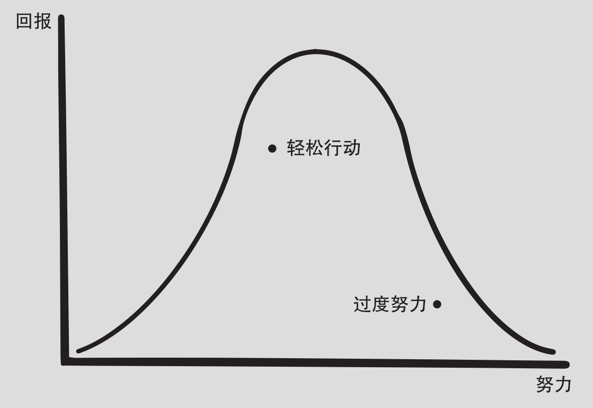
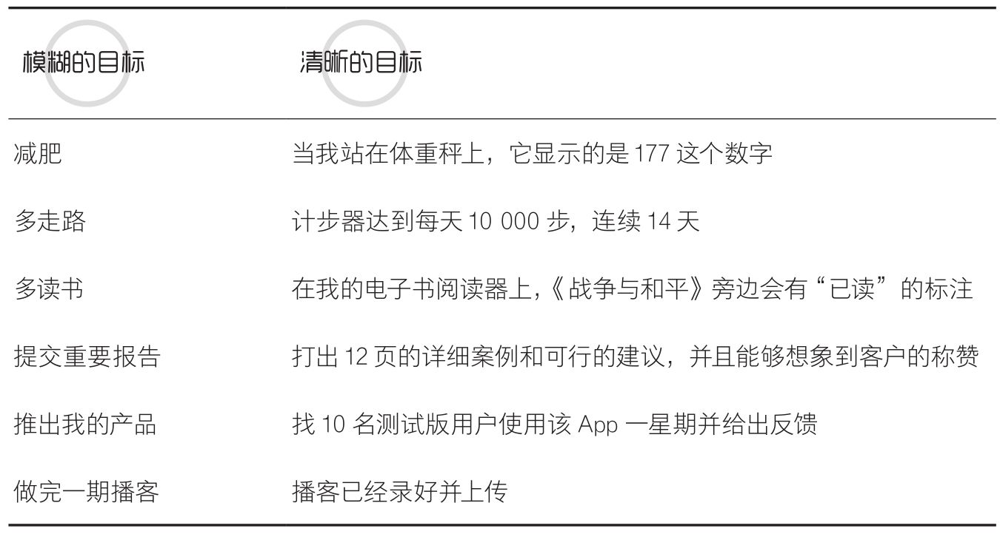
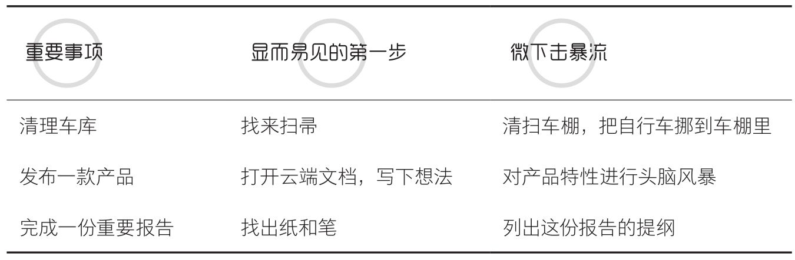
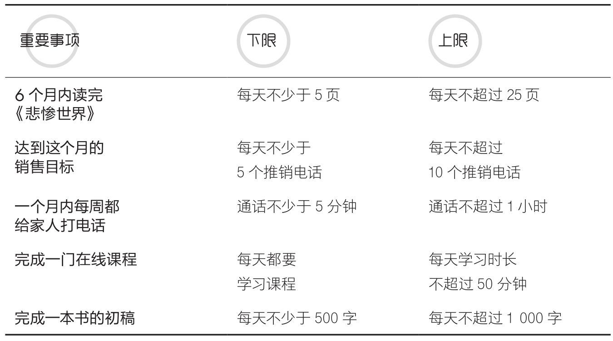
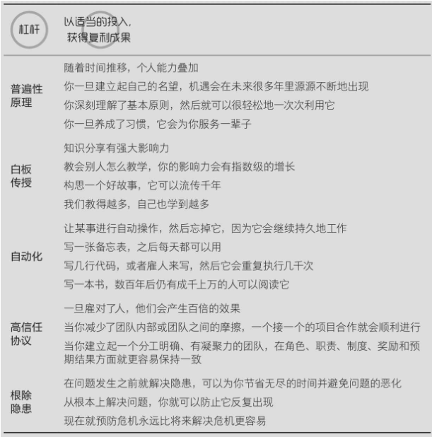
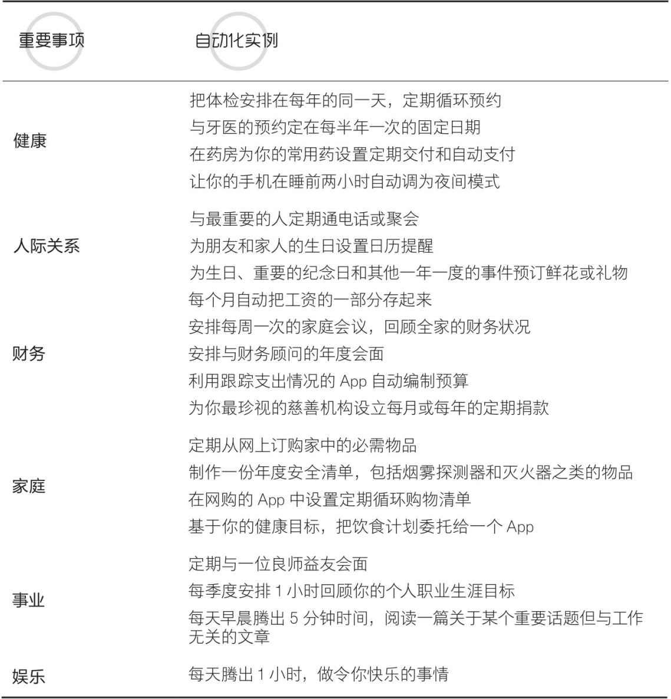
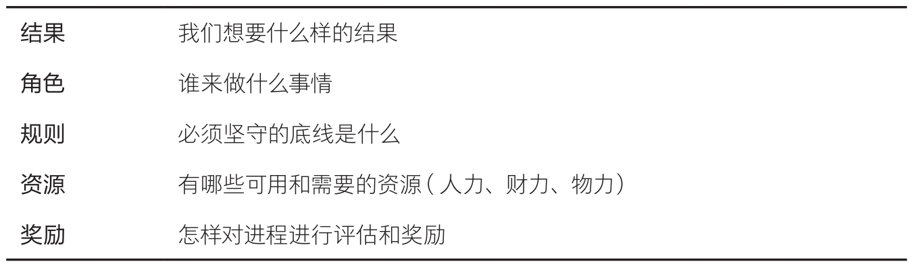
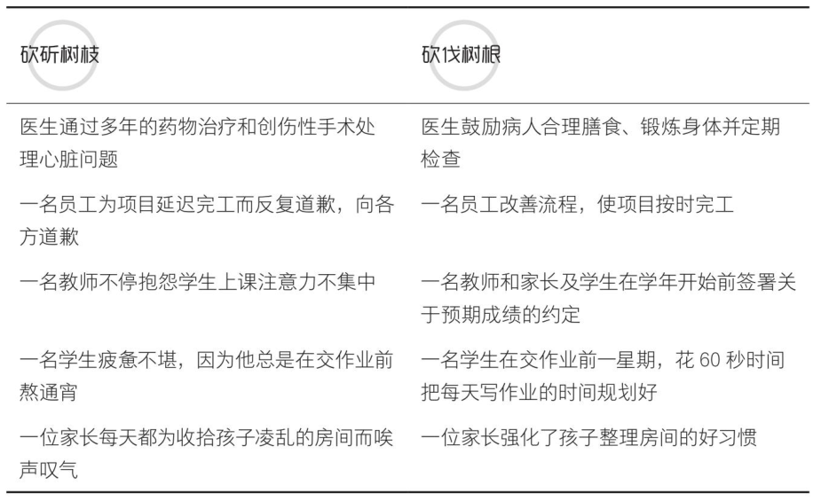

| operator | createtime | updatetime |
| ---- | ---- | ---- |
| shenx | 2024-7月-23 | 2024-7月-23  |
| ... | ... | ... |
---
# 轻松主义.md

[toc]

## 无尽的拼搏不能带来无尽的成功  

**过度努力不是荣耀**
毕竟，我们能够投入的时间和精力是有上限的。我们的投入超过上限越多，我们通过努力得到的回报就越少。  

**不只要做正确的事，还要正确地做事**

> 对一些人来说，“减少努力”的理念会令人不舒服，这会令他们有偷懒的感觉，令他们担心落后于人，或是为没有“多走一英里”而内疚。一定要摆脱这种心态，即认为做困难的事情本身具有内在价值，不仅迷信困难，还怀疑所有做起来容易的事。

> 更容易的方式一直都在，找到它  
> 正如英国伟大作家乔治·艾略特所说：“如果不是为了让彼此过得轻松一点儿，我们活着是为了什么？”  

## 第一部分 轻松状态
> 如果你能让自己的动作尽可能地简单，就不太容易出错。
> 不要过度思考。罚球时最重要的事情是不能让太多的东西出现在你的脑海中。 

> 同样，当你的大脑被乱七八糟的东西，比如不合时宜的假想、负面情绪和有害的思维模式挤占时，你就没有多少脑力去执行最重要的任务了。  
>
> “轻松状态”是这样一种状态：身体放松，没有情绪负担，精神保持振奋。你全神贯注，专注于当前最重要的事情，而且你能够轻松完成这些事情。  
>
### 倒置，自觉追求“更容易”
> 永远选择最省力的路径。

> 我明白这一切压力是怎么来的了，一层又一层不必要的复杂性在叠加。此刻我已经看清了这种复杂性持续扩张的过程，我被这种复杂性压得喘不过气来。  

#### 重要的事也可以是容易的事
> 问题就在于，现代生活的复杂性使人们用一种错误的二分法把事情粗暴地分为“重要且艰难的”和“容易且琐碎的”。大多数人奉它为铁律：容易的事情都不重要，艰难的事情才重要。  

> 某件事令人感觉困难，只是因为我们尚未找到更容易的解决方法？

**永远选择最省力的路径**
> 我们的大脑会本能地抵制它认为困难的东西，而接受它认为容易的东西。这种偏见有时被称为“认知放松原则”。  

> 如果我们能不去与“寻找最省力路径”的天生本能做对抗，而是拥抱甚至利用它，使它成为我们的优势；如果我们能不纠结于“应该怎样对付这个真正困难但又至关重要的事情”，而是直接把问题倒过来问“**这个至关重要的事情是否可以变得容易呢**”，结果会有什么不同？

> 我得到的教训是，努力过头会让我更难得到我想要的结果。我开始意识到，在人生中每一次失败的背后，我几乎都犯了同样的错误。我很少由于不够努力而失败，我失败都是因为我努力过头了。  

> 我们一直都习惯于相信这样的假设：要实现超出预期的成绩，必须付出超出预期的努力。结果，我们让事情变得比实际情况更难了。一定有更好的办法。

> 当我们感到无力应对时，可能并不是由于问题本身十分复杂，而是我们在头脑中把问题复杂化了。问自己这样一个问题：“**也许这事儿很简单呢？**”这是一种倒置思考的方法，看起来容易得有些不可思议，但也正是因为它容易，才如此有用。

> 不可否认的是，有些目标对我们而言是几乎无法实现的，是难以企及的。但是，一旦我们找到一种间接的方法，这些目标的实现就可以变得不那么困难了。  

> **摆脱那些让问题看起来很难的假设，你会惊讶地发现，简单易行的方案会层出不穷。**

#### 不要“英雄主义”，只要轻松的成功
> 当我们放弃了对复杂的执念，即使微小的努力也能推进重要的事情。  

#### 总结
> 1．面对一项难以完成的任务时，自问：“有没有更容易的办法？”  

> 2．如果将事情简单化，就不太可能出错。

> 3．摆脱那些让问题看起来很难的假设，简单易行的方案会层出不穷。  

> 4．放弃对复杂的执念，即使微小的努力也能推进重要的事情。  

> 5．一旦找到简洁的方法，就可能破解无法达成的目标。

###  享受，"满足"不需要被延时  
> 如果可以“享受”，我们何必“忍受”？

> 人们总说：“我要先努力工作，然后才可以痛快地玩耍。”对很多人来说，事情分为重要的事情和享乐的事情。但是这种错误的二分法会产生恶性循环的结果。

> 因此，把重要的工作和娱乐分开，会给生活增加不必要的难度。

> 一旦我们抛弃了“对任何值得做的事情都必须付出艰辛的努力”这种理念，那么重要的工作就可以是令人愉悦的。对于那些真正重要的事，**如果我们可以“享受”，又为何要“忍受”？把重要**  
> **事项和愉快的事项相结合，就连最沉闷、最难以应对的任务都可以变得轻松起来。**  

#### 不再延迟满足，现在就是快乐时刻  

> 但是，完成重要事项取得的成果不一定非要事后才能享受，我们也可以在做事情的过程中体验到快乐：只需要把奖励叠加在重要事项上，缩短行动和奖励之间的滞后时间就可以了。

> 在我们的工作和个人生活中有许多经历是无聊的、平凡的，甚至令人饱受压力。我们常常觉得除了忍受或逃避之外别无选择，但是我们可以把那些过程分解成多个步骤，如果我们可以
> 找到一种方法，让这些步骤更易承受，或者能变得充满乐趣就更好了。

#### 搭建“快乐积木”，在玩耍中产出  

> 就像乐高创造的“自动拼搭积木”能够堆叠拼插成各种组合，你也可以把最重要和最令你愉悦的事项堆叠组合起来，构建新的更轻松的体验。

> 我和妻子安娜曾经列出20个各自的“快乐积木”，并彼此分享： 这个列表很容易创建，一旦我们有了这个列表，就能更轻松地让那些重要事情在令人愉悦的独特体验中完成。

#### 创造有灵魂的习惯，邀请快乐进入我们的生活  
> 仪式给习惯注入意义，以此使重要的习惯更容易保持。

> 叠衣服这个行为远不止是让衣物更加紧凑以便收纳。这是一种关爱的行为，是对这些支持你生活方式的衣物表达一种爱意和欣赏。因此，叠衣服的时候，我们应该全身心投入，感恩衣物保护过我们的身体。

> 不管这些行为表面上看起来多傻，只要始终如一地坚持，就可以让我们获得平静，缓解我们的焦虑，并且用一种只属于我们自己的方式让我们恢复到轻松状态。

> 我们用自己的独特性定义着自己的仪式，这样，我们的仪式就拥有了灵魂。这些仪式能将一项乏味的任务变成一种创造快乐的体验。  

> 我们邀请“快乐”进入我们的日常生活时，我们不再渴盼着时光倒流，最值得珍惜的是当下的时光。当我们给无趣的任务增添一点儿小小的惊喜时，我们就不再像被监禁一样，期待着到底什么时候可以允许自己放松一下。总而言之，当下才是最好的。随着更多的生活瞬间被快乐和欢笑照亮，我们就更容易回到自然的轻松状态。  

### 释怀，雇佣“感激”，解雇“抱怨”

积极情绪为我们创造“上升螺旋”。 -- Positive emotioncreate “an upwardspiral” for us.

#### 小心！识别大脑中的“入侵者”
> “冲锋队盔甲”有很多形式，比如**萦绕心头的遗憾**，挥之不去的怨恨，**已经过期的期待**。

> 对于这种不公正，他内心充满怒火和愤慨，以至于没有了宽恕的余地。在他弥留之际，已经神志不清、精疲力竭的时候，人们还能听到他在痛苦地喃喃自语：“一小段绳子，一小段绳子……” -- 莫泊桑

> 实际上，抱怨是最容易的事情之一，它太容易了，以至于许多人抱怨起来就停不下来。

> **我们生活在一种“抱怨文化”当中**，通过表达愤怒来让自己兴奋，尤其是在社交媒体上，人们总是在对那些不满意和不能接受的事情进行无休止的抱怨和哀叹。即使我们没有直接参与其中，它仍然会
影响我们。**吸多了这种情绪上的“二手烟”，我们就会患上情感上的“癌症”。于是我们开始察觉到自己生活中更多的不公**，这些都是在我们头脑和心灵中占据宝贵空间的“冲锋队盔甲”。

> **当我们专注于我们所缺乏的，就会失去我们所拥有的。**

> 感恩有一种强大的力量，它使消极情绪失去赖以生存的氧气。无论何时何地，当它起作用时，还会形成一个积极的、自我维持的系统，**当我们专注于我们所拥有的东西时，我们会拥有得更多。**

> 抱怨也创造了一个自我维持的循环系统，但这个系统不是让重要的事情更容易完成，而是让事情更难，是一个“下降螺旋”。

> 简言之，如果维持一个系统运转所需投入的能源越来越少，那么这个系统就变成了一个自我维持系统。一旦这种自我维持启动了，维持这个系统的难度就降低了，然后系统的运行就会变得容易起来，一切既高效又轻松。

#### 掌握“习惯处方”，感恩你所得到的  

> 创建一个新的习惯，我们只需要找到一件我们已经做过的事情，然后将一个新的行为加入其中。他把这称为“习惯处方”，最简单的版本是：“做完事件X之后，我会做事件Y。”

> 我们可以应用这个理念让感恩变成一种习惯，我们只需使用下面的“处方”：抱怨之后，说一些值得感恩的事情。

> 这样的转变最开始是刻意而困难的，后来，它依然很刻意，但没那么难了，最终，它变成了一个能轻轻松松坚持下去的习惯。

#### “解雇”怨恨，释怀你无法改变的 

> 你是否怨恨过伤害你的人？你是否浪费了宝贵的精力去生气、痛苦、烦闷或怨恨？你的伤口溃烂多久了，数周？数月？数年？数十年？你可以有一种完全不同的处理模式，就像威廉姆斯的故事所展示的那样。在经历那样不堪设想的悲剧之后，威廉姆斯都能够选择宽恕，我们当然也能放下一直以来的怨恨，因为怨恨会让我们更难专注于我们真正关心的事情。我们可以迈出全新的第一步，试着提出一个不寻常的问题：**我“雇用”怨恨这种情绪都做了些什么事情？**

> 我们经常雇用怨恨去填充一种当前尚未得到满足的情感需求

> 怨恨耗费了我们的资源，但并没有给我们的投资带来令人满意的回报。所以，我们必须把怨恨“解雇”掉。

> 有时候，我们会雇用怨恨来让自己感觉有控制权。但这种感觉稍纵即逝且不真实，因为实际上是怨恨在控制我们。怨恨假装屈从于我们，但实际上接管了我们。它让我们陷入无休止的责怪、自以为是和自我厌恶的循环。

> 有时候，我们会雇用怨恨来博取关注。在收获别人同情的同时，还会收获别人的厌倦。

> 有时候，我们会雇用怨恨来让我们摆脱困境。同样的道理，这种做法在短期内能让人感觉自由，但从长远来看，我们得到的“奖赏”不是自由，而是被生活中的愤怒、怨恨、蔑视和消极情绪监禁。

> 有时候，我们会雇用怨恨来保护自己。们认为怨恨会制造出情感上的盔甲。但这其实也是一个骗局。怨恨使我们更易受伤害、更加恐惧，让我们更难信任和接纳他人。

> **毕竟，下雨的时候，一个人所能做的最好的事情，就是让雨落下。**

> **当我们对伤害自己的人放下惩罚的念头时，被释放的并不是对方，而是我们自己。**

### 休息，有规律的无所事事。

> 与身体的自然节奏和解。

#### 高效休息，掌握“无所事事”的艺术

> 学会放轻松是一种责任。

#### 睡眠不足会杀死我们

> 当我们挣扎时，与其加倍努力，不如考虑暂停行动，哪怕只有一分钟。

> 足够的睡眠可能是我们能给予自己的身体、精神，乃至我们身心承受力极限的最佳礼物。

> 我们花费生命中三分之一的时间睡觉。也许是时候评估一下你是否可以做得更好了。  

#### 你需要的，只是轻松地打个盹儿  
> 是时候换一种方式来看待小睡了。轻松小睡的秘诀有：  
> 1．注意这个时刻：你疲劳到一定程度，感觉要强打精神了。  
> 2．用眼罩、噪声消除器或耳塞屏蔽光线和噪声。  
> 3．定个闹钟。  
> 4．当你试着入睡时，屏蔽掉关于你“本可以做某事”的想法。你醒来的时候，你的待办事项都会在那儿，只有这时候，你才能更快、更轻松地完成它们。  

#### 与钥匙共眠，享受梦境带来的灵感
> **梦境是一片沃土，为那些整天困扰我们的问题孕育了创造性的解决方案。**
> 但是通常我们醒来之后只剩一些零星的想法，如果没能及时捕获它们，它们就会消失得无影无踪。假如你在寻找灵感，最简单的方法就是让眼睛休息，你可以坐在你最喜欢的椅子上，不管你用闹钟还是钥匙作为提醒，记得把一支铅笔放在触手可及的地方，当你突然睁开双眼的时候，可以用它记下实现的灵感。  -- 真有趣

### 觉察，在‘噪声’中保持专注

> 倾听内心的声音，每个人都有一位内在的导师。

> 这当然不是魔法，而只是“看”和“观察”之间的区别，是“注视”和“察觉”之间的区别，是“在场”和“参与”之间的区别。
> 
#### 屏蔽干扰，玩转福尔摩斯的“魔法”
> 倾听本身并不难，难的是保持专注。专注于当下并不难，难的是避免瞻前顾后。观察本身也不难，难的是排除噪声。

> **更有用的一个事实是，所有参与者在测试中都有非常快速的进步。每个人都能越来越好地把注意力集中到重要的事情上，忽略不相关的事情。** -- 注意力训练，我挺缺乏注意力的。

#### 像“打网球”一样，轻松搞定人际关系

> 我们与大多数人的相处都只是泛泛之交，很难与每一个人在精神上产生共鸣。我们总是发现，要真正了解别人，是非常困难的。  

> 在我们的人际关系中，我们都会或多或少地努力得到他人的喜爱、肯定和关注。戈特曼夫妇把这称为“关系需求”。  

> 我们可以形象地把这三种方式比作打网球。
1. 第一种回应叫作“击回”。在这里，你的爱人就像球场另一端的球手，接到你的发球，他用一个落地球直接将球打回你站立的地方，让你很轻松就能把球再打回去。于是你们的对话能够很轻松地继续。  
2. 第二种回应是“击偏”。这种情况下，对方相当于把球打过了球网，但是球完全朝着球场的另一侧飞去，你不得不飞奔过去接球。你们可能会继续击球，但会更费力一些。  
3. 第三种回应是“击飞”。这相当于球直接击中了球网。比赛结束了，现在，你必须劳神费力再开一局。  

> 前两种反应——哪怕是夹杂了一点儿争论意味的那个，通常对一段人际关系来说都是健康的。伤害最大的是第三种，它意味着这两个人“看不到”对方。他们没有参与同一场比赛，或者根本没在进行同一项运动。

> 没有哪一种人际关系是轻松的，但是有一些方法可以让我们更容易地保持一段牢固的关系。我们不需要认同对方的一切，但是我们需要与他们共情，尊重对方，给对方足够的关注。你不用每次都这么做，但要尽可能频繁。  

#### 全然投入，感受陪伴的奇妙力量  

> 当我们全身心投入陪伴别人时，就会对别人产生影响，这种影响不只发生在当下。即便只有最短的瞬间，那种“感觉自己是世界上最重要的人”的体验，也会在那一刻过后的很长一段时间里伴随我们。“陪伴”有一种神奇的力量。  

> 当我们与另一个人全心相伴时，我们会把他看得更清楚，我们也能帮他更清楚地认识他自己。  

#### 清醒委员会，倾听内在的声音

> 生活中，总会有一些人由于想弄清一个问题或者做出一个决定而求助于我们。但我们经常会不知不觉地**妄下判断**，**使他们更难决断**。  
> 第一，当人们害怕被评判时，他们内心的声音就会被压抑，这时候他们的关注点就会只放在他们认为我们想听的东西上，而不是他们实际看到的或者感受到的。   
> 第二，当我们的判断和意见被表达出来的那一刻，它们就开始冲击别人的心智空间，对他们得出自己的结论造成影响。  

> 我们每个人都有一位内在的导师，每个人心里都有自己认同的真理和标准，这些能为我们需要处理的问题提供指导和力量。

> **我们能给予他人的最佳礼物不是我们的技能、金钱或努力，而是我们的关注。**

## 第二部分 轻松行动
> 我们的目标是达到这样一种境界：你努力而不费力，你的动作变得流畅、自然，并且这一串动作都是发自本能。 

> 一旦越过某个点，更多的努力就不再能带来更好的结果了，反而会破坏我们的表现。

> 这种不讲求效率的努力不只会影响整体产出效率，还会让人产生职业倦怠感。这就是过度努力，或者说得通俗一点，努力过头了。 -- 我大概没有经历过，2333

> 我们的目标是，在完成重要事项时投入更少，而不是更多，通过约束我们的努力程度而不是通过过度努力来达到目的，这就是“轻松行动”的意义。  

### 定义，找到'产出低于投入'的那个点

> 一旦越过某个点，更多的努力不会带来更好的结果，反而会破坏我们的表现。

> 这是因为，你肯定无法完成一个终极目标不明确的项目，你可能会原地踏步，也可能会对它改来改去，甚至很可能会放弃它。相反，如果你想完成一个重要项目，绝对有必要让终极目标尽可能地清晰。这个道理可能听上去显而易见，但是，如果考虑一下你正在进行的那些重要事项，你有没有清晰把握它们的终极目标？  

#### 小修改导致大代价，清晰定义终极目标  

> 很多时候，我们都会拖延或挣扎于迈出第一步，因为我们心中没有一个明确的目标。一旦你清晰定义终极目标，你就给了自己的意识和潜意识一个清晰的指示。当事情开始运转时，你就可以规划通往最终目标的路线了。  

> 你只需要花1分钟的专注力去弄清楚终极目标是什么样子。在想清楚结果的那一刻，你对这件事的专注度会是前所未有的。此时，你一定可以头脑清晰地调动所有的资源，去把目标变为现实。  

> **“当天完成事项”清单应该由重要而有意义的事情组成。** 
-- 我不知道我是否做的对现在，我的清单似乎只是一个记录，我没有给自己设定目标，只有一个很模糊的目标。。 很多事情想去做。。 或许我真的应该放弃一些事情了。。 蝴蝶刀 还要不要修呢。。。
修好它，我也会有满足感吧。。

> “瑞典式死亡清理”可能听起来很可怕，但它是一种释放自己的过程。你把房间收拾好，把事情按你想要的方式做完。在你还能做这些事的时候，你为关爱的人解除了一个痛苦而不可避免的负担。  

> 无论是否意识到，我们每个人都有一个重要的人生使命。我们都怀有一种目标感，有一个独特的目标，而我们一生的努力就是为了弄清楚它是什么，并且实现它。  

### 开始，从简单可笑的第一步入手

> 想要实现伟大的构想，先走出简单到可笑的第一步。  

#### 第一步的行动可以是最微小的行动  

> 第一步的行动可能是最微小、最易忽略的事情，但它带来的效果却出奇地显著。  

#### 构建最小可行产品，轻松起步  

> 畅销书《精益创业》（The Leam Startup）的作者埃里克·莱斯将“最小可行产品”定义为：“一个新产品的版本，它让一个团队以最少的付出收集最大数量的有效客户信息。”

> 佩里用“微下击暴流”来形容专心做事10分钟的“浪涌”，它可以对我们所进行的重要事项产生直接影响。它是我们从显而易见的第一步中所获得的动力与能量的小爆发。有**了它之后，你的能量和信心会随着行动不断积累。**  
-- 所以走出第一步，无需害怕，去努力做好手头的尽可能多的事。走好生活中的每一步，而不是要做好完完全全的准备。。。生活需要变化，或者的意义就是活着，体验此时此刻。  

#### 2.5秒改变一切

> **近年来，神经科学家和心理学家发现，我们对“现在”的体验只持续2.5秒。这是我们心理层面上的“现在”。**其中的一个隐含意义是，进展可以以微小增量的形式发生。2.5秒足够我们转移注意力：放下手机，关闭浏览器，深呼吸。2.5秒足够我们打开一本书，拿出一张空白纸，系好跑鞋的鞋带，或者拉开抽屉找出卷尺。  

> 当我们难以找出显而易见的第一步时，我们需要让一些重要事项变得能够立即开始，或者让一些不重要的事情变得失去吸引力。

### 简化，能不做的都不做

> 别急着追求完美，完美的前提是完成。  

#### 消除不必要的，“完成”好过“画蛇添足”  

> 不管你迈出的每一步有多轻松，不迈出这一步永远会更轻松。  

> 这个方法就是问自己：完成这件事最必不可少的步骤是什么？  

> 需要明确的是，**删减非必要步骤不等于“敷衍了事”**，或者搞出一些你拿不出手的东西。 “完成”是一件值得引以为傲的事情：**想在某件事上取得成功，你至少得完成它。**  

#### “只跑1千米”，不做多余的事  

> **“被要求做事件X，并不构成做事件Y的充分理由。”**  

> 我只用6页幻灯片，上面总共不到10个词。  -- 提炼问题的关键  

> 我们很少需要跑2千米，跑完1千米就比哪里都没去要更好。  

#### 能省则省，把握不为人知的简单性  

> **“任何多余的东西都会变成阻碍”**  

> 他最大的感悟是，在设计这个产品时，他和他的团队当初采取了错误的方式。他们以一个非常复杂的产品作为开始，然后尝试精简它。但乔布斯从另一个角度切入。**他从零开始，然后尝试找出最必不可少的元素，以此来实现想要的成果。** 

> 如果你的生活中有些事情包含了过多的步骤，**尝试从零开始吧，然后看看你是否能够找到一条可以少走几步，却殊途同归的路。** 

> **《敏捷软件开发宣言》的12条原则之一提道：“简化是必不可少的，技巧是能不做就不做。”**   

> **大多数天才取得成功靠的并不是解析烦琐的复杂性，而是利用不为人知的简单性。**  

### 过程，拥抱“简陋的雏形”

> 不犯错误就无法领先。 --There isno mastery without mistakes  

> 同理，在你完成一项任务时，如果你想“制造一个更好的飞行器”，不要试图让所有事情都一步到位。  

#### 非凡的突破常常从“垃圾”中诞生

> 如果创作过程中没有产生数百个糟糕的想法，最终就不会有“巴斯光年”这样的好角色。  

> 他们在事情进展过程中的每一个阶段都以**高标准要求自己，追求完美。但是他们的标准既不现实，又鲜有成效。**  

> 他让学生们想象自己有一个装满1000颗珠子的袋子，每次在与他人交流时犯了错误，就拿出1颗珠子。当袋子被掏空的时候，他们大概率会非常精通这门语言。**因为犯错越多，进步就越快。**  

> 不犯错误就无法领先。没有成为“垃圾”的勇气，就无法成就学问。  

#### 不完美就是完美 

> 允许自己失败是需要勇气的。失败很吓人，它令我们变得脆弱，而且失败的代价越高，就需要越大的勇气。鉴于我们的勇气储备有限，我们要找到一种方法，**用尽可能低廉的成本体验失败**，并从失败中学习。

> 这是因为，他已经从代价较低的错误中吸取了教训。我将这类错误称为“学习型错误”。 

> “为了能快速行动，我预计你会犯一些错误。我可以接受10%～20%的错误率，如果这意味着你能够快速行动的话。”  
> “当我心中有了这个比例，我感觉被赋予了决策权，这是令人难以置信的解放。”  

> “如果你没有为你第一次发布的产品感到尴尬，”他说，“那说明你发布得太晚了。”或者换句话说：“在产品发布方面，不完美就是完美。”  

#### 不停犯错比碌碌无为更可贵  

> 哪怕犯下最蠢的错误，也不要贬低自己，要为你不再重蹈覆辙而感到骄傲。  

> 不停犯错的人生比碌碌无为的人生更加可贵，而且更加有益。   

> 即使是垃圾词句，也比一张白纸更有力。  

### 节奏，接近权利不如有所保留

> 设定行动上限，找到轻松的节奏。  

> 设定一个稳定、一致、可持续的行进节奏，最终让挪威人的队伍“不需要特别的付出”，便抵达目的地。  

#### 勉强为之，得不偿失  

> 如果我们一开始就试图在某个目标或项目上取得过快进展，那么就会陷入一种恶性循环：我们累了，所以休息一下，但随后我们觉得必须弥补这部分进度，所以我们再恶补一下。  

> 当我们试图完成一些重要事项时，全速飞奔的起跑很有诱惑力。问题是，开始时冲得太快，整个过程的进度反而会让我们在剩下的路途中被拖慢。  

#### 设定行动上限，找到轻松的节奏  

> 当你仍然有精力的时候，用有所保留的方式去完成重要事项看上去可能是反常识的。但事实上，这种克制是在效率方面实现突破的关键。  

> **“慢则稳，稳则快。”**  

> 这种“拔枪—收枪”的循环可能在当时看起来很迅猛，但在具体的环境中，从长远来看这是很低效的，还会受到不明威胁的困扰。 -- 跳绳的过程中感受到了。 记得我骑去无锡吗，我没有透支自己，一公里一公里的减少距离，我成功了，140km。 

> 当你慢下来的时候，事情会更平稳。你有时间去观察，去计划，去协调努力。但是如果太慢，你会陷入僵局或者失去势头。这个道理不只在战场上适用，在生活和工作中同样适用。日常生活充满了复杂性和不确定性，因此我们在做事的过程中要设置合理的进度范围，并按照这个范围执行。  -- 我应该引起警惕哦，很多时候我其实是过于慢了，心很散，很多东西想要，却提炼不出重点。。

> 有一个更简单的方法是，我们可以设立上限和下限。利用下面的规则：永远不要小于X，永远不要多于Y。  

## 第三部分 轻松成果

> 为了在生活中反复取得轻松成果，你只需要把产生线性成果的行为转变为产生复利成果的行为。  

  

### 学习，掌握事务的基本原理  

> 获得知识可以打开一扇机遇之门，但创造知识可以带来源源不断的机遇。  

#### 探寻原理，摸索共性  

> 并非所有知识都有持久的价值。  

> 普遍性原理不仅适用于科学，事实上，在理解他人的时候，这些原理也可以提供同样有用的思维捷径。 -- MBTI算吗，算吧。。。目前我看到的一个不错的原理。。。但是不应该生搬硬套  

#### 种下一棵知识树  

> 重点是要把知识看作一棵树。在你获取树叶也就是具体知识之前，确保你已经理解基本原理，也就是树干和大的枝杈。要不然，树叶就无枝可附了。  

> 当我们尝试学习新东西时，往往会经历一系列的尝试、失败和调整。导向成功的神经连接将得到巩固和加强。就像一棵树通过变粗变壮来支撑新枝杈的生长那样，我们的大脑神经也可以发展连接，把新的信息纳入我们已有的知识根基。**与此同时，那些没有成果的连接会变弱，最终像枯枝一样被折断**。  

> 狐狸知道许多事，但刺猬了解一件大事。 -- 人不用事事都知道。。。 理清自己的知识脉络，将叶子凭借到自己的知识之树上。  

> 他认为狐狸缺乏专注力，浪费了精力。但阿基罗库斯的比较是想暗示，如果狐狸不只是知道许多事，而是懂得如何把这些事联系起来，它会做得更好。芒格就是一只把许多事联系起来的狐狸。  

> 换句话说，整体要大于各部分之和。  

> **学习别人已经掌握得最好的知识。**  我不相信坐在那里全凭自己空想就能解决问题，没人能那么聪明。

#### 获取知识，更要创造知识  

> **读书是世界上回报率最高的活动之一。**聪明的人早已明白投入大约一个工作日的时长外加几美元买书的钱可以获得什么。阅读，特别是为了真正的理解而读，无论如何都会产生复利成果。  

---

**读书**

1. 是利用林迪效应（Lindy Effect）。这个定律指出，一本书的预期寿命与它当前的书龄相等。   
2. 是为理解而读，而不是仅仅为了“打卡”。一本好书可以改变你，让你与作者产生共鸣。
一种情况是，有些书我读过，但我没法告诉你关于它的任何事。另一种情况是，有些书我可能没有从头读到尾，但我经常回想其中的某个章节或段落，它们已经变成我的一部分。

3. 提炼你的知识。当我读完一本书，我喜欢在一张纸上用自己的话总结我学到的东西。如果你每本书都花10分钟来总结其中的关键知识，你会理解得更深刻。 **总结是一种提炼思想本质的过程，帮助我
们把信息转化为认知，把认知转化为独有的知识。**

---

> 把没人做的事情做好，其价值大于把别人都在做的事情做精；而把没人做的事情做到极致，其价值将有指数级别的增长。  

> 获得知识可以打开一扇机遇之门，但创造知识可以带来源源不断的机遇。你会获得信誉，人们会慕名而来，机遇会来找你。如果你是唯一绝对专业的人，你会获得难以置信的“杠杆效应”。  

> 懂他人之不懂  

> 你需要做的就是获得独有的知识，在接下来的时间里吸引机遇。  

#### 总结 

1. 具体方法只能产生线性成果。如果追求的是复利成果，我们就必须究其原理。  
2. 学习别人已经掌握得最好的知识。
3. 把传统事物变成新生事物往往是轻松创新的关键。  
4. 独立的各种想法代表线性知识。当它们相互关联时，这些想法便形成了复利知识。  
5. 把没人做的事情做好，其价值大于把别人都在做的事情做精。  

### 提升，借助分享让影响力指数级提升 
-- digoal ？

> 把最重要的事变成最容易学的事。  

> 当我们想产生深远的影响时，把教学方法传授给别人，让别人也成为老师是最高效的。  

#### 讲一个故事，将你的听众变成他人的老师  

> 令我惊讶的是，忘记前面的几代人是如此容易。大多数人都无法说出他们8位曾祖辈的姓名，想想看是不是这样。  

> 故事是连接过去和现在的桥梁，它们让历史生动起来，它们扩展了我们的自我感知。  

#### 把最重要的事，变成最容易学的事  

> 教别人的过程也是一种快速学习的过程。**即便只是意识到我们可能会被他人请教，也会增加我们对学习的投入度。**  

> **如果你试图教会人们关于每件事的每个细节，你就要面临什么都没教会的风险。如果你能清楚地识别、简化最重要的信息，并让别人学会怎么教授这些信息，你将更快地收获复利成果。**  

> **意思是不要使用过于复杂的信息，不要追求那种让你听上去很专业的信息，而要选择那些易于理解和重复的直白信息。要把最重要的事情变成最容易教，也最容易学的事情。**  

#### 总结  

1. 用故事把听众变成继续分享这些故事的老师。
2. 简化最重要的信息，并让别人学会教授这些信息，你将更快地收获复利成果。
3. 在教授过程中继续学习。  

### 自动，让行动不假思索

> 为重要的事选择高技术含量的轻松路径。  

> **文明的进步，来自不假思索即可执行的重要操作的增加。**换种方式来说就是，我们应该尽可能多地让重要步骤和事项自动化。

#### 备忘单，让行动不假思索  

> 专业知识惊人的体量和复杂性已经超出专家们可以掌控的能力范围。这就是悲剧性意外发生的真正原因。

> 极端的复杂性只会增加认知负荷，让我们更容易出错。 所以我们需要的不是积累更多的知识，而是新的技巧和策略，使我们能在不消耗“工作存储器”的情况下运用知识。  

> **清单的美妙之处在于，思考已经提前完成，这些列在清单上的事项已经从大脑工作存储器流程中被剔除。**  

> 备忘单的概念就是把大脑中的一些东西提取出来，这样你就可以自动完成它们，而不必依赖记忆。  

#### 解放大脑，用技术提前完成思考  

> 做决定是一种精神消耗。每个人都有不同的偏好、条件和重点，要做出让几十个人都满意的决定不但劳神费力，而且几乎不可能实现。  

> 他们的度假计划是“自动化”的，而且与我见过的其他家庭度假计划相比，这样度假轻松多了。  

> 自动化可以对你有利，也可以对你不利。如果无关紧要的事项是自动化的，它们同样也会在你没有想到它的时候持续发生。

> **因此，要为重要事项选择高技术、低成本的路径，对于无关紧要的事情则要选择低技术、高成本的路径。**  

## 总结  
1. 尽可能多地让重要步骤和事项自动化。  
2. 备忘单是我们手头上最有效的工具之一。  
3. 为重要的事选择高技术含量的轻松路径，为小事情选择低技术含量的高成本路径。  

### 信任，与值得信赖的人一起工作  

> 没有高度的信任，就没有高绩效的团队。  

> 这个例子说明，信任可以成为杠杆，将适度的努力转化为复利成果。  

> **不管在什么情况下，与他人打交道都可能会让人有压力。**  

#### 没有高度的信任，就不会有一个高绩效的团队。  

> 在团队成员中或团队之间获得轻松成果的关键是，确保“发动机内部部件始终都有润滑油”。

#### “3I法则”，聘用价值百倍的员工 

> 他寻找的人需要具备的品质有**诚信（Integrity）、才智（Intelligence）和主动性（Initiative）**，三者缺一不可，如果没有诚信，空有才智与主动性，可能会适得其反。

> 当你能够发自内心地说出“我相信你的判断”这句话时，一切就像施了魔法。团队成员感到获得授权，他们直面风险，他们成长，从而信任得到巩固。  

#### 高信任协议，把适度的努力转化为复利成果  

> 每段关系都有一个结构，即便它难以表述、不那么显而易见。其中，**低度信任结构是一种预期不明确的结构**。在这种结构中，大家的目标有矛盾或不一致，双方不知道彼此都在做什么，规则模棱两可，没人知道成功的标准是什么。这是一种优先事项不明确、激励机制失调的结构。  

> **高度信任结构是一个预期明确的结构**。在这种结构中，大家的目标是一致的，每个人的角色都有明确划分，规则和标准阐述得很清楚，创造优秀成果的人会受到优待、鼓励和奖赏。这是始终如一的，并不是偶尔如此。大多数人都同意：高度信任结构是更可取的。

> 问题在于，低度信任结构通常是自动出现的，而不是有意为之。 

> 一种解决方案是拟定一份独特的合同，他们把它称作“约定”（The Deal），**它把每个参与者的报酬与整个项目的成果而不是与个人贡献联系起来。**   

> 无论是改造住房，还是带领一支团队，我们都可以创建一个类似的“高度信任协议”，这让我们更容易共同把事情做好。即便对这样的协议只进行一次投入，也会产生红利。  

  

#### 总结

1. 将信任作为杠杆，将适度的努力转化为复利成果。  
2. 团队获得轻松成果的关键是，创建“高度信任协议”。  
3. 利用信任来获得复利成果的最佳方式是**选择**值得信赖的人。  

### 预防，在问题发生前就“连根拔起”  

> 把时间投入有长期效应的行动。  

> 我们可能没有把“预防”当成取得复利成果的最有效方式，但是当一次“预防”使未来无数生命免于罹难，一劳永逸地解决了一个存在了几百年的问题时，你对它会产生全新的看法吗？  

#### 时间管理的长期效应  

> **生活中有很多大大小小的问题，我们原本不需要忍那么久，但我们为什么容忍度那么高？因为任何时候，“应付”一个问题耗费的时间通常都比“解决”这个问题耗费的时间更少。**

> 但是，我们常常没有意识到，一些在当时看起来“不值得去做”的任务，可能会在未来浪费你100倍的时间，而且越拖越糟糕。  

问问自己：
* 有什么事情让你反复烦恼？  
* 这些年来“应付”这件事的总成本是多少？  
* 你可以在几分钟之内马上采取什么步骤来推动“解决”这个问题？  

> 目标是，**找出可以用最短时间解决掉的最烦恼的事**。一旦问出这些问题，你会开始注意到你可以采取哪些小行动来使未来的生活更容易。  

#### “砍伐树根”的惊人力量  

> 它只是被“应付”，从未被“解决”。你的生活或工作中有没有反复出现的问题或挫折？与其简单地砍斫树枝，不如试着砍伐树根。  

  

#### 设计让生活不复杂的小行为  

> **“整个过程的关键在于时间。你越早发现问题，就越有可能避免危急局面的发生。”**  

> 就像你可以通过一些小行动让你的未来生活更加轻松一样，你也可以找到一些小行动来防止生活变得复杂。这个原理适用于所有领域。  -- 有清单的影子。

#### “测量两次再切割”  

> 遗憾的是，另一位发言人证实了他们“发现问题时已经有点儿晚了”。事实也的确如此。**一个小小的推断未经核实便被传达。** 

### 总结

1. 越早发现问题，就越有可能避免危急局面的发生。  
2. 解决掉那些频繁发生的小问题，这会在未来为你节省百倍的时间。  
3. 在错误尚未造成损害之前“砍伐树根”，防止整个连锁反应的发生。  

## 结语 顺势而为，人生会更轻松

> 实际上，情况恰恰相反。我们需要找到一个方法，让每一天都变得轻松一些。为什么？因为我们需要有能力在长度未知的时间里维持这种努力。我们根本不可能总是耗尽全力，这是不可能办到的事。**如果你的工作是让火焰在一段时间内保持燃烧，你不能一开始就把所有燃料都丢进火焰中去。**

> 不论你在生活中遭遇了什么事情，**不论它们多么艰苦、有多重大，你都拥有“现在怎么做”的选择权，在处理那些问题之前，你必须先做出这个重要的选择。**  

> 生活不一定是艰难和复杂的。我们每个人都要“信守诺言，走完这段路才能长眠”  -- 罗伯特·弗罗斯特（Robert Frost）。**无论你面对什么样的挑战、阻碍和困难，你永远都可以去寻找一条更轻松、更容易的道路。**  

