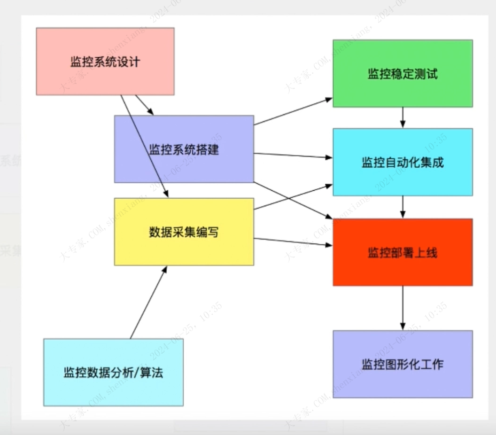

| operator | createtime | updatetime |
| ---- | ---- | ---- |
| shenx | 2024-6月-24 | 2024-6月-24  |
| ... | ... | ... |
---
# prometheus学习笔记

[toc]

## 监控 报警

监控流程

监控系统设计
监控系统搭建
数据采集编写
监控数据分析/算法
监控稳定性测试
监控自动化集成
监控部署上线
监控图形化工作

### 监控系统设计：

1. 评估系统业务流程，业务种类，架构体系  
   
2. 监控项目分类
    业务监控
    系统监控
    网络监控
    日志监控
    程序监控
    
3. 监控技术方案的选择/软件选取 
4. 监控体系人员的安排

### 监控系统搭建
* 单点服务端的搭建(prometheus)
* 单点客户端的部署
* 单点客户端服务器测试
* 采集程序单点部署
* 采集程序批量部署
* 监控服务端HA / cloud (⾃⼰定制)
* 监控数据图形化搭建（Grafana）
* 报警系统测试(Pagerduty)
* 报警规则测试
* 监控+报警联合测试
* 正式上线监控

### 数据采集的编写
数据采集分类
* 一次性采集：shell + crontab 
* 后台采集：守护进程后台运行 例如 promethous exporter
* 桥接式采集：NRPE for nagios

### 监控数据分析算法
需要专业知识才能确定一个合理的**告警规则**和**告警阈值**

### 监控稳定性测试
不管是⼀次性采集，还是后台采集，只要是在Linux上运⾏的东西 都会多多少少对系统产⽣⼀定的影响  
稳定性测试 就是通过⼀段时间的单点部署观察 对线上有没有任何影响

### 监控⾃动化
监控客户端的批量部署

### 监控图形化工作

## 监控的发展历程

发展方向

未来的监控 主要会在⼏个⽅⾯ 不断的提⾼
* 监控准确性 真实性
* 监控⾼度集成⾃动化 ⽆⼈值守
* 监控成本的⽇益降低
* 监控和CMDB的集成化以及⾃愈系统的发展

