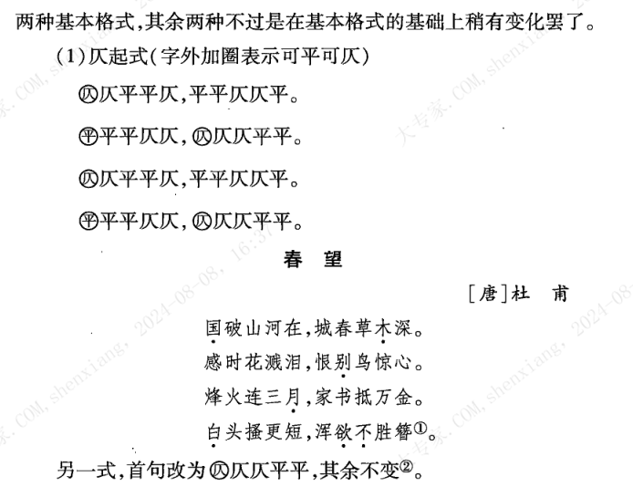
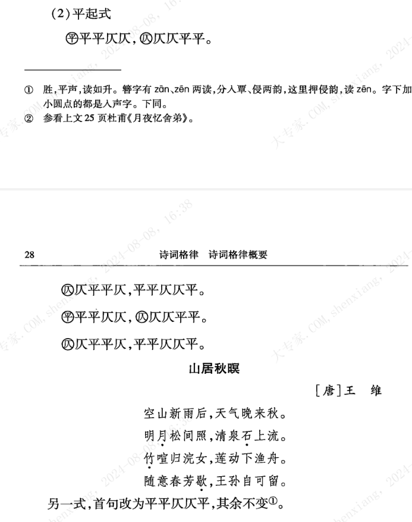

| operator | createtime | updatetime |
| ---- | ---- | ---- |
| shenx | 2024-8月-07 | 2024-8月-07  |
| ... | ... | ... |
---
# 诗词格律--王力

[toc]

## 诗词格律概念

### 韵

韵母相同，什么韵母就叫做压什么韵，押韵在戏曲中被称为合辙
i,u，v 被称为韵头，同韵头的字也算同韵字。

古音与今音可能不一致，所以会有现在的读法不押韵的情况。
古人押韵是依照韵书。官韵就是朝廷官方发布韵书。

### 四声

现在的四声：阳平，阴平，上，去  
过去的四声：平，上，去 ，入

《分四声法》  
平声平道莫低昂，  
上声高呼猛烈强，  
去声分明哀远道，  
入声短促急收藏。  

（⒊江淮官话的声调数目在5个——7个之间：  
洪巢片一般有5个声调，即：阴平、阳平、上声、去声、入声；）  

### 平仄

平就是平声，仄就是，上，入，去三声。

* 平仄在本句中是交替的；
* 平仄在对句中是对立的；

### 对仗

对仗又叫对偶

上句叫出句，下句叫对句  

对偶一般规则：名对名，动词对动词，形容词对形容词，副词对副词。

自对工整，两句相对，就会显得特别工整。

* 出句和对句的平仄是相对立的；
* 出句的字和对句的字不能重复；

例子：
墙上芦苇，头重脚轻根底浅；  
山间竹笋，嘴尖皮厚腹中空。  

## 诗律

### 诗的分类  

**古体诗 近体诗**

所谓古风即古体诗，没有严格的格律限制；律诗是近体诗。绝句和乐府 有古体也有近体诗。

**五言 七言**

五古，七古；五律，七律。

### 律诗的韵  

上平十五韵：
下平十五韵：

### 律诗的平仄

