| operator | createtime | updatetime |
| -------- | ---------- | ---------- |
| shenx    | 2024-6月-18 | 2024-6月-18 |

---
# 社会心理学

## 第一章：导论

### 我们构建起社会现实

> 我们人类总是有一种不可抑制的冲动，想要解释行为，对其归因，以使其变得次序井然．具有可预见性，使一切尽在掌握之中。你我对于类似的情境却可能表现出截然不同的反应，这是因为我们的想法不同。

> 我们对自己的信念也同样重要。我们是否对自己的前途抱有乐观的态度?我们是否认为一切尽在自己的掌握之中?我们把自己看得高人一等还是矮人一头?我们如何构建这个世界、如何构建我们自己是极其重要的。

想法: 强大的内心，与自己和解。既不高看自己，也不自怨自艾。

> 心理学作为一门科学，它揭示了一个令人惊叹的无意识心灵——一个由直觉在幕后操纵着的心灵

> 思维、记忆和态度都是同时在两个水平上运行的：一个是有意识和有意图的另一个是无意识和自动的。今天的学者把它称为“**双重加工**”。我们的所知比我们知道自己所知的还要多。

> 在多数情境中，“快捷省力”的速食型判断方式足以适应我们的需要。但在另一些情境中，当准确性变得很重要时——正如当我们需要适时地表现出恐惧．合理使用我们的资源时——我们最好用批判性的思维来抑制直觉冲动

### 社会影响塑造行为

聚焦: 我早就知道了

后见之明：
有时候我们会对自己过分苛责，我们忘记了事情在当时并非是那么的显而易见。

观点之多如大海浩瀚，无论我们发现了什么，总有人对此预见。

我们免不了误以为，我们现在和过去所知道的，比我们现在和过去已经做的要多。

帮我们区分真实与幻想，真正的预测和简单的后见之明。

## 第二章：社会中的自我

对于人类来说，没有比人更有趣的话题了。再者对大多数人来说，最有趣的人正是他们自己  -- 《社会心理学中的自我》

**焦点效应** ： 我们很在意自己给别人留下了什么印象，我们倾向与认为别人给与我的关注比实际要多。

**透明度错觉** : 我们也倾向与认为我们的情绪总是比实际表现的更明显。

### 社会自我的发展
不要做任何比较 -- 查尔斯一世

实际上我们基本无法做到，到时应该意识到，我们就是我们自己，我们不需要与别人比较来产生价值。只应该与自己比较，只要确信我们走在正确的道路上，我们就会充满力量。当然如果我们现在的状态并不让自己满意就尽量让自己变得更好，但是不要过分苛责自己。。。身份是自己给的。

**他人的评价**

我们一他人的评价作为镜子来认识我们自己。  -- 我希望我能强大到不在依赖别人的评价来认识自己。

与我们的自我概念有关的不是别人如何评价我们而是我们

自我与文化关系：
西方人更自在的赞美个人，东方文化相对更难。我很少赞美别人，这要改，这其实也是我过度的自尊心。
集体主义催生了相互依存的自我，在我们东亚的文化中，人们往往自我批评，很少自我肯定  -- 做的好的事不应该是理所当然，做的不好的事也不应该过分苛责，不要后知之明。

西方  
保守主义 往往 倾向于 经济上的个人主义（减税），道德上的集体主义(加强法律约束犯罪)   
自由主义 往往 倾向于 经济上的集体主义（医保），道德上的个人主义(放松法律约束，自由感)

**个人主义在文化中的滋长**，文化随时间变化，许多文化在走向个人主义 -- 20世纪的中国，集体温馨的农村的解体，城市到处是冷漠缺少温情。

文化与认知

与个人主义文化不同。在相互依赖型的文化中社会生活的目标不仅仅是提升个体自我或者独立做出选择，而是协调并支持所处的群体。

毫无疑问，我的自我是更偏向依赖自我的。

**解释我们的行为**

事实上，我并不知道我为何如此悲伤。 -- 莎士比亚《薇威尼斯商人》

与我们的生活的世界相比，我们对自己头脑中的世界视乎了解的更少。

**预测我们的行为**

人们在预测他们的行为时同样也会犯错，事实上，他人的预测反而更加准确。

规划谬误：低估我们完成一项任务的时间。

知人者智，自知者明  -- 老子

**预测我们的感受**

当一种感觉存在的时候，他们感到它好像永远不会走；当它消失以后，他们感到它好像从未有过；当它回来的时候，他们感到它好像从未消失。  -- 乔治.麦克唐纳

到时是什么让我们快乐：
我们想要，我们得到，我们快乐。   然而事实并不尽然如此。 -- 我们常常高估情绪事件的持久影响，好消息带来的情绪痕迹消失的比预想中要快的多。

**影响偏差**是重要的，如果高估了快乐的强度和持续时间，那么就可能做出轻率的决定。

因为关注消极事件，人们会忽视其他所有事件对快乐的贡献。所以就会过高地预期自己的痛苦。

你所关注的事不会带来你所以为的那么大的改变。

**免疫忽视现象** : 我们是有恢复力的。
相比轻微的消极事件（不能激活我们的防御机制），重大的消极事件（触发了我们的心理防御机制）所引发的痛苦持续时间反而更短。

**自我分析的智慧与错觉**

我们对大多数心理事件都没有察觉，我们对思维的结果比对思维的过程知道的多。

**控制我们社会行为的心理过程与解释我们社会行为的心理过程显然不同。** 我们的理性解释可能因此忽略了实际上指引我们行为的内在态度。

我们常常是自己的陌生人，我们在意的因素往往没有我们预想中的那么重要，我们也往往并不那么真的在意。

双重态度系统： 我们关于人或事的自动的内隐态度通常与受意识控制的外显态度不同。

尽管可能外显态度改变起来相对容易一些，，内因态度就像老习惯一样，改变起来非常缓慢。然而通过重复练习来形成新的态度，新的习惯就能够代替就的态度。

认识到自我认知的局限性有两种价值 ：   
> 第一是对于心理调查来说，自我报告常常是靠不住的，自我理解中的错误限制了主观报告的科学性。  -- 对于自己的自我理解  
> 其次，在我们的日常生活中，权威报告和解释其经验的真实性无法保证这些报告的有效性。-- 对于他人的自我阐述应有的认知态度。  不要相信墙上的字虽然很大。    
> 牢记这种潜在的错误，可以帮助我们较少的产生受人胁迫和被骗之感。

小结：  
自我包括的两种元素 ： 
1. **自我图式**：指导我们对与自我相关的信息进行特殊加工  
2. **可能自我**：我们梦想或害怕成为的自我

文化对自我的塑造  
**独立的自我** 与 **依赖的自我**

自我认识存在缺陷：
1. 我们常常不知道自己为什么如此行动。
2. 当他人无法发现我们行为的有力影响时，我们也会忽视它。
3. 控制行为的内部微妙过程可能与我们对它有意识的，清楚的解释不同。
4. 我们往往会错误的预测自己的情绪。 -- 缺少做出判断的场景，也无法预估当时哪一个角度才会在我们的脑海中占据最有利的位置，以及某种情绪可能被我们高估它的重要性。
5. 我们会低估心理免疫系统的力量，并因此倾向与高估我们对重大事件的情绪反应。

## 自尊的实质与其动机力量
给与称赞： 给与具体的称赞；反应真实的情况的称赞，而不是盲目乐观主义。

### 自尊动机
社会拒绝 会降低我们的自尊。
并不是每个人都能认识到其存在的真正的价值，**认识到真正的自尊永远无法完全是无条件的。**   -- 你因为是你而特别。

### 自尊的阴暗面：
**自恋: 当自尊变成了自负**

经过这么些年，很抱歉我的建议是：**忘掉自尊，把更多的精力集中到自我控制和自律上。**

我们可能会以为一个自大的同学仅仅是为了掩盖他的不安全感，但更有可能的是。他们内心就认为自己极好。

**自恋人数在增加**

安全型自尊的人：
不是因为外在，而是因为自己的内在特质而感觉良好的人

对自我形象少关注一些，多注意开发自己的才能和发展人际关系，才会为你带来更大的幸福感。
自我同情： 即不予他人比较，而是善待自己  -- 真正的卓越并非超越他人，而是超越以前的自己。

### "知觉到自我控制"的意义

努力控制自我会耗尽我们有限的意志力。尽管自我的力量可以被耗尽，但是自我概念确实会影响我们的行为。 **多想象一些积极的可能性**，会让你更有可能制定和实施一个成功的策略。

#### 自我效能
自我效能理论：  
-- 对自己能力与效率的乐观信念可以获得很大的回报。  

自我效能与自尊   
自我效能： 相信有做事的能力；  
自尊：由衷的喜欢自己；  
-- 我现在还不确定的喜欢着自己，仍有缺憾。但是不是单单是因为我造成的，我真的没有办法接受不平等的两性关系，也无法接受不真诚的自己。  如果不行单着也不失为一种选择。  
-- 补充 ：很奇怪，我这是不是因为认识失调对自己的行为做出的辩解呢？  
-- 不是

如果你想鼓励他人，**那就提升他们的自我能效而不是他们的自尊**。

#### 控制点
内部控制点 还是 外部控制点

内部控制点：倾向于认为自己的命运是由自己控制的。  
外部控制点：可能会认为机会和外部力量决定了你的命运。

他们行是因为他们认为自己行。  
-- 我也行，我需要调整好心态，找好方法。  人应该都是差不多的，我不应该觉得我天生就比别人差
很显然，积极思考的力量存在着局限。

#### 习得性无助与自我决定
**抑郁的或压抑的人变得被动，是因为他们认为自己的努力没有任何作用。无助的狗和抑郁的人都丧失了意志，变的被动顺从，甚至死气沉沉。**

我们可以训练自己的自我控制力： 坚持锻炼计划或减少冲动购物行为等等来锻炼自我控制。

强调选择的机会，往往能让人更加有自控能力  
-- 促进个人控制的系统确实能增强个体的健康和幸福。

#### 过多选择的代价

过度的自由，反而导致人们生活的满意度下降。 
-- 更多的选择或导致信息过载，也会带来更多的后悔机会。

自我效能感:由社会说服（你拥有通往成功的一切）和自我说服（我认为我能）来支持。

榜样 -- 看到其他类似的努力获得成功的例子同样能获得自我效能感。**但自我效能主要来自对成功的体验。**

**自我服务偏差**  
自我服务偏差：个体倾向于以有利于自身的方式来进行自我知觉。

自我服务归因：把好的结果归因与自己，把坏的结果归因于其他。

**盲目乐观**

大多数人对事物的看法偏乐观。

悲观主义思维和乐观注意思维都具有力量。既需要乐观精神来支撑希望，同样也需要足够的悲观思维

**虚假的普遍性和独特性**

虚假的普遍性：我们看到的并非世界本身，而是我们自己的影子。
在观点方面，我们会高估别人与我们的一致性，我们也更喜欢跟我们相似的人。

虚假的独特性：
在能力方面，我们往往把自己的才智和品德看的超乎寻常，以此来完善自我形象。

总结
自我服务的归因，自我恭维的比较，盲目的乐观，以及自身失败的虚假普遍性，所有的这些倾向都是**自我服务偏差**的表现。

*--头脑是心脏的延伸。*

**自我服务偏差的适应性**

1.影响我们的自尊，表现为更高的自尊。  
2.更强的情绪复原能力。  
3.对自己的积极信念激发我们的努力（自我实现预言），并在困境中保持希望。  

**自我服务偏差的不良适应**
1.错误的归因，往往导致不快乐的情绪，因为没有认识到自己在其中的责任。
2.更难构建良好的团队关系，往往高度自己对成功的贡献，低估自己的对失败所负的

-- 胜利总能轻而易举的找到上百个老爸，而失败却总是孤儿。

-- 别人的过错在我们的眼前，而我们自己的过错却在背后。

**虚伪的谦逊**
虚伪的谦卑其实是为了掩饰内心认为自己真的比别人优秀的想法。（越这么说，却越在心理觉得自己优秀）。 真正的谦卑，与其说是虚伪谦逊，  
反而更像是不太在意自己。**它一方面让人为自己的专长而欣喜，另一方面而实事求是的认可他人专长。**

## 自我表露的管理

### 自我妨碍
人们通过设置障碍来阻挠自己的成功。这种行为绝不是一种故意破坏，而恰恰是为了达到自我保护的目的。

**如果我们在重重障碍下失败了，我们仍然可以维持对自己的能力的信任。**如果我们成功了，那正好可以提升我们的自我形象。

-- 我是有这个情结的，不希望自己被过多的关注，我害怕失败，害怕被否定。又往往过于在意了别人的看法。

### 印象管理
自我服务偏差，虚伪的谦逊和自我妨碍 都揭示出个体十分在意自我形象。在不同程度上，我们是种在管理自己给他人留下的印象。

作为一种社会性动物，我们总是在向周围的观众表演。**我们渴望被社会接纳，这种渴望如此强烈，甚至可能让们我不惜伤害自己。**

### 自我表露
当失败可能会使人们看起来很糟糕时，人们就会采取自我妨碍的方式。

### 自我监控
“我总是倾向于成为人们希望中的样子”。  -- 人们也包括自己吧，不要给自己提不切实际的要求。

由于总是意识到他人的存在，所以他们很少会依据自己的态度行动。  
在自我监控上得分较高的人更少致力于人际关系。  

低自我监控的人往往更多的受其内在的指引，更多的按照自己的感觉和信念来说话做事。

-- 我真的有点拧巴啊。

### **总结**
**生活中最了不起的成就，和最让人沮丧的挫折，都来自对自己的高标准的预期。**   
-- 换句话说，一切的发生都有意义，不需要过于沮丧和欣喜。认清楚自己，不要有不切实际的期待。

## 第三章 社会信念和判断

### 社会世界的感知

**目不可信，心不足恃。**

*我们并非如实的对现实做出反应，**而是根据我们对现实的构建做出反应**。*

#### 启动
我们对社会中很多信息的加工是自动的，无目的的，不为肉眼所见，而且发生在我们意识之外。

**具身认知**，身体的温暖会强化社会温暖，社会排斥会让人感觉寒冷。

#### 感知和解释事件
**一旦你形成了某种信念**，它就会影响你对其他所有相关信息的知觉。你就**倾向于将其模棱两可的行为诠释为表示敌意的**。 -- Robert.Jervis

我们眼里的错误引导着我们的心灵，错误导致的也必定是谬误。 -- 莎士比亚

他人对我们的知觉 解释的过程也会影响他人对我们的认知。  
**自发性特质转移**：当我们说默认的好话和坏话时，人们会试图将这些特质和我们联系在一起。  

##### 信念固着
它证明了信念可以独立存在，而且当支持它的证据被否定时仍会存活。

**假设我是一个持有相反观点的人，我是否会能根据事实得出这个想法的观点呢。**    
-- 有时候我应该考虑一下这个问题

##### 构建我们自己和我们世界的记忆

记忆与读书不同，它更像根据不连贯的笔记片段写一本书。。

**误导信息效应**

人不为曾经犯错而羞愧，换句话说，则表示他比从前更聪明了。

毛毛虫在化茧成蝶之后会认为自己小时候是小蝴蝶，成长和成熟把我们变成说谎的人。

**重构我们过去的行为**

**在记忆中，事情有必要按照期望的方式发生。**

我现在可能是不完美的，但是我在之前更加糟糕，而且这些努力使我受益。  
-- 可能我们的改变并没有那么多，但是我们倾向于肯定自己的努力

### 社会世界的判断

#### 直觉判断
我们大脑所知道的比它告诉我们的要多的多。

##### 直觉判断的局限
错觉: 我们还不知道为什么会产生错觉，是什么制造了错觉。。。**但是并不能认为一切直觉产生的信念都是错觉**。。

#### 过度自信
智者十分了解自己的弱点，因此绝不会保证不会出错;**那些懂得最多的人也最清楚自己知之甚少。**  -- 托马斯.杰斐逊

##### 验证性偏差
与寻找证据证伪自己的信念相比，我们更愿意证实它们。

##### 对过度自信的矫正

即使当人们看起来十分确信自己正确的时候，它们也可能是错的。**自信和能力之间没有必然一致的关系。**

三种技巧：
1. 即时反馈
2. 分解任务（降低规划谬误）
3. 设想自己可能失败的原因  
**当人们开始思考为什么一个观点看起来是正确的，该观点就开始看起来像是正确的了。**

**尽管如此，不应该低估人们的自信或摧毁他们的果断性**。在那些需要人们表现出智慧的时刻，哪些缺乏自信的人无法毫不犹豫地说出或做出坚定的决定。

#### 启发式判断：心理捷径

`代表性启发式判断` 与 `易得性启发式判断`  
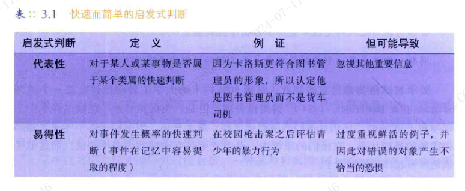

概率性忽视

反事实思维

##### 错觉思维
-- 控制错觉，误以为各种随机事件受我们的影响

趋均数回归

#### 情绪和判断
**记忆和判断随着情绪色调变化而变化。**  
-- 情绪对我们的记忆有着强大的涂色作用

### 社会世界的解释

#### 归因因果：归于个人还是情景
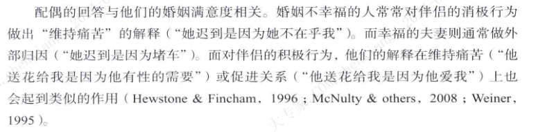

**性格归因**（内部归因） or **情景归因**（外部归因）

常识性归因  
一致性：
区别性：
共同反应：

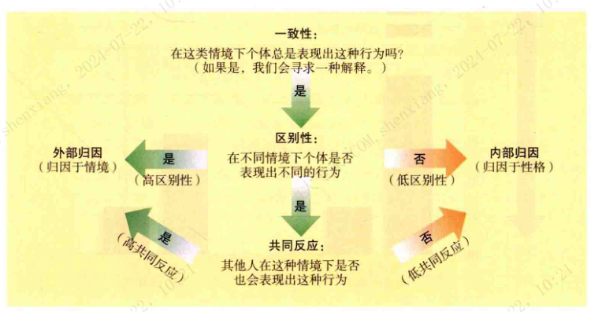

### 基本错误归因

当我们解释他人的行为时，我们会低估环境造成的影响。而高估个人的特质和态度所造成的的影响。

这种个体在归因时低估情景因素作用的倾向，被称为基本归因错误。

为什么我们会犯归因错误  

* 视角和情景意识
1. 当我们作为行动者时，环境会支配我们的注意。但我们观察别人的行为时，作为行为载体的人会成为我们注意的中心，而环境变得模糊。
2. 一旦曾经可见的**行动者在记忆中变得模糊**，观察者通常会分配给情景更多的权重。
3. 对我们大多数人来说'过去的你'并不是今天'现实中的你'。 
4. 我们从自己关注的地方寻找原因。

* 文化差异

### 社会期望的影响

#### 自我预言实现和行为确证

**自我实现预言**： 即信念能够导向自我实现。

可续研究和社会生活一样，一些人会欣赏的东西其他人却不会，这就是为什么我们总是需要尝试，在遭到拒绝的时候，要再试一次。  

**行为确证**： 一旦形成错误的社会信念，就可能引发他人做出某些行为反应一支持这些信念。

#### 社会信念和判断

信念有时运作的很好，有时会导致我们误入歧途。如何在两者间取得平衡。同时关注社会思维的优势和不足。  

减少错误的信念

1. 训练人们在其自身的社会直觉中识别错误的可能来源。
2. 接受逻辑和社会判断的训练，这能帮助人们更好的对日常事件进行推理。
3. 列举日常生活中大量丰富的具体的趣事和例证进行教学。
4. 总结性的语句。。。**总结**

#### 对错觉的反思

剥夺了平常人生活中的错觉，也就剥夺了他的快乐。 -- 易卜生  
我们的**主观体验**是构成人性的材料。 -- 主观体验才是生活的真实吧。 

带着少许谦逊，牢记我们出现错误判断的可能性。  
我们人类是一种了不起的智慧和错误的混合物，**具有高贵的尊严，但并不是神。**  

在错觉中寻找现实需要开放的好奇心和冷静的头脑。这种观点被证明是对待生活的正确态度：批判而不愤世嫉俗，好奇而不受蒙蔽，开放而不被操纵。  

## 第四章 态度和行为

如果我们希望改变行为，首先改变我们的心智。

 态度三维度ABC：
 情感（affect）、行为倾向（behavior tendency）和认知（cognition）

### 态度对行为的预测  

人们的态度很难预测他们的各种行为

道德伪善："显得有道德水平，但实际上拒绝为之付出任何代价"。 -- 与影响力中的一致性原则相悖。

当道德与贪婪同场竞技时，通常会是贪婪大获全胜。

真理只有在被发现时才会变得显而易见。  

#### 态度合适能预测行为

我有自己的想法，强烈的想法，但我并不总是赞成他们。 -- 

内隐联想- 内隐偏见
1. 内隐偏见普遍存在
2. 内隐偏见存在个体差异
3. 人们通常意识不到自己的内隐偏见

我们的双重加工能力：受控制的思考（目的性的，有意思的，外显的）和自动思考（不费力的，习惯的，内隐的）； -- MBTI 的理论基础  

**其他因素何时对我们影响最小**

一个更好的预测个体行为的指标是，**了解个体行为意向**和**他们知觉到的自我能效与控制感**。

诱发新的意图将会引起新的行为，即时只是简单的询问人们是否会做出某种行为也会增加他们行动的可能性。  

态度预测行为的条件：
1. 将影响态度和行为的其他因素最小化；
2. 态度与观察到的行为存在**具体的相关性**；
3. **强有力的态度**能更好的预测行为。

**态度何时是有效的**

我们的大多数行为是自发的，不假思索的；

"人类文明随着不假思索的行为的增加而进步" -- 怀特海德

**当我们思考的自己的态度时，态度才会影响我们的行为。**

知易行难，要将想法付诸实践是这个世界上最难的事。 -- 歌德

**镜子确实能使行为与内化的道德态度保持一致。**

美德的说教比身体力行容易的多。 -- 拉罗什福科

**通过经验建立稳定的态度**
当态度是通过某种经验建立的，而不只是道听途说，他们就更具有可接近性，更持久，更能引发行为。

**小结**
1. 态度并不能很好的预测人们的行为。
2. 要想让态度对行动的预测更有知道意义，有三个维度可以考虑:   
(1). 其他影响最小化。  
(2). 态度和行为的相关度。  
(3). 态度的强力程度，（是否被反复提醒，是否通过经验总计出来的态度）  

### 行为对态度的影响

现在我们转向令人震惊的想法，即行为决定态度。  

#### 角色扮演

我们扮演的角色会塑造我们的态度。  

这种行为源于罪恶的环境，它可以把好人变成罪恶的替身。  -- 环境对人的影响就是有这么大，近朱者赤近墨者黑

#### 语言变成信念 

当一个人的话语缺乏令人信服的外在解释时，语言就会变成信念。  

我们似乎倾向于根据听众来调整我们讲话的内容，并且之后也会相信这些歪曲的信息。  

#### 登门槛现象

如果你想一个人帮你一个大忙，一个有效的策略是先请他帮你一个小忙。  

当人们承诺公众行为并认为这些行为都是自愿做出的时候，他们更加坚信自己的所做所为。  

如果你培养一个已有善举的人的善心，那你很容易发现乐于助人的人。  

**在我们答应一个小要求之前，考虑一下后续会发生什么。**   
-- 怎么才能避免被登天梯

我们的自我定义不是在我们的头脑中构造，而是我们的行为塑造的。  

#### 邪恶行为和道德行为

**邪恶行为**

1. 一个不起眼的恶行会侵蚀人的道德感，轻易已发一种更恶劣的行为。  -- 勿以恶小而为之，勿以善小而不为  

2. 邪恶行为影响态度的另一个途径是我们意想不到的，**即我们不仅伤害我们不喜欢的人，也不喜欢我们伤害的人**。  我们倾向于去合理化自己的不当行为。  

人们是越是伤害他人并同时调整自己的态度，则伤害行为就越容易出现。于是，道德变异了。  

**道德行为**

1. 同样的，温柔的行动，道德行为，特别是当可以选择而不是被强制接收时，会影响道德思维。  人们会内化自己的决定。  

2. 对他人的积极行为会增强对那个人的好感。  

在很大程度上，我们并不会因为别人对我们好而喜欢他们，而是因为我们对他们好。  

我们由于行使正义而变得正义，由于练习自我控制而变得自我控制，由于行为勇敢而变的勇敢。 -- 亚里士多德  

#### 社会运动 

政治社会化而将这种影响运用在公众人群中。 由于禁止发表自己的言论，所以他们试图有意识的强迫自己相信自己所说的话，以此来平衡心态。  

记得我曾参加空袭演练，在反复演练之后，我们好像真的变成了俄罗斯攻击的目标，我们中许多人开始害怕俄国人。  

你可以使用较小的承诺来操纵某个人的自我形象，使公民变成'公仆'，潜在购买者变成'顾客'，囚犯变成'合作者'。  -- 影响力

**我们不仅仅坚持自己相信的，我们也相信自己坚持的。**

### 行为影响态度的原因 

自我表露理论认为，出某些重要的原因，我们会表现出一定的态度，以使我们看起来表里如一。  

认知失调理论则认为，为了减少自己的内心不适，我们说服自己的某些行为是合理的。   

#### 自我表露：印象管理 

自我表露理论：我们希望自己看起来一致。

但是它也无法解释一些情况，因为当面对一些根本不知道自己过去行为的人时，人们也会因为行动改变自己的态度。  人们为什么会**内化自我表露**。

#### 自我辩解：认知失调

认知失调理论: 它假定两种想法或者信念（认知）在心理上不一致时，我们就会感到紧张，不舒服（失调）。为了减少这种不愉快的体验，我们经常会调整自己的想法。

使失调感最小的办法之一是**选择性接触**与自己观点一致的信息

与之相反，**准确性动机**在一些实践性强与价值关无关的问题上更可能起作用。

---
**认知失调的触发**  

---

##### 理由不足

认知失调理论认为：当我们的行为不能完全用外部报酬或强迫性因素来解释，我们就会体验到认知失调。  
-- 我们通过相信自己的所做所为来减少失调。  

当人们可以预见结果时，或者拥有选择权时，态度依从行为的效应是最强的。  

认知失调理论不是关注行为后的奖惩具有怎样的效力，而是什么因素会引发好的行为。  

当学生认为参加活动是自己自愿的选择而非被迫时，他们更可能内化正确的态度，更可能参加以后的活动。  

---

##### **如果我们觉得必须要为自己的行为负责，我们的态度就会依从行为。**

失调理论强调鼓励和诱导的力量应该足够引发所期望的行为。但是他也表明，管理者，父母和教师用于引发期望行为的刺激应该刚刚够就好。 

---

##### **决策后失调**
对于简单的决定，这种决定变成信念效应会滋长自负。  

一旦做出决定，它就会自圆其说。通常，这些新的支撑点非常牢固，即使失去一个支撑点--也许是最初的那根--确定也不会崩溃。  

每次你做出一个决定，你就会稍稍改变自己重要的一部分，你所选择的那部分。  

---

#### 自我知觉：自我观察

当我们无法将自己的行为简单的解释为外部约束的时候。我们自由做出的行动正是对自我的揭露。  

行为可以修正自我概念。  -- 对自我的观察，会让我们感觉我们是这样的人，我们也会更加愿意保持一致性。  

##### **表情和态度**

自由的表露情绪可以强化情绪。相反，尽可能地压抑情绪则会削弱情绪。  

观察他人的面孔，姿态和声音，我们就会自然而然，无意识地模仿他们每时每刻的反应。这样我们就能体会到他们的感受，同样会产生"情绪传染"。  这就能解释为什么在悲伤的人群中会感觉沮丧，在快乐的人群中会感觉也快乐。  

面部表情也会影响我们的态度。

行为影响思想，姿态也会影响表现。  双臂交叉与决心和毅力有关联。双臂交叉往往会让人更有决心和毅力。  

##### **过度合理化的内在动机**

认知失调理论认为：当外界的刺激不足以证明我们行为的合理性，我们会通过内部心理活动证明自己行为的合理性，以减少失调。  

自我知觉理论认为：我们观察自己未受胁迫的行为，并认为是我们真实内心的表达，从而推断我们的态度。  
-- 该理论认为，给人们报酬让他们做自己喜欢的事会让他们将其归因于只是为了得到报酬，这样就会削弱他们的自我知觉   
-- 因为兴趣而去做。

给孩子报酬来让他们做自己喜欢的事，孩子们就会将这种游戏变成工作。  

如果因为工作出色而获得赞扬能让我们感到自己更加成功的话，这确实能增加我们的内在动机。如果我们的能提供恰当的报酬，同样可以创造生产力。  

当某些人显然是出于控制别人的目的，事先提供不必要的报酬时，就会产生过度合理化效应。  **关键是报酬意味着什么**。是报酬和赞赏针对人们的成就，还是报酬是为了控制人们。

如果我们为学生的学习提供充分的理由，**并给与他们报酬和赞赏**，让他们觉得自己很有能力，我们也许就能激发他们的内在动力。  

#### 理论比较

自我肯定理论： 因为这种事，让人很尴尬，会让我们觉得自己愚蠢，会破坏自我效能感和善良感。  

失调理论可以很好的解释行为与态度冲突时出现的结果。自我知觉理论在态度还没有完全形成时，很好的解释了态度的形成。  

### 通过行动改变我们
要想养成某种习惯，那就去付诸行动。
不想养成某种习惯，那就避而远之。
要想改变一个习惯，那就做点别的来替代它。 -- 埃匹克提图 

如果我们想在某个重要的方面改变自己，最好不要等待顿悟或灵感。有时真的需要我们做出行动。

**没有反应就没有接受，没有相关表达就不会产生印象。**

## 第五章 基因，文化与性别

### 自然天性与后天教养对人类的影响

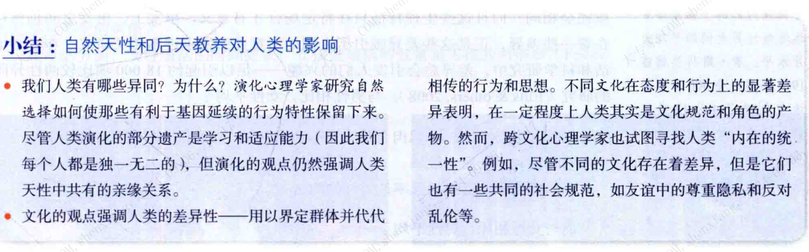

### 性别的相似性和差异性

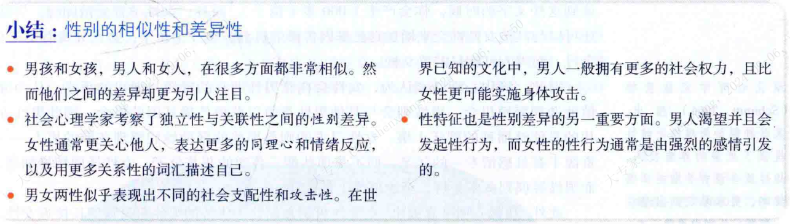

### 演化与性别：文化塑造的行为

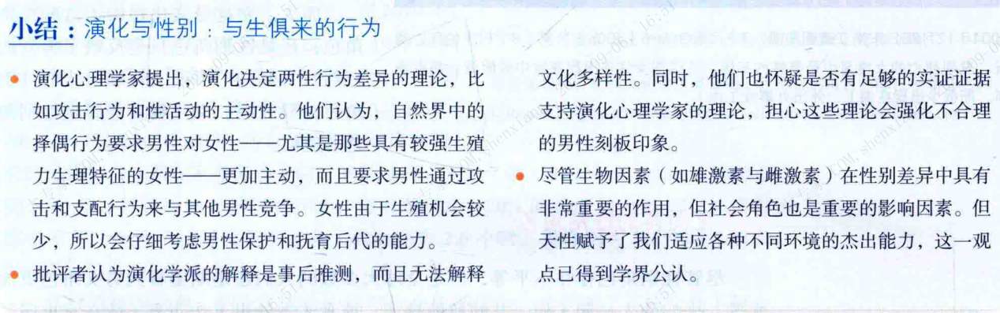

### 文化与性别：文化塑造的行为

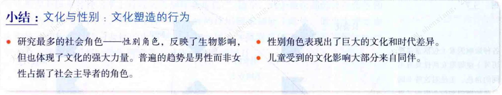

### 基因，文化与性别的各自影响

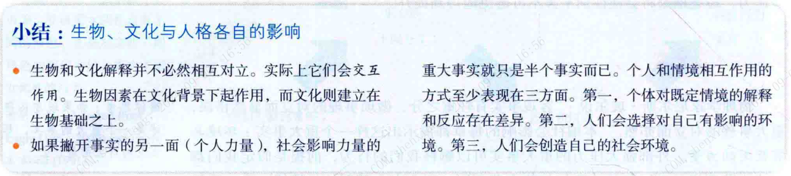

## 第六章 从众与服从

### 经典的从众与服从研究

#### 谢里夫的规范形成的研究

有时错误的观念会因文化规范而得以持续。

### 哈欠的传染性

人的可以自由行事时常常会相互模仿。-- Eric

心境连接

变色龙效应

#### 阿施的群体压力实验
1+1=2 ?

#### 米尔格拉姆的服从实验
电击学习者的实验

##### 影响服从的四个要素
1. 与受害者的性感距离（个性化的，还是模糊的笼统的人的概念）
2. 权威的接近性和正当性（权威下命令的方式和权威是不是真权威） 
3. 机构的权威性  
4. 群体影响的释放效应 （敢于首先反抗的人是少数人，他们是真正的英雄）

**行为和态度**  
谴责受害者来正当化自己的行为 -- 认知失调理论

##### 情景的力量

邪恶的情景催生邪恶的行为，正如实验中揭示的那样，社会情景有时会导致人们赞同谬误或屈从暴行。

当大家分散工作个行其职时，恶行似乎更容易实施。

日常的生活也是这样，对恶行的听之任之会导致日积月累，尽管我们不是有意识的去作恶。拖延同样是对恶行的无意识放任，会造成自我伤害。

在邪恶力量的支配下，善良的人们也会堕落，他们会对不道德的行为进行合理化归因。  

理解不带表原谅。理解不代表宽恕。  你不理解一个人的行为，但你可以原谅他。你理解一个人的行为，但不愿原谅她。

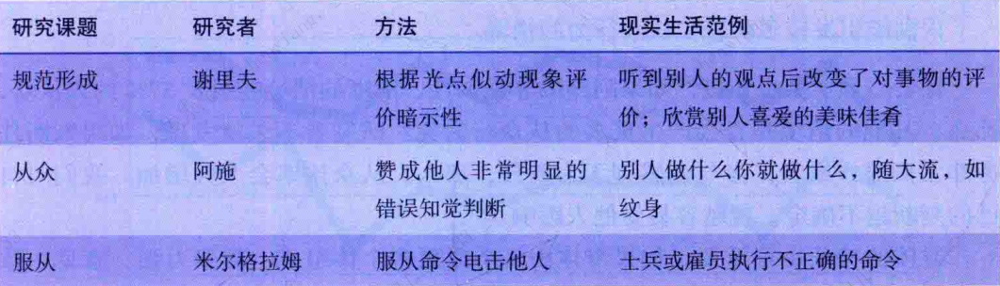

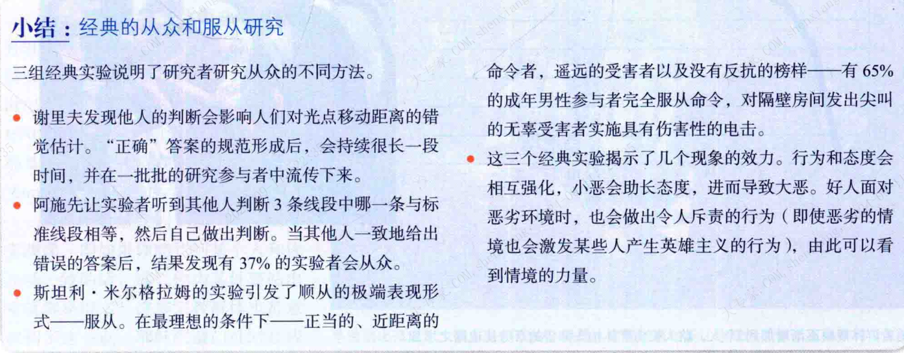

### 预测从众的因素

#### 群体规模  

3-5人比1-2两人更能引发从众。  
多个小团体单独做出决定，比更少的大团体更能触发从众。  

#### 一致性  

若果有人破坏了群体的一致性，会降低群体的一致性（释放效应）  
实验的参与这者常常说，对于不从众的同伴倍感亲切。但他们同时有否认自己被同伴影响。  

如果你能找出来一个人和你的立场一致的话，那么你为某件事站出来就容易的多。同伴极大的增强了一个人闯荡社会的勇气。  

我的观点，我的信念，当第二个人接收它时便获得了无穷的力量和成功。  

他人持有异议--即使这种异议是错误的--会增强个体的独立性。  

#### 凝聚力  

我们在群体中的身份认同影响着我们的态度和行为。  

#### 地位  

服从实验中地位低的人比地位高的人更愿意服从研究者的命令。

#### 公开的反应

公开更容易从众。  

#### 事前承诺  

个体一旦在公众面前做出承诺，就坚持到底。

那些从来不收回自己观点的人爱自己胜于爱真理--joubert 

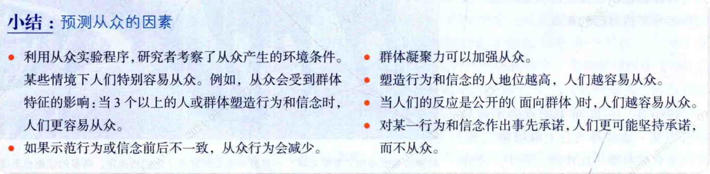  

### 影响个体从众的因素  

**规范影响**：来源于我们想获得别人的喜欢。 -- 对社会形象的关注产生规范影响
**信息影响**：来源于我们想正确的行事。 -- 对正确行为方式的追求产生信息影响

社会拒绝会让人痛苦。如果我们偏离了群体规范，常常要付出情感代价。

有时聘礼群体的巨大代价会使人违心的附和群体。 

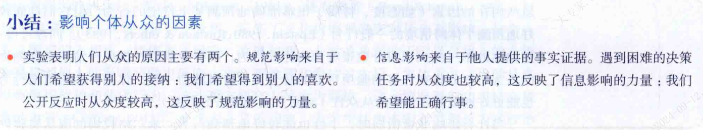

### 从众的个体差异  

#### 人格

我不想改变自己来适应这个世界 -- 伍迪 加索里  

#### 文化  

从众和服从虽然全世界都有，但也会表现出文化差异和时代差异。

#### 社会角色  

#### 总结  

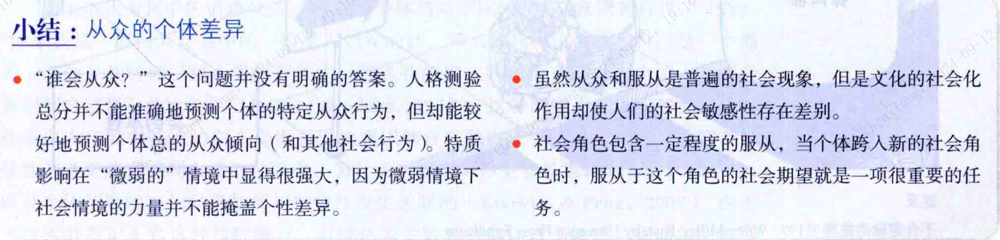

### 抵制从众的社会压力  

#### 逆反  

企图限制个体自由通常引起事与愿违的反从众行为。  精明的父母通常不会生硬的命令，而是让孩子自己选择。  

#### 坚持独特性  

个体与周围差异

在一个群体中我们更能深刻的认识我们之间的不同之处。以维持'自发性自我概念'。

当两个群体非常相像时，冲突往往也最激烈。

我们并不喜欢太过离经叛道，然而讽刺的是，我们所有人都希望与众不同，并热衷与特立独行。 

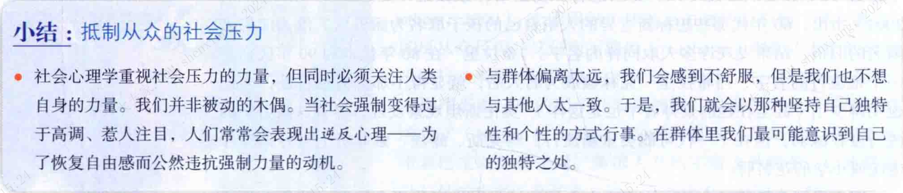 

## 第七章 说服 

### 说服的路径

#### 中心路径 

当人们积极主动，并且能全面系统的思考问题时，就更可能接收**中心路径说服**。  

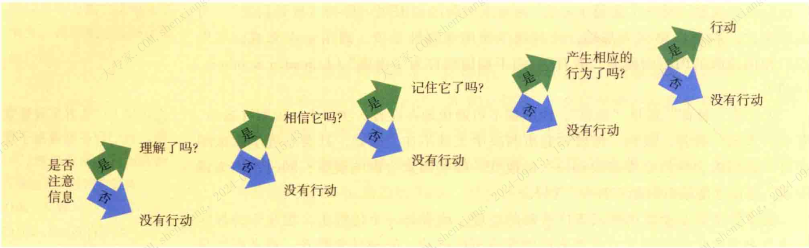  

说服为了引发行为，关键不在于信息本身，而在于记住自己做出反应时的想法。  

#### 外周路径 

但论据是有力有时并不重要，我们并不总能全神贯注的思考。如果我们没有办法仔细的推敲信息的意义。我们会接收**外周路径说服**。  

当人们心不在焉或没有积极主动的思考信息时。熟悉易懂的表述比新异的表述更容易让人接受。  

任何有效的宣传都必须限制在很少的几个点上，并且不断的重复这些口号，回到每一个成员都理解为止。  -- 阿道夫.希特勒 

两种说服路径一种外显，反思，一种内隐，自动（双加工）  

#### 不同目的选用不同路径  

中心路径说服影响的行为比外周路径更加持久。 

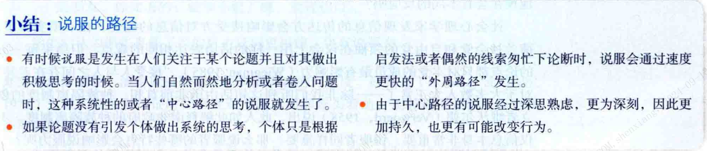 

### 说服的要素

#### 可信度  

**知觉到的专业度**  

**知觉到的信赖性**

感觉到对方没有说服我们的企图  
对方站在自身利益的对立面说话  
语速越快越有说服力  

**吸引力与喜好**  

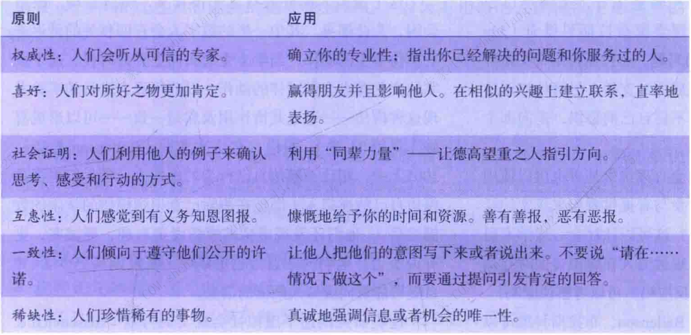

相似性重要还是专业性重要
可能取决于说服主题的侧重点：主观偏好还是客观现实，主观偏好人们可能更看重相似性，客观现实更看重专业性。  

#### 说服内容：信息特点

**理智与情感**

人类的意愿受到理智支配；  
全服别人时请专注于他们的感受，内心以及人性的弱点，但千万不要诉诸理智。 

两种说法有不同的适用对象，对于有良好教育背景的人或善于思辨的人更容易接收理性说服。会积极选择中心路径。

新的情感体验会影响建立在情感基础上的态度。但是要改变基于信息的态度，就需要跟多信息。

**好心情效应** 和**恐惧效应**  
好心情会让人跟容易被说服。吃零食与阅读的关系。

**观点差异** 

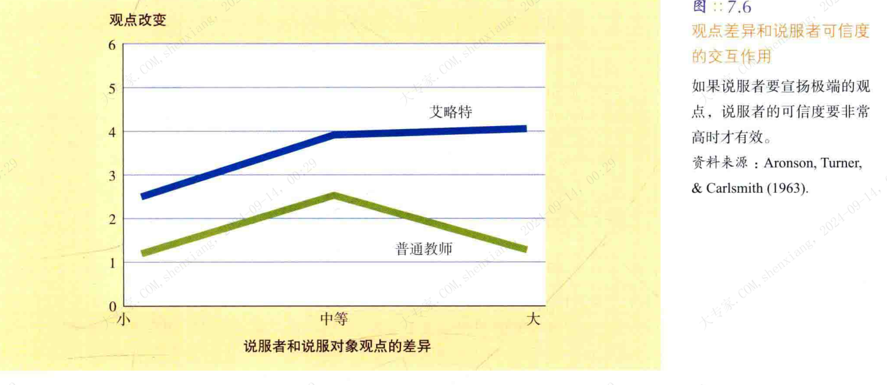

观点差异的大小对说服效果的影响取决于可信度 

深度卷入者（思想的顽固程度）往往只能接收最狭隘的观点。对他们来说稍有差别可能就会看上去激进而愚蠢。  

**正面说服**和**反面说服**

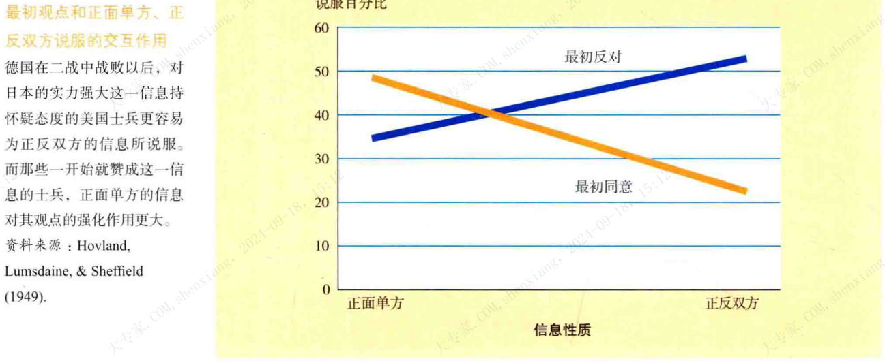

**首因**和**近因**

**首因效应**: 最先呈现的信息最具有说服力。

 

遗忘会造成近因效应

人们发现事物的呈现顺序也会影响简单的偏好。

#### 说服渠道  

**主动接受**或**被动接受**

一开始你什么都不信，但后来愚蠢到仅仅重复就能让你相信原来认为不可能的事情。 -- 乔治.麦克唐纳 

某些话仅仅重复就能增加流利度 -- 这对我们的舌头来说易如反掌  
任何能增加流利度的要素，都能增加可信度。  

被动说服随着问题的熟悉性和重要性的增加而下降。  

主动的经历会强化人的态度。影响更持久。  

**个人**与**传媒**

媒体对文化的影响是层层递进的，慢慢渗透的。  

#### 说服对象：信息的接收方

**年龄**与**说服**  

**生命周期**：人随着年龄的增长会变得趋向于保守

**代际隔阂**：每代人都会趋向于固守青少年期和成年早期的态度

代际隔阂受到的支持是更多的：  
因此对于青少年的指导意义是：年轻人应该慎重的选择自己的圈子，获取信息的途径，参加的组织，交往的人等等。  

抵制态度的巅峰是中年期，因为中年人往往拥有较高的社会权力，这种社会角色本身要求坚定的态度。  

**慎思**与**说服**

避免打草惊蛇--如果你不想遭人反驳，请勿引起对方的警觉。  

分心会减少反驳

引起说服对象的思考（不太投入的说服对象会倾向于使用外周说服路径）  
-- 用反问句引起对方的思考，举出引人入胜的例子，用难题引起对方的兴趣。  

#### 总结

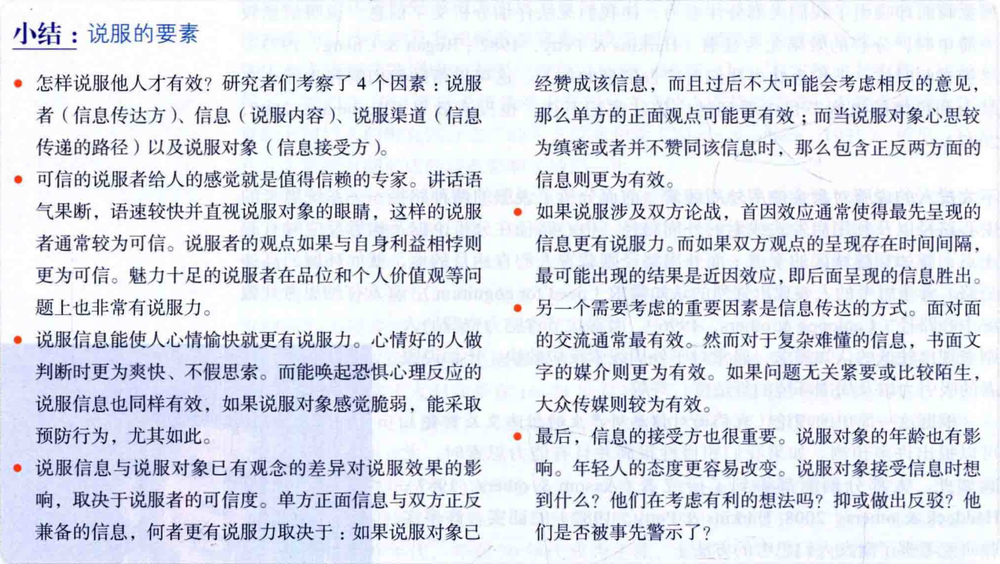

### 极端的说服的例子：邪教

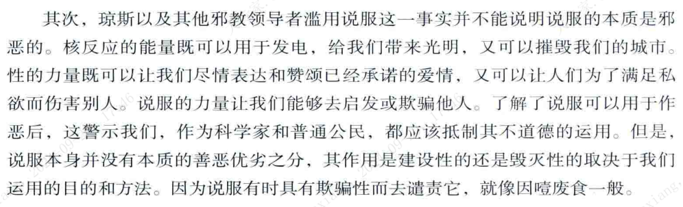

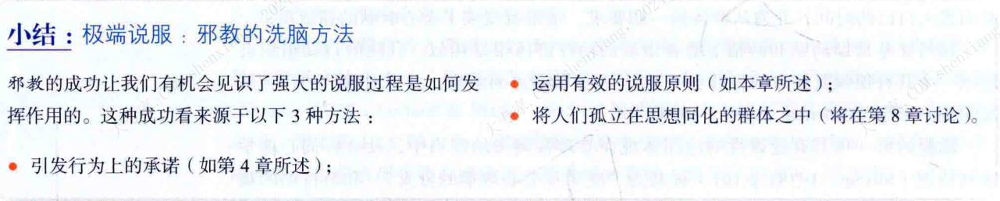  

#### 抵制邪教说服 

##### 加强个人承诺 

**挑战信念** -- 不够强有力的挑战，反而会增加信念
**引起反驳** -- 不正确的反驳会增强信念， 态度免疫：适当的刺激，可以让态度对抗强大挑战的能力变强。

#### 总结

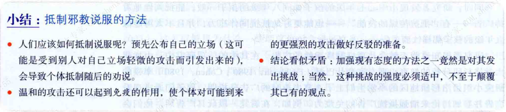 

## 第九章 群体影响 

群体：连个或更多的人在较长时间的里进行互动，并以某种方式互相影响，将他们自己视为"我们"。

### 社会助长作用：他人在场的影响

#### 纯粹他人在场

社会唤醒能促进优势反应。提高简单任务的作业，并且会降低困难任务的作业成绩。  

#### 拥挤现象：众多他人在场

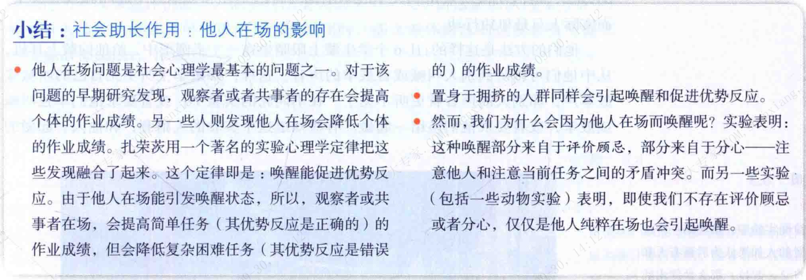

### 社会懈怠：群体中个人减少努力

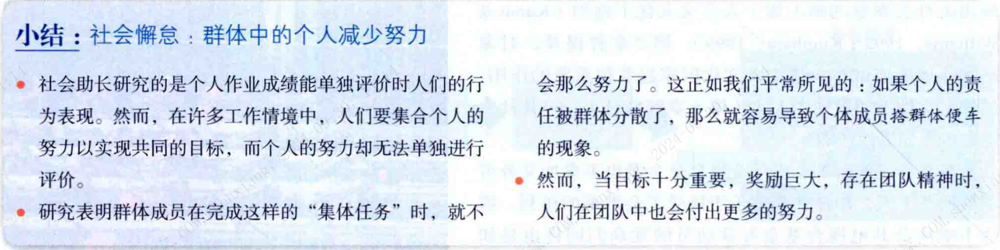

### 去个体化：自我感知丧失

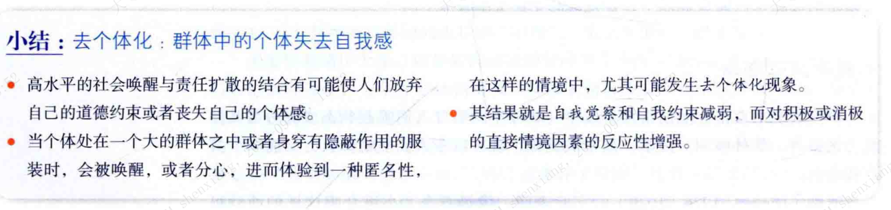

### 群体极化

#### 群体对于我观点的加强

群体思维的症状表现 -- 贾尼斯

1. 无懈可击的错觉
2. 群体道义的毋庸置疑
3. 合理化
4. 对对手的刻板印象
5. 从众压力
6. 自我审查
7. 一致同意的错觉
8. 心理防御

真理产生与朋友间的辩论 -- 休谟

#### 少数派影响

1. 一致性
	如果一个人不屈不挠的坚信自己的才能，并且一直坚持，那整个世界就是他的 -- 爱默生
	相比多数派常激发不假思索的统一，少数派会激起更深刻的讨论，并且会提升创造力。
2.  自信
	一致性和坚持性是自信的表现
	关注事实的时候少数派的说服力没有关注态度的时候强有力。
3. 背叛的多数派
   背叛多数派的人的说服力强于一致处于少数派中的人。一旦出现被拍行为，其他人往往紧随其后。 
4. 领导是否属于少数派
	任务型领导
	社会型领导
	转变型领导

### 后记
  根据群体扩大或放任自流的方向，群体可以极其糟糕，也可以及其美好。所以**我们最好能明智而有目的地选择我们的群体**。
  
  
## 第三编 社会关系

## 第九章 偏见 ：不喜欢他人

### 偏见的本质和作用
#### 偏见的界定
基于错误和顽固的概括而形成的憎恶感。

偏见是一种负面态度，而歧视是一种负面行为。歧视行为的更远往往在与偏见。

偏见有外显和内隐偏见。

多数人看到其他人身上的偏见

#### 种族偏见
#### 性别偏见
有差异但平等。

### 偏见的社会根源
#### 社会不平等：不平等的地位与偏见

偏见一旦为自己的找到理由，它就会从容不迫。 -- 《论偏见》

社会不平等不仅滋生了偏见，也造就了不信任，实验证明了二者之间的相关：群体间受到的待遇越不平等，群体间的信任和合作就越少。收入差距巨大的国家，其公共卫生往往较差，焦虑，肥胖，凶杀，少女生育，吸毒等多发，监狱和警察也更多。

#### 社会化

**权威人格**
**权威人格倾向**： 不能容忍软弱，具有惩罚性的态度以及服从群体内部的权威。
权威人格倾向的个体特别容易出现偏见和刻板印象。

权威人格的个体在同年通常受到苛刻的管束。
在经济衰退，社会巨变，日子变得艰难的时候，权威主义倾向也会急剧高涨。
尽管这些人很少，但是他们往往会成为仇视群体的领袖。

**宗教与偏见**

宗教对偏见的强化，再与我们是否借助宗教，合理化我们的偏见。
顽固分子往往借助宗教使其固执合理化。

**从众**
偏见一旦形成，它在很大程度上就会由于惯性而持久存在。

#### 社会制度的支持

### 偏见的动机根源
#### 挫折与攻击：替罪羊理论
当我们遭遇挫折的原因令人胆怯或者尚未可知的时候，我们往往会转移我们的敌对方向。

#### 社会同一性理论：感觉自己比他人优越

社会同一性理论：
* 我们归类 ：我们发现匠人，包括我们自己，归入各种类别是很有用的。
* 我们认同 :  我们将自己与特定的群体【我们的内群体】联系起来，并以此获得自尊。
* 我们比较 ：我们将自己的群体与其他群体【外群体】进行比较，并且更偏爱自己的群体。

**拥有一种“我们”的感觉能增强我们的自我概念。这种”感觉“好极了。我们不仅在群体中为自己寻求尊重，还在群体中寻求自豪感。而且，认为我们的群体比较优秀，有助于让我们感觉更好。**

 如果缺乏积极的个人同一性，人们往往会通过认同某一群体来获得自尊。当人们的个人统一性和社会同一性融合到一起，自我与群体的边界变得模糊时-- 他们会更愿意为组织而战，甚至为组织牺牲。
 
我们的社会同一性越重要，我们越强烈地感受到对群体的依恋，面对来自其他群体的威胁时，我们的反应就月充满偏见。

**内群体偏差**

仅仅是感觉到被归入某一群体，也可能增加内群体偏差。

人们倾向于积极地描述自己的群体，以便于能够积极地评价自己。 -- 约翰·特纳

**内群体偏差提供积极自我概念**
**内群体偏差滋生偏袒**

爱和恨有时是同一硬币的两面。

对内群体成员，我们同样持有各种独特的人类情感，而我们却不愿意在外群体成员身上看到这样的人类情感。
我们大于宠物宠物赋予人性，二队外群体程艳去人性化。

**社会地位，自我关注和归属的需要**
社会地位是相对的：哦感觉自己有地位，就需要有人不如我们。

也许哪些有着稳定社会地位的人对于优越感的需要相对弱一些。

当人们已经感觉到他有可能死亡，偏见有助于支撑一个受到威胁的信念系统。 

一旦归属感需要获得满足，人们就变得更为接纳外群体。

### 避免偏见的动机

不好的的想法和情感往往长久存在，打破这种偏见习惯并非是一件容易的是事情。

当人们避免偏见的动机是内在的(自己认为应该怎么样的)，而不是外在的（在意别人的看法）的时候，即便是自动的偏见也会有所减弱。

如果你发现自己的反应有一种细条反射般的假设或情感，不要失望，这并不稀奇。重要的是你如歌对待这种意识。你是否让这些感受主宰了你的行为？或者你采取了一些弥补措施，控制和调整你在未来情境中行为？

## 偏见的认知根源

### 类别化：将人归入不同的群体

#### 自我类别化
我们无法抗拒将人归入不同群体的倾向。

具有种族偏见的人花费更多时间对人进行分类，他们考虑将人归为“我们”和”他们“。

#### 知觉到的相似性和差异性

一旦我们吧人分成群体，我们就有可能夸大群体内部的相似性和群体间的差异性。

仅仅区分出群组，就能造成“**外群体同质效应**”。**内群体偏好**是一个很自然的结果。

一般而言我们越是熟悉某一个社会群体，我们就会看到越多的多样性。我们越是不熟悉，我们的刻板印象就越严重。

我们看到宁一个种族的面孔时，我们首先注意到的是种族，而不是个人特征。当我们观看我们自己的种族时，我们相对较少的考虑其种族，而是更多的关注个人细节。

### 独特性：感知哪些突出的人
#### 独特的人

吸引我们注意的人，视乎对所发生的一切承担更大的责任。
人们也是用你最独特的特质和行为来描述你的。

**独特自我意识的形成**
“被丑化”的女性自我感觉变得不一样了，进而曲解了他人的行为方式和评价，而在其他情况下他们并不会注意到这类误解。

一个强势的人和一个弱势的人之间的自我意识的互相作用任然会令人感到紧张。

**污名意识**
污名意识：人们有多大程度上预期他人会对自己产生刻板印象。

### 独特时间促进虚假相关
因为我们对独特事件比较敏感，所以当两件这样的事同时发生时就特别引人注意。

人们的刻板印象让他们感知到根本不存在的关联性。

### 归因：这是一个公正的世界吗

我们总是热衷于将人们的行为归结于他们的内在倾向，而忽视哪些重要的情景的力量。之所以犯这样的错误，部分原因在与我们关注的检点在人而不在情境。

人们越是认为人的特质是一成不变的，他们的刻板印象就越强烈。

#### 群体服务偏差
我们总是对自己群体的成员给与善意的理解，在解释其他群体的成员行为时。

群体服务偏差能非常微妙地影响我们的语言风格。

职责他人能为职责者本人的地位提供辩护。
”他们失败是应为他们很笨，我们失败是因为我们没有尝试“

![[Pasted image 20250929103227.png]]

动机和认可，以及情感和思维，都是不可分割的。

#### 公正世界现象
仅仅是观察到其他无辜者受害，就足以让受害者显得不那么值得尊敬。

之所以存在这种对不幸者的遍贬低，是因为人们需要相信"善恶有报"，“我们的世界是公正的，这个世界的人们得到他们应得的东西。”由此我们进一步认定春风得意的人必然是好人，而受苦受难的人是命中注定的，

就行大屠杀发生后的犹太人一样，遭受的痛苦越多，人们越是不喜欢受害者。

人们之所以对社会不公漠不关心，并不是因为他们不关心公正，而是因为他们眼里看不到不公正。他们相信世界是公正的。

把好运和美德，厄运和不道德联系起来，能失幸运的人在自豪的同时，也不必对不幸的人承担责任。

人们会根据结果去评价他人,好的决策也有可能会带来坏的结果，可人们无视这一事实。

不能说天才和主动性与成功无关，但是公正世界假设低估了不可控因素，这些因素会使一个人竭尽全力的努力付诸东流。

事情越是这样，我们就越倾向于认为事情本来就应该如此。这种天然的保守性使得新的社会政策难以推行。

-- 从来如此，便对吗

### 偏见的后果
#### 自身永存的刻板印象

偏见是一种预选判断。预先判断是在所难免的。

- 预先判断引导我们的注意和记忆。
- 预先判断还能引导我们对事件的解释。
  标签的作用犹如一个拉响的汽笛，它让我们对所有平时能感知到的细微差异充耳不闻。-- 《偏见的本质》
  我们的确会注意到哪些与刻板印象明显不一致的信息，但是即使是这类信息，它们的影响可能比我们预期的要小。
  
  **再分群** -- 形成一个子群体的刻板印象。
  
#### 歧视的影响：自我实现的预言

#### 刻板印象威胁

只要感觉的到偏见就足以使我们意思到自己是少数群体。

刻板印象威胁-- 一种自我验证的忧虑，担心有人会依据负面刻板印象来评价自己。（当你置身于别人都预期你会表现的很差的情景中，你的焦虑可能会导致你证实这一信念）

如何你告诉学生他们有失败的风险，那么刻板印象就可能损害他们的行为表现，导致他们不认同学校，到别的地方去寻找自尊。

-- 学会肯定别人的能力，再去指正别人的问题。

正面的刻板印象似乎也能促进取得成绩。

#### 刻板印象会使个体的判断出现偏差吗

人们常常相信一些刻板印象，然而一旦接触到生动的个人逸闻趣事时，他们又会无视这些刻板印象。

**强烈的刻板印象**确实能印象我们对个体的判断。

#### 刻板印象扭曲认知解释

我们的刻板印象的“认知监狱”管理和限制这我们的印象。

在缺少其他信息的情形下，刻板印象的影响就会举足轻重。

当刻板印象足够强，而关于的某人的信息又模棱两可时，刻板印象能微妙的扭曲我们对个体的判断。

-- （再仔细考虑了案情以及刻板印象的相关研究后，最高法院与1989年做出了裁决，认为鼓励男性而不是女性更加进去，是”基于性别“的行为）

#### 后记：我们能够减少偏见

本世纪能否继续取得进展，或者是否会像人口增加，资源减少的时期容易发生的那样，对立再次演变为公开的敌意，对此，我们还要拭目以待。

## 第十章 攻击：伤害他人

### 攻击的概念

**敌意性攻击**
* 大多数谋杀

**工具性攻击**
* 大多数恐怖活动属于工具性攻击。恐怖分子一般都不是心理异常者；相反，他们是通过某种途径寻求其人意义。
* 大多数战争

### 攻击的理论

#### 攻击的生物学理论

人性本善 or 人性本恶

本能论和进化心理学
弗洛伊德  的 “死本能”：人类的攻击根源于一种自我破坏冲动。攻击将这种强力的欲求所蕴含的能量转向他人。
动物学家洛伦兹，认为攻击更多是适应性的而非自我破坏。

两者都认为攻击的能量来自本能，是非习得的和普遍的。如果得不到释放，这种能量就会越积越多，直到爆发。

本能理论无法解释攻击性在个体和文化之间的多样性。虽然攻击的确有其生物学基础，但人类的攻击倾向不能仅仅被定位为一种本能行为。

**进化心理学**家提出

纵观人类历史，男性尤其发现攻击行为具有适应性。有目的的攻击可以提高生存和繁殖的几率。

“在正确的时间对正确的对象发动攻击是获得社会成就的敲门砖”

**神经系统的影响**

攻击是复杂的行为，并非简单地受到大脑中某个特定的区域控制。

前额叶被认为是对于攻击行为有关的脑区进行紧急抑制的。脑区异常可能导致异常的攻击行为。

**基因的影响**

一个人在幼年表现出来的气质通常是稳定的。

攻击性和反社会行为并非单纯地只受“不良”基因或者“不良”环境的影响，先天和后天因素是互相影响的。

**生物化学因素**
酒精
酒精可以降低人们的自我觉知和考虑后果的能力。酒精使人们的个性弱化，降低我们的抑制能力。
睾丸激素
男性的睾丸激素能够增加面部的宽和长的比例，脸部较宽的男性攻击性更强，更不值得信任。

#### 攻击的 挫折-攻击理论

**挫折-攻击理论**
这里的挫折指的是，任何阻碍我们实现目标的事物。当我们达到一个目标的动机非常强烈，但我们预期得到满意的结果，却在行动中遇到障碍，挫折便产生了。

攻击的能量并非直接朝挫折源释放。我们学会克制直接报复，特别当知道别人会对这种行为表示反对或者进行惩罚时。相反，我们会把我们的敌意**转移**到一些安全的目标上去。

外群体的目标尤其容易成为攻击的替罪羊。 

**修正的挫折-攻击理论**
挫折-攻击理论是为了解释敌意性攻击，而非工具性攻击。

如果这种挫折是可以理解的。会降低攻击行为发生的可能性。
伯科威茨认为，挫折产生的是愤怒，即攻击的一种情绪准备状态。

**相对剥夺**（relative deprivation）
不只是完全的剥夺会产生挫折感，更多时候，*挫折感来源于期望和现实间的差距*。

当你的成就满足滋生期望，当你的收入能够满足自己的需要时，你会感到满足而非挫折感。

当我们把自己和他人进行比较时，我们的挫折感就会变得较为复杂、

房子自然是有大有小的，如果附近的房子都和这间一样小的话，那它便足以实现一个住所的所有社会功能。但乳沟这座小房子旁建起了一座宫殿，它一下子变成了一间破草棚。 -- 卡尔·马克思

#### 攻击的社会学习理论

**攻击的回报**

人类也如同动物一样，也可以习得攻击的回报。

一旦社会决定不在理睬这样的事情，这一现象也就消失了。

**观察学习**

**社会学习理论** 认为，人们对攻击的学习不仅发生在亲身体验其后果时；通过观察别人，人们也可以进行同样的学习。像很多社会行为一样，当看到别人表现攻击行为并没有受到惩罚时，我们会习得攻击。

对成人攻击行为的观察降低了他们对自己的抑制。
观察攻击性行为不仅降低了孩子对自我的控制，还教给了他们怎样去攻击。

班杜拉认为，攻击行为是由挫折，疼痛，受辱等令人不快的体验激发的，这些体验在情绪上把我们唤醒。但我们是否真的选择攻击性行为还是取决于我们对结果的预期。

### 攻击的影响因素

#### 厌恶事件
挫折
疼痛
炎热
攻击  以牙还牙

#### 唤醒

厌恶刺激可以激起人们的情绪。

沙克特：
一种躯体唤醒状态会引发怎样的情绪，取决于人们对这种唤醒的解释和分类。

唤醒的状态只会强化情绪。

有观点认为，攻击行为会提高唤醒水平。反之亦然。

#### 攻击线索

枪支不仅使暴力成为可能，还可以刺激它的发生。手指扣动扳机，但扳机同样可以拉动手指。

家中有枪与否，往往意味着这样的区别：是争斗还是葬礼，是忍耐还是饮弹自尽。

枪支并不只是提供攻击线索，它们还拉大攻击者和受害者之间的心理距离。与受害者的远离使我们更加残忍。

#### 媒体影响：色情与性暴力

**对性现实的歪曲理解**

我们不难理解，甚至许多女性也会相信：或许其他女性喜欢被征服--而实际上没人认为自己会是这样的。

暴力色情刺激增加了对女性的惩罚性行为。

**媒体意识教育**

我们理想主义乃至天真的愿望，就是科学所揭示的真理终将胜利；公众将会相信，这些作品不仅贬低了其中的角色，也贬低了他们的观众。

#### 媒体影响：电视和互联网

当一个有魅力的人因正当理由而实施了湿度的暴力，而这种暴力未收惩罚且没有造成任何伤害时，观看暴力节目的效果是最为显著的。

考虑三种可能性
1. 不是暴力内容导致了社会暴力，而是由其引发了唤醒状态。唤醒状态容易引发其他行为。
2. 观看暴力使人们降低抑制。
3. 观看暴力引起了模仿。

**电视对思维的影响**
1. 脱敏作用
2. 社会脚本
3. 改变知觉 ：媒体塑造了对现实的知觉。
4. 认知启动
5. 消耗时间

任何一代人在性格形成时期花在看电视上的时间越长，公共活动参与度就越底。

#### 媒体影响：电子游戏

玩暴力游戏产生以下系列效应
1. 诱发攻击性行为
2. 引发攻击性思维
3. 唤醒攻击性情绪
4. 减少对他人的帮助和同理心

并非没个接触失眠和二手烟的人都会得癌症，但石棉和二手烟忍让被认为危害公共健康。

加深人们对某一问题认识的最好方法就是给反对者与支持者同等的机会发表观点。 -- 我深以为然

#### 群体影响

群体通过责任扩散是攻击行为增大。

责任扩散随着距离的增大和人数的增多而变强。

他们会在群体中寻找社会同一性。随着群体同一性的发展，服从的压力和去个体化在增加。自我同一性随着成员把他们自己完全投入群体而逐渐消失了。

战争最残忍是的，它强迫人们集中在一起，干一些就个人而言谁都很反对的事情。 -- 艾伦·凯

当旁观者不对欺负行为做出积极反馈时，欺负行为就会减少。

攻击的增强可以有一下因素预测：
* 男演员
* 匿名
* 攻击性或A型人格
* 被激怒
* 酗酒
* 武器的存在
* 观看暴力
* 群体互动
  
### 减少攻击行为

#### 宣泄假说成立吗

残忍行为引起了相应的态度。人们贬低受害者，从而使进一步的攻击合理化。

以一种能失别人更好地做出积极反应的方式交流他们的感受。我们可以不采用攻击性的方式，而仍然可以坚持自己的利益。

#### 社会学习法

如果攻击是的习得的，那么控制它就有希望。

厌恶体验，避免给人们以错误的，不可达到的预期是明智。预期的回报与代价会影响工具性攻击。她建议我们应该奖励合作性的非攻击行为。

**我们应该学会用攻击之外的手段来解决问题**。在教授解决问题的技巧，情绪控制策略和冲突解决方法后，学校中有暴力或破坏行为的儿童减少了35%。

**体罚会产生消极的作用**。暴力少年和虐待孩子的家长大多出自以严酷体罚来管教孩子的家庭便不足为奇了。

为了创造一个温和的世界。训练计划鼓励家长强化期待的行为，积极而非消极的表达观点。（“打扫完，你就能出去玩了。”；而不是“不打扫完，你哪儿也不准去。”）

我们可以减少影视作品中的暴力元素，也可以教育儿童，地址媒体暴力的影响。

#### 文化改变和世界暴力

文化是可以改变的几个世纪以来，人类的文明程度越来越高。

### 后记：对暴力文化的改革

比起惩罚的严重程度更重要的是它的**确定性**。

打蚊子确实不错，但是排干沼泽的水会更好。-- 通过改造我们的文化，去除哪些腐蚀年轻人的社会毒瘤和重建我们的道德根基。

## 第十一章 吸引与亲密：喜欢他人与爱他人

我们确实是社会性动物。我们需要归属于某一群体。跟其他的动机一样，阻碍归属的需要只会更增强这种需要，而满足这种需要就会降低这种动机。

当我们有所归属时，即当我们感到被一种亲密关系所支持时，我们会更加健康和快乐。幸福感是感觉与人有联结，自由以及有能力。

排斥伤害和社会性疼痛非常尖锐，远超出那些不受排斥的人的想象。

若内心深处的归属需要得不到满足，就会使我们感到不安。

省会排斥是一种真实的疼痛，而爱则是天然的止痛剂。

### 导致友谊和吸引的要素

#### 接近性 

**互相交往**
事实上，地理距离并不是关键，功能性距离--人们的生活轨迹相交的频率--才是关键

**对互相交往的预期**
仅仅是对互相交往的预期就可以触发喜欢。

**曝光效应**
熟悉诱发了喜欢。****

扎荣茨认为，情绪相比与思维更具即时性。-- 情绪半独立于思维（情感可以先于认知）

曝光效应也产生相反的效应：我们喜欢的人似乎也就更熟悉。

#### 外表吸引力

**匹配现象**

**外表吸引力的刻板印象**

**社会比较**

#### 相似性和互补性

**物以类聚吗**

**对立引发吸引吗**

某些方面的互补的确可以促进关系的改进。然而，人们似乎更倾向于喜欢并和那些需求和人格方面相似的人结为夫妻。

### 喜欢那些喜欢我们的人

我们的反应依赖于我们的归因

**自尊和吸引**
人们在自尊心受到大技并极为渴望获得社会承认时，更可能被他人吸引。

**获得他人尊重**

频繁的赞扬可能会失去价值。
保持坦率而真诚的关系。

伤害你的不仅有你的敌人，还有你的朋友；敌人诽谤你，朋友则告诉你这个消息。  --马克吐温

真诚和营造两人之间的良好关系很重要，但假定对方天性善良也同样重要。

### 关系中的奖赏

我们是被那些林我们感到满意和开心的人所吸引。（我的感受才是最重要的。）

**吸引奖赏理论**: 如果跟某人交往所得到的回报大于付出的成本，那我们就喜欢并愿意继续维持这种关系。

人们条件反射形成了对那些奖赏性时间有关的人和事的积极感受。

### 爱情的种类及要素

第一印象十分重要。但是，长期的爱情并不仅仅是初始好感的延续和增强。

斯滕伯格的爱情三成分理论
![[Pasted image 20251021103236.png]]
#### 激情之爱

情绪性的，令人兴奋的，强烈的爱。

任何一种既定的生理唤醒状态最终都可以被归结为某种情绪，究竟被句结尾哪一种情绪，取决于我们对于这种唤醒状态如何归因。

激情之爱就是由于我们在生理上被有吸引力的人所唤醒而知觉到的心理体验。

肾上腺素是两颗相爱的心贴的更近了。

爱情不仅仅是欲望。浪漫爱情是信誉和深厚友谊的综合体。激情之爱=欲望与依恋。

#### 影响爱情的因素：文化与性别

研究表明，其实男人比女人更容易坠入情网。

#### 相伴之爱

事情总是这样发展的；你不知道你拥有什么，直到失去。 -- 琼尼·米歇尔《黄色出租车》

如果感情曾经是亲密的互相奖赏，那么相伴之爱就会根植与共同体验的人生风雨历程中，从而愈久弥醇。

### 促进亲密关系的因素

#### 依恋

与他人的亲密依恋关系构成了一个人生活的核心……人们都是通过这些亲密依恋来获得力量和享受生活的。

所有爱的依恋中都有一些共有的元素：双反的理解，提供和接受支持，总是并享受和想爱的人在一起。然而，激情之爱视乎还有一些额外的特征：身体上的亲昵，排他性的期待，以及对爱人的强烈迷恋。

婴儿与父母之间表现出的强烈情感，和激情之爱相比类似，设置脑区的活动都与激情之爱相似。
#### 依恋类型

安全型依恋
回避型依恋（恐惧型和疏离型）
不安全依恋（焦虑-矛盾型依恋）

不管怎么样，早期的依恋类型看来的确为后来人机关系的形成奠定了基础。

#### 公平

不斤斤计较是友谊的标志。在正式场合中，投桃报李会促进双方的关系，但在友谊中却不是这样。

没有人会这样说，设置很少人会这样想：“我的美丽外表可以换取你巨额收入。”但是，公平原则确实是存在的，在哪些持久的感情中更是如此。
#### 自我表露

**表露互惠**

### 亲密关系的结束

我们活得更长了，但是爱的更短了

#### 聚焦：互联网穿创造了亲密关系还是人际隔绝
#### 离婚

激情之爱在许多方面都不是意识的常态……在当今的很多国家，法律规定结婚是不能处于最久状态……但是激情之爱本身就是一种不清醒的陶醉。 -- 《生活的意义》

陶醉与一时激情锁做出的长相厮守的决定是愚蠢的。基于稳定的友谊，以及相近的背景、兴趣、习惯和价值观去选择伴侣会比较好。

#### 分离的过程

分离是一个过程，而不仅仅是一个事件。

在数月或数年之后，拒绝别人的爱比自己的爱被拒绝会唤起人们更多地痛苦。

因为他们觉得，持续一段痛苦而无意的婚姻关系将是更大的代价。

人们处理失败婚姻关系的三种方法：
1.一些人会终于伴侣，等待时机以改善关系。忠诚的一方会坚持，期待昔日美好光阴的重现。

2.另一些人会忽略掉伴侣，将痛苦和不满忽略掉，感情上的分离便随之而来，伴侣间的谈话更少，并开始重新定义他们没有彼此的生活。

3.还有一些人会表达他们在乎的内容，斌采取积极措施改善婚姻关系，入讨论问题,寻求建议，尝试改变。

健康的婚姻不见得没有冲突，而是夫妻双反能够调和差异,并且他们的情感能够胜过互相的指责。

**真正能够预测婚姻危机的因素是冷漠**

通过角色扮演和表达爱意，最初的浪漫和激情能够发展成为持久的爱情。

现代生活的两个事实似乎无可辩驳：
其一，亲密而持久的婚姻关系是幸福生活的标志。
其二，亲密而持久的婚姻关系正在减少。

人们必须付出努力才能防止爱情的衰退。例如，每天基础时间来聊聊当天发生的事情；克制自己的唠叨，不争吵，袒露自己并倾听对方的感伤，关注和梦想；努力使婚姻关系发到理想的完美境界。 

## 帮助行为

### 帮助行为发生的原因

#### 社会交换与社会规范

**社会交换理论**并不主张我们要有意识地去监控成本和收益，只是表明这类因素能与预测人们的行为。

**奖赏**
催生帮助行为的奖赏可以来自外部，也可以来自内部。

慷慨的人比那些只为自己花钱的人获得更快乐。给予可以提高幸福感。

斯金纳认为，只有当我们不能解释别人做好事的原因时，我们才会因此而信任他们。只有当我们找不到外在的解释时，我们才会把他们的行为归因于他们的内在品质，而当外部原因明显时，我们就会相信外部原因，而非个人品质。

为了避免陷入“利己主义”的循环自证。我们必须把收益和成本独立于帮助行为之外。

**内部回报**

接近一个痛苦的人，我们也会感到痛苦。对他人的痛苦反应最强的人，给别人提供的帮助也最多。

**内疚感**
人们定期地将自身的罪过加诸于作为替罪羊的动物身上，然后把动物放到野外，让它带走人类的罪责感。

人们会尽其所能去消除内疚感，减少不良感觉，并回复自我形象。

“别说谎，不然你会生活在内疚里”（并且你还会想要减轻内疚感）。

内疚感有许多益处。它促使人们坦白、道歉、帮助，避免再犯错误，它还是人们更敏感，病史亲密关系能够持久。

**心情与好行为**

自我关注的悲伤效应。嫉妒的悲痛，通常会经历一段强烈的自我关注期。

**坏心情**

如果不是全然沉浸在自己的抑郁和悲伤中，悲伤的人是敏感而乐于助人的。

**好心情**

积极的思维往往也更可能带来积极的行动

**互惠规范**

对于哪些曾经帮助过我们的人，我们应当施一帮助而不是伤害。

当人们不能给与回报时，他们会因接收了援助而感到受到威胁和被贬低。因此，骄傲、自尊心强的人通常不愿意寻求帮助。

**社会责任规范**

因此可见，人们的反应与其所做的归因密切相关。如果我们吧别人的需要归因为不可控的困境，我们就会帮助他们；如果我们把别人的需要归因为他个人的选择，公平的规范就不要求我们去帮助他，我们会认为那是他咎由自取。

#### 演化心理学

献身的英雄往往午后。如我自我牺牲导致其后代的减少，那么允许英雄行为产生的基因就会从人群中逐渐消失。 -- 《论人性》

然而，我们表现出克服自私的多重机制，包括：
* **亲缘选择**
  如果人类在很大程度上被引导去……偏爱他们的亲人和部落，那么世界和平的可能性将非常有限。
* **直接互惠**
  交朋友需要付出代价。
* **间接互惠**
* **群体选择**
  人类的内群体忠诚会通过牺牲自己来支持所谓的“我们”。

#### 比较和评价帮助行为的理论

一个有效的理论也应该能提供一个一致的结构，以概括各种各样的观察结果。

#### 真正的利他主义

当我们感到我们与某人之间存在依恋时，我们也会产生**同理心**。因对方的痛苦而痛苦，因对方的高兴而高兴。

同情崩溃：遭受痛苦的人数增加，人们关注反而下降。

我们更容易与一个活生生的人产生同理心，而不是遭受痛苦的人数；

目睹他人痛苦，会引发两种情绪：关注自我的痛苦和关注他人的同理心。
研究者一致认为痛苦能引发利己的动机，但他们对同理心是否能引发存储意义上的利他动机仍然有争议。

稍微体验一下别人的感受，这样有助于增加同理心。

同理心是我们与生俱来的能力。

如果我们产生了同理心，但同时知道有别的方式能让我们好过写，我们就不太可能帮助别人。

#### 聚焦 同理心已发的利他主义的益处和代价

### 帮助行为的影响因素

#### 旁观者数量

其他旁观者在场----会大大降低人们对事件的干预。
当旁观者数目增加时，任何一个旁观者都会更少地注意到事件的发生，更少地把它解释为一个重大问题或者紧急情况，更少地认为自己有采取行动的责任。

- **发现**
- **解释**
透明错觉:高估他人解读我们内心状态能力的倾向。
由于对自身情绪非常敏感，我们通常认为他们非常明显，别人很容易就能看穿。但是大多数情况我们都能很好的掩藏我们的情绪。

人众无知 -- 人们对他人关于自己的想法和感受是无知的。
- **确定责任**
我们通常并不知道自己所做所为的原因。

#### 当别人也提供帮助时

热心帮助的榜样确定会促进帮助行为。
然而，榜样却并不总是言行一致。“照我说的做，不要照我做的做。”

#### 时间压力

情境对行为的影响比我们通常认为的还要大。 
-- 感悟：一定要了解事情的前因后果，不要妄下判断。不要想当然，我们的脑子想象力很丰富，它会构建出我们以为的情景，而那未必是事实。

#### 相似性

相似性容易唤起喜欢，而喜欢又会引发帮助行为。

### 帮助者的特点

#### 人格特质

情景对利他行为的影响要比人格大的多。

哪些具有交个的积极情绪、同理心能力和高自我效能感的人更关心人。
自我监控能力强的人，更可能为了追求社会赞许而迎合他人期望从而乐于助人。

#### 性别

亲社会行为的出现和性别规范得以发挥作用都归功于充裕的时间。

性别差异交互作用（取决）于情境。

#### 宗教

宗教信仰能够预测长期的利他主义，如志愿者和慈善捐款

### 增加帮助行为

#### 减少模糊感，提高责任感

个人化的方式，正如向我求助的那个人所熟知的，能失匿名性减弱，从而有更高的责任感。

**降低匿名性**，互相介绍姓名等。
个人请求、木管接触、告知名字、预期的会面---都可能增加了帮助的可能性。

“去个体化”会使人们的责任感降低。因此，提高自我意识的做法，比如贴上姓名标签，被观察和评价、静静地注视，都能增加帮助行为。

#### 内疚和对自我形象的关注

以退为进

#### 利他主义的社会化

![[Pasted image 20251030135421.png]]

**教化道德包容** 
道德排除 -- 将某些人（或动物）排除于自己的道德关怀之外。它令多有的伤害行为都变得合理，博对和残忍就会变得可以接受，甚至是是适当的。

利他主义社会化第一步是去除天然的内群体偏爱。

**树立利他主义榜样**

这种“亲社会的价值取向”引导他们将其他群体的人包容到自己的道德关怀范围中，并感到对他们的复制负有责任。

**通过做出具体的帮助行为来学习**

帮助行为也有助于满足孩子们形成积极自我概念的需要。

**把帮助行为归因于利他主义动机**

**过度辩护效应**：当对一种行为的反馈过度时，个体可能会将行为归因为外部反馈（奖励）而非内在动机。

对人们的良好行为给与恰到好处的反馈（必要时应戒除收买与威胁），我们也许可以增加他们自己从做这些事情中得到的快乐。

虽然把奖赏用作控制性的收买会破坏内在动机，但是一个意外的褒扬却能零人感到胜任和有价值。

我们也可以通过引出他们暂时性的积极承诺，使其得出自己乐于助人的结论，从而更倾向于提供帮助。

反向的暗示或者反向的“引导承诺”： “如果不打算去献血就回复;不”。人们可能不会选择回复不。

**习得的利他主义**

成为英雄第一步是要认识到那些能过后阻止你袖手旁观的社会压力。

## 冲突与和解

几乎每个国家都在强调和平是自己的唯一目标的同时，也表现出对其他国家的不信任。

无论处于冲突中的人们能否正确认识双方的行为，他们总是认为一方的收益就是另一方的损失。

- 什么样的情境会引发冲突？
- 误解是如何加深冲突的？
- 和另一方的接触会减少冲突吗？
- 什么时候合作、脚轮与调和能够促成和解？
  
### 引发冲突原因

#### 社会困境
- 囚徒困境
- 公地悲剧
  当一种资源未获得明确的分配时，人们往往回不自觉的消耗更多。

**基本归因错误**

不客观的评价对方的行为

**动机的演化**

行为的动机是在变化的。

**结果的总和并不一定为零**

冲突双方得到的利益和损失之和并不一定为零。双方可能都赢也可能都输。

**解决社会困境**

- 适当的管制
- 小即是美
- 沟通
- 改变激励机制
- 倡导利他规范
  知道怎么做是好的与实际的行为并没有必然联系
  
#### 竞争

事实上，他们的邪恶是被邪恶的环境诱发的。
当
1.  人们知觉到诸如金钱，工作岗位和权力这些资源是有限的，并且是零和的；
2. 一个明显额外群体成为潜在的竞争者；
这两种情况的竞争更易于引发冲突

#### 知觉到不公平

为了纠正主观偏差，你应该更好地对待他人，比你预期他人对待你的还要好上20%。 -- 鲍林

有较强社会影响力的人会利用自己的力量使别人相信，他们获得的就是他们应得的。这一现象被称为“黄金定律”：总是由拥有环境的人来制定规则。

请我们设想这样的一个未来，我们所有人都不清楚自己在社会经济阶梯中处于哪一个阶层，我们会选择什么样的公正标准。

#### 误解

冲突双方眼中，对双方的形象都是被歪曲的，尽管这种误解很容易被我们理解，但它仍深深的影响着我们的行为。

侵略滋生爱国主义，爱国主义压制不同政见 -- 莫里·多德

**镜像知觉**

"偏见盲点" 他们认为自己的对手尤其不赞成他们的核心价值。吧不同意他们的人看做是不公平的和有偏见的。

党派间总是夸大对手与自己的分歧，而事实上他们的对手与他们自己的一致性要比想象的多。

要想解决冲突，我们必须抛弃这些夸张的感觉而去了解别人的想法。这并非易事。

回忆最近遇到的一次较严重的冲突时，只有12%的人认为冲突的另一方具有合作意愿；而74%的人认为自己是愿意合作的。

**简单化思维**

有效感知是对抗仇恨的解药。

**知觉转换**

### 获得和平的途径

